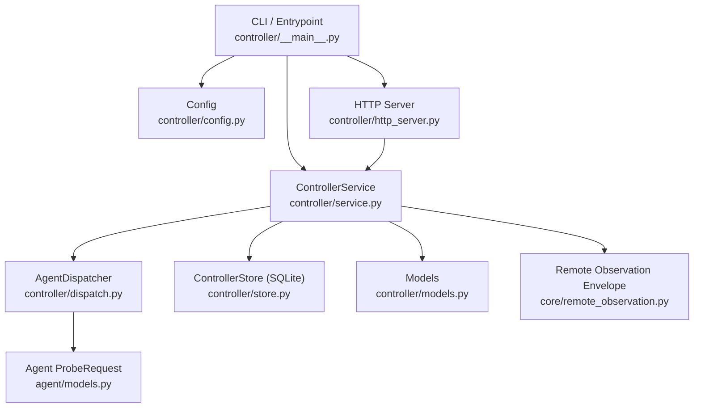
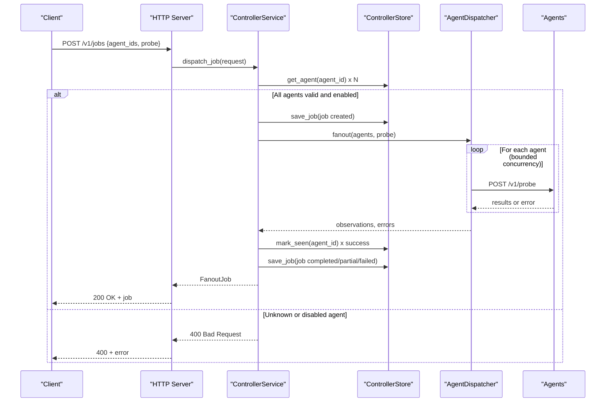
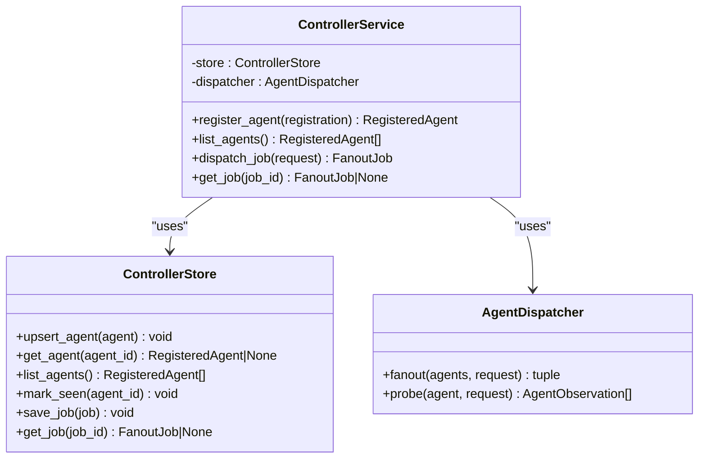
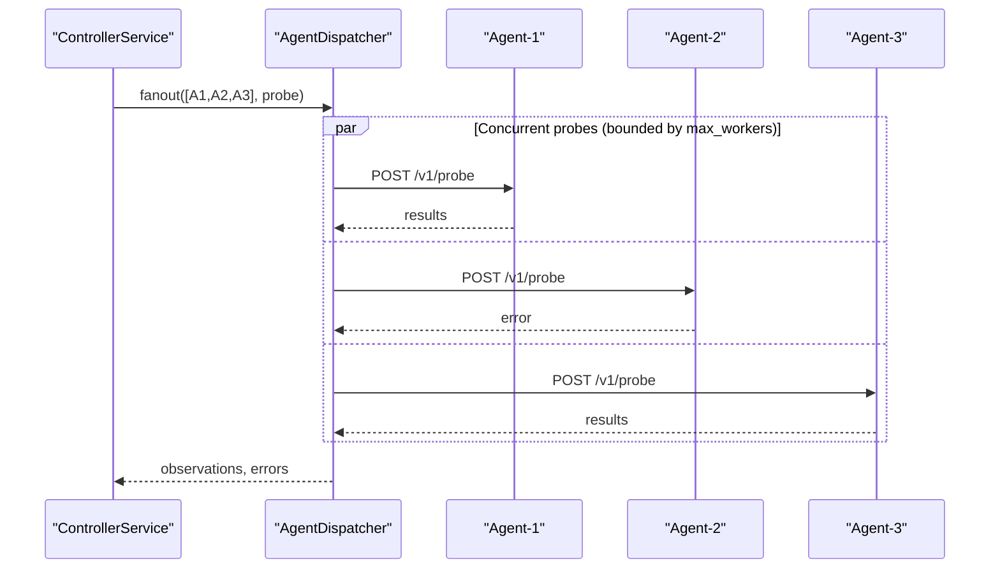
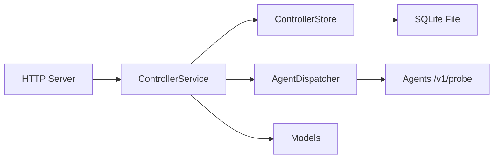
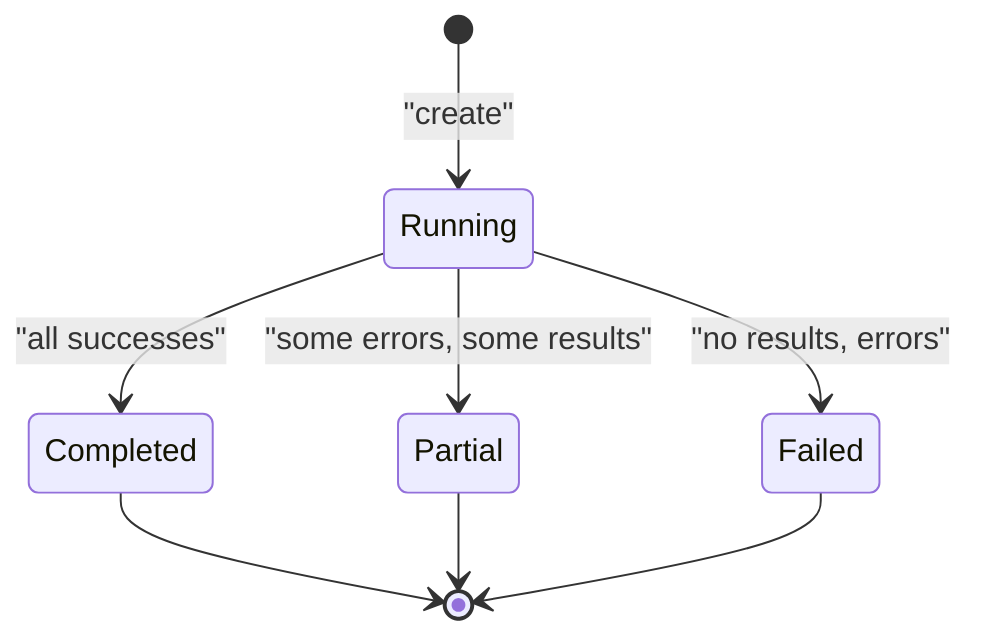

# Controller Service

<cite>
**Referenced Files in This Document**
- [controller/__main__.py](file://controller/__main__.py)
- [controller/service.py](file://controller/service.py)
- [controller/http_server.py](file://controller/http_server.py)
- [controller/config.py](file://controller/config.py)
- [controller/models.py](file://controller/models.py)
- [controller/dispatch.py](file://controller/dispatch.py)
- [controller/store.py](file://controller/store.py)
- [agent/models.py](file://agent/models.py)
- [core/remote_observation.py](file://core/remote_observation.py)
- [tests/test_controller_service.py](file://tests/test_controller_service.py)
- [tests/test_controller_http.py](file://tests/test_controller_http.py)
- [README.md](file://README.md)
</cite>

## Table of Contents
1. [Introduction](#introduction)
2. [Project Structure](#project-structure)
3. [Core Components](#core-components)
4. [Architecture Overview](#architecture-overview)
5. [Detailed Component Analysis](#detailed-component-analysis)
6. [Dependency Analysis](#dependency-analysis)
7. [Performance Considerations](#performance-considerations)
8. [Troubleshooting Guide](#troubleshooting-guide)
9. [Conclusion](#conclusion)
10. [Appendices](#appendices)

## Introduction
The NetForge Controller service is the central coordination point for distributed diagnostics across multiple agents. It manages agent registration, dispatches diagnostic jobs to one or more agents concurrently, aggregates results, and persists job state. The controller exposes a minimal authenticated HTTP API for agent management, job submission, and result retrieval. It is designed for simplicity and reliability in production environments with bounded concurrency and fault-tolerant fan-out execution.

## Project Structure
The controller module is organized into focused components:
- Entry point and configuration loading
- HTTP server exposing REST endpoints
- Orchestration service handling business logic
- Dispatcher for concurrent agent calls
- SQLite-based persistence store
- Shared models for requests, responses, and observations



**Diagram sources**
- [controller/__main__.py:14-21](file://controller/__main__.py#L14-L21)
- [controller/config.py:9-21](file://controller/config.py#L9-L21)
- [controller/service.py:17-50](file://controller/service.py#L17-L50)
- [controller/http_server.py:16-72](file://controller/http_server.py#L16-L72)
- [controller/dispatch.py:19-51](file://controller/dispatch.py#L19-L51)
- [controller/store.py:13-77](file://controller/store.py#L13-L77)
- [controller/models.py:13-37](file://controller/models.py#L13-L37)
- [agent/models.py:23-40](file://agent/models.py#L23-L40)
- [core/remote_observation.py:15-58](file://core/remote_observation.py#L15-L58)

**Section sources**
- [controller/__main__.py:14-21](file://controller/__main__.py#L14-L21)
- [controller/config.py:9-21](file://controller/config.py#L9-L21)
- [controller/service.py:17-50](file://controller/service.py#L17-L50)
- [controller/http_server.py:16-72](file://controller/http_server.py#L16-L72)
- [controller/dispatch.py:19-51](file://controller/dispatch.py#L19-L51)
- [controller/store.py:13-77](file://controller/store.py#L13-L77)
- [controller/models.py:13-37](file://controller/models.py#L13-L37)
- [agent/models.py:23-40](file://agent/models.py#L23-L40)
- [core/remote_observation.py:15-58](file://core/remote_observation.py#L15-L58)

## Core Components
- ControllerService: Orchestrates agent registration, job creation, dispatching, and result aggregation. Validates agent existence and enabled status before dispatch. Persists job lifecycle states and outcomes.
- AgentDispatcher: Executes bounded-concurrency fan-out to registered agents using a thread pool. Collects successful observations and errors per agent.
- ControllerStore: Provides SQLite-backed persistence for agents and jobs, including upserts, queries, and last-seen timestamps.
- HTTP Server: Exposes an authenticated JSON API with endpoints for health, agent management, job submission, and job retrieval.
- Models: Define request/response schemas and observation envelopes used across the controller and agent boundary.

Key responsibilities:
- Agent registration and listing
- Job creation and persistence
- Parallel execution via dispatcher
- Result aggregation and status resolution
- Fault isolation per agent

**Section sources**
- [controller/service.py:17-50](file://controller/service.py#L17-L50)
- [controller/dispatch.py:19-51](file://controller/dispatch.py#L19-L51)
- [controller/store.py:13-77](file://controller/store.py#L13-L77)
- [controller/http_server.py:16-72](file://controller/http_server.py#L16-L72)
- [controller/models.py:13-37](file://controller/models.py#L13-L37)

## Architecture Overview
The controller runs as a single process that:
- Loads configuration from environment variables
- Initializes a service with a store and dispatcher
- Serves an HTTP API on a configurable host/port
- Dispatches jobs to agents concurrently and persists results



**Diagram sources**
- [controller/http_server.py:30-55](file://controller/http_server.py#L30-L55)
- [controller/service.py:30-47](file://controller/service.py#L30-L47)
- [controller/dispatch.py:40-51](file://controller/dispatch.py#L40-L51)
- [controller/store.py:38-77](file://controller/store.py#L38-L77)

## Detailed Component Analysis

### ControllerService
Responsibilities:
- Register agents and persist them
- Validate requested agents exist and are enabled
- Create and persist jobs with initial status
- Dispatch probes to agents concurrently
- Aggregate observations and errors
- Update job status based on outcomes

Concurrency and fault tolerance:
- Uses dispatcher’s bounded thread pool to execute probes in parallel
- Tracks per-agent errors separately from observations
- Marks agents seen only when they successfully respond

Status resolution:
- completed if no errors
- partial if some errors but at least one observation
- failed if no observations and errors present

**Section sources**
- [controller/service.py:17-50](file://controller/service.py#L17-L50)

#### Class Diagram


**Diagram sources**
- [controller/service.py:17-50](file://controller/service.py#L17-L50)
- [controller/store.py:13-77](file://controller/store.py#L13-L77)
- [controller/dispatch.py:19-51](file://controller/dispatch.py#L19-L51)

### AgentDispatcher
Responsibilities:
- Send POST /v1/probe to each agent with the probe payload
- Use a ThreadPoolExecutor with bounded workers to limit concurrency
- Collect results and exceptions per agent
- Return aggregated observations and errors

Fault tolerance:
- Catches network and timeout errors during probing
- Records errors per agent without failing the entire job
- Honors per-probe timeouts with additional margin

**Section sources**
- [controller/dispatch.py:19-51](file://controller/dispatch.py#L19-L51)

#### Sequence Diagram: Fan-out Execution


**Diagram sources**
- [controller/dispatch.py:40-51](file://controller/dispatch.py#L40-L51)

### HTTP API
Endpoints:
- GET /v1/health: Returns service health status
- GET /v1/agents: Lists all registered agents
- POST /v1/agents: Registers a new agent
- POST /v1/jobs: Submits a diagnostic job
- GET /v1/jobs/{job_id}: Retrieves job details

Authentication:
- Requires Authorization: Bearer <token> header
- Rejects unauthenticated requests with 401

Error handling:
- Validation errors return 400
- Unknown endpoints return 404
- Missing jobs return 404

**Section sources**
- [controller/http_server.py:16-72](file://controller/http_server.py#L16-L72)

#### Endpoint Flow
```mermaid
flowchart TD
Start(["HTTP Request"]) --> Auth{"Authorization valid?"}
Auth --> |No| Err401["401 Unauthorized"]
Auth --> |Yes| Route{"Path match"}
Route --> |/v1/health| Health["Return healthy"]
Route --> |/v1/agents GET| ListAgents["List agents"]
Route --> |/v1/agents POST| Register["Register agent"]
Route --> |/v1/jobs POST| SubmitJob["Submit job"]
Route --> |/v1/jobs/{id} GET| GetJob["Get job"]
Route --> |Other| Err404["404 Not Found"]
Register --> Done(["Response"])
SubmitJob --> Done
GetJob --> Done
ListAgents --> Done
Health --> Done
Err401 --> End(["End"])
Err404 --> End
Done --> End
```

**Diagram sources**
- [controller/http_server.py:30-55](file://controller/http_server.py#L30-L55)

### Persistence Layer (ControllerStore)
Responsibilities:
- Ensure schema for agents and jobs tables
- Upsert agents with tags, enabled flag, and last_seen_at
- Persist jobs with full payload and update completion metadata
- Provide read accessors for agents and jobs

Data model highlights:
- Agents: primary key agent_id, URL, tags, enabled, last_seen_at
- Jobs: primary key job_id, timestamps, status, serialized payload

**Section sources**
- [controller/store.py:13-77](file://controller/store.py#L13-L77)

### Configuration
Environment variables:
- NETFORGE_CONTROLLER_TOKEN: Required bearer token for controller API
- NETFORGE_AGENT_TOKEN: Required bearer token for agent-facing API
- NETFORGE_CONTROLLER_DB: Optional path to SQLite database file

Startup:
- Parses command-line arguments for host and port
- Builds ControllerService with store and dispatcher
- Starts HTTP server with configured bearer token

**Section sources**
- [controller/config.py:9-21](file://controller/config.py#L9-L21)
- [controller/__main__.py:14-21](file://controller/__main__.py#L14-L21)

### Data Models
- AgentRegistration and RegisteredAgent: Identify agents, their URLs, topology tags, enabled state, and last seen timestamp
- FanoutJobRequest: Specifies target agents and probe parameters
- FanoutJob: Captures job lifecycle, status, observations, and errors
- ProbeRequest: Defines probe type, target, port, counts, hops, timeouts, and interface selection
- RemoteObservationContext and AgentObservation: Strict envelope for remote diagnostic results with provenance and quality metadata

**Section sources**
- [controller/models.py:13-37](file://controller/models.py#L13-L37)
- [agent/models.py:23-40](file://agent/models.py#L23-L40)
- [core/remote_observation.py:15-58](file://core/remote_observation.py#L15-L58)

## Dependency Analysis
High-level dependencies:
- HTTP server depends on ControllerService for business logic
- ControllerService depends on ControllerStore for persistence and AgentDispatcher for execution
- AgentDispatcher depends on agent models and core observation types
- Store depends on Python’s sqlite3 and standard library modules

Coupling and cohesion:
- Clear separation between HTTP presentation, orchestration, dispatch, and persistence
- Minimal coupling through well-defined models and interfaces
- No circular dependencies observed among core modules

External integration points:
- Agents expose /v1/probe endpoint; controller calls it over HTTP with bearer token
- SQLite file-based storage for agents and jobs

Potential risks:
- Single-process HTTP server may become a bottleneck under high load
- SQLite write contention under heavy concurrent job submissions
- Thread pool size fixed at dispatcher initialization



**Diagram sources**
- [controller/http_server.py:16-72](file://controller/http_server.py#L16-L72)
- [controller/service.py:17-50](file://controller/service.py#L17-L50)
- [controller/dispatch.py:19-51](file://controller/dispatch.py#L19-L51)
- [controller/store.py:13-77](file://controller/store.py#L13-L77)

**Section sources**
- [controller/http_server.py:16-72](file://controller/http_server.py#L16-L72)
- [controller/service.py:17-50](file://controller/service.py#L17-L50)
- [controller/dispatch.py:19-51](file://controller/dispatch.py#L19-L51)
- [controller/store.py:13-77](file://controller/store.py#L13-L77)

## Performance Considerations
- Concurrency: The dispatcher uses a bounded thread pool to avoid overwhelming agents and the system. Tune max_workers based on expected agent count and resource constraints.
- Timeouts: Probes include per-request timeouts with added margin to prevent long-running tasks blocking threads.
- Storage: SQLite is simple and portable but can face write contention under high throughput. Consider WAL mode and periodic vacuuming for production workloads.
- Scaling: For higher scale, consider horizontal scaling by sharding agents across multiple controller instances and using a shared backend store.
- Memory: Keep payloads small; large observation sets increase memory usage during aggregation.

[No sources needed since this section provides general guidance]

## Troubleshooting Guide
Common issues and resolutions:
- 401 Unauthorized: Ensure Authorization header matches the configured bearer token.
- 400 Bad Request: Validate request body against model constraints; ensure required fields like target for targeted probes and port for TCP probes.
- Unknown or disabled agent: Verify agent registration and enabled status before submitting jobs.
- Job not found: Confirm job_id exists; jobs are persisted by ID after creation.
- Partial failures: Inspect job.errors to identify problematic agents; retry or remediate agent connectivity.

Operational checks:
- Use GET /v1/health to verify controller availability.
- Use GET /v1/agents to confirm agent registrations and last_seen_at timestamps.
- Use GET /v1/jobs/{job_id} to inspect observations and errors post-execution.

**Section sources**
- [controller/http_server.py:30-55](file://controller/http_server.py#L30-L55)
- [controller/service.py:30-47](file://controller/service.py#L30-L47)
- [tests/test_controller_http.py:17-39](file://tests/test_controller_http.py#L17-L39)
- [tests/test_controller_service.py:18-34](file://tests/test_controller_service.py#L18-L34)

## Conclusion
The NetForge Controller provides a concise, robust foundation for orchestrating distributed diagnostics. It balances simplicity with essential features: authenticated APIs, bounded concurrency, fault isolation, and persistent job tracking. For production deployments, focus on proper authentication, tuning concurrency, monitoring agent reachability, and planning for storage scalability.

[No sources needed since this section summarizes without analyzing specific files]

## Appendices

### Job Lifecycle
- Creation: Job created with unique ID, timestamps, and initial status set to running.
- Execution: Dispatcher fans out probes to agents concurrently; observations and errors collected.
- Completion: Status updated to completed, partial, or failed based on outcomes; results persisted.



**Diagram sources**
- [controller/service.py:37-46](file://controller/service.py#L37-L46)

### Operational Best Practices
- Secure tokens: Rotate NETFORGE_CONTROLLER_TOKEN and NETFORGE_AGENT_TOKEN regularly.
- Monitor agents: Track last_seen_at to detect stale agents.
- Backups: Regularly back up the SQLite database file.
- Logging: Integrate structured logging around HTTP handlers and dispatch operations.
- Capacity planning: Size thread pools and timeouts according to agent capabilities and network conditions.

[No sources needed since this section provides general guidance]