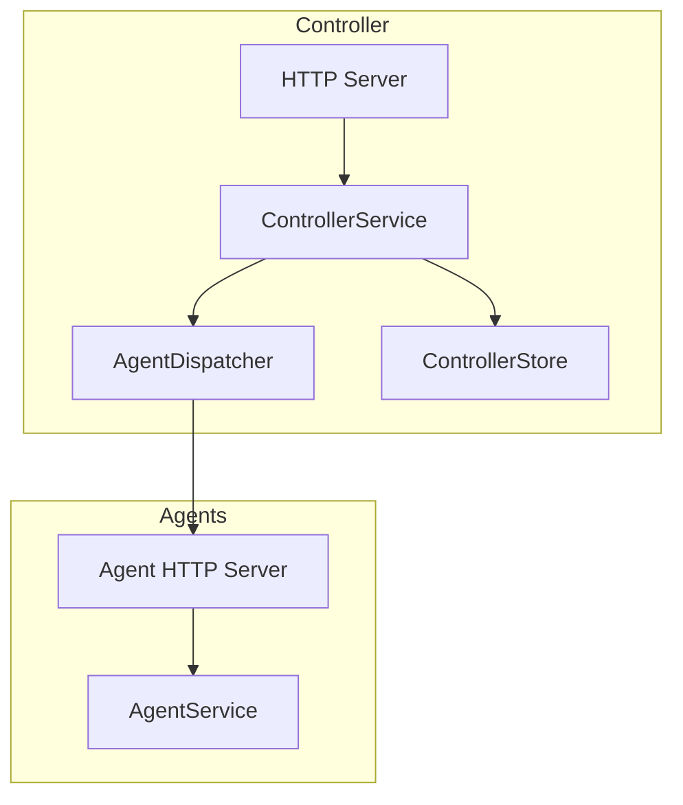
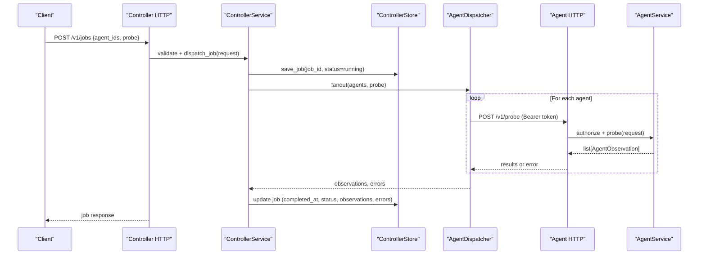
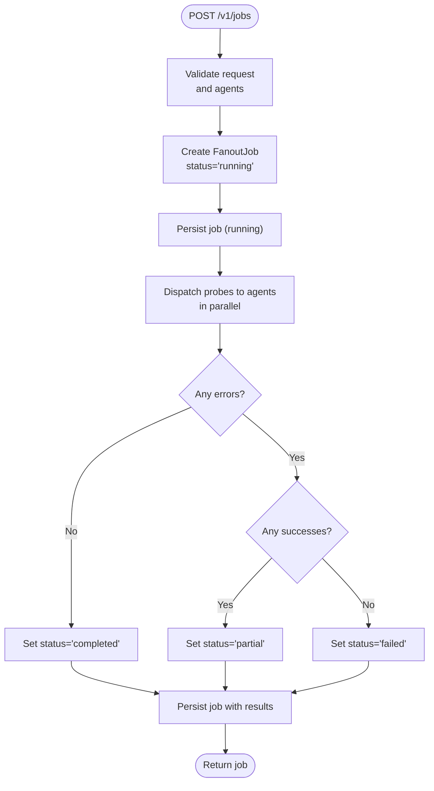
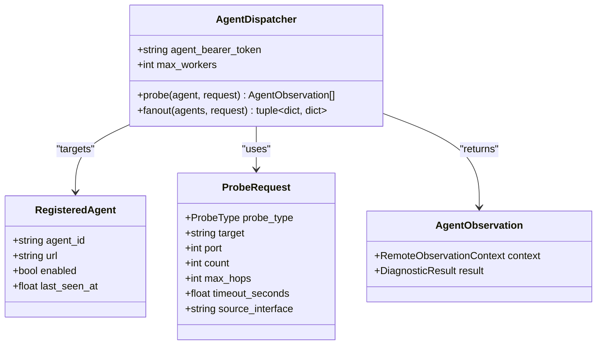
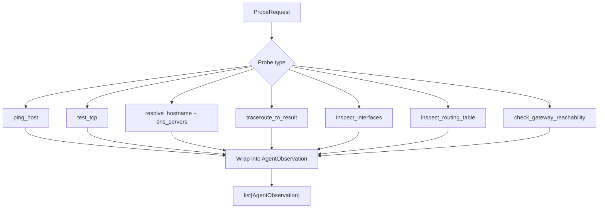
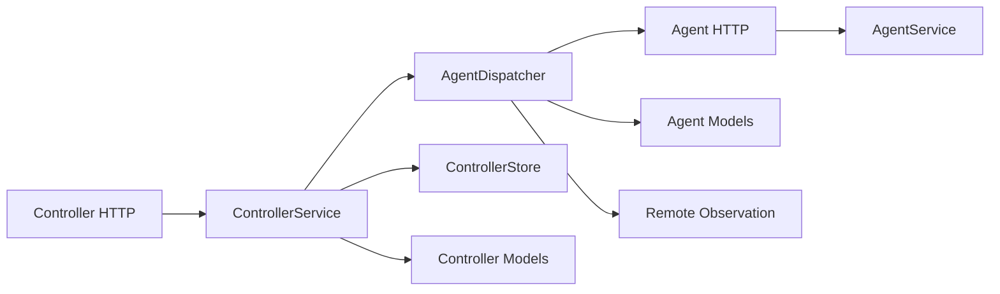

# Job Dispatching

<cite>
**Referenced Files in This Document**
- [dispatch.py](file://controller/dispatch.py)
- [models.py](file://controller/models.py)
- [service.py](file://controller/service.py)
- [http_server.py](file://controller/http_server.py)
- [store.py](file://controller/store.py)
- [models.py](file://agent/models.py)
- [service.py](file://agent/service.py)
- [http_server.py](file://agent/http_server.py)
- [remote_observation.py](file://core/remote_observation.py)
</cite>

## Table of Contents
1. [Introduction](#introduction)
2. [Project Structure](#project-structure)
3. [Core Components](#core-components)
4. [Architecture Overview](#architecture-overview)
5. [Detailed Component Analysis](#detailed-component-analysis)
6. [Dependency Analysis](#dependency-analysis)
7. [Performance Considerations](#performance-considerations)
8. [Troubleshooting Guide](#troubleshooting-guide)
9. [Conclusion](#conclusion)

## Introduction
This document explains the NetForge Controller’s job dispatching system for distributed diagnostics. It covers how a FanoutJob is created, how jobs transition through states from running to completed/partial/failed, and how probes are dispatched in parallel to multiple agents. It also documents the request model (FanoutJobRequest), probe specification, result collection patterns, error handling strategies, and performance considerations for large-scale deployments.

## Project Structure
The job dispatching system spans controller and agent components:
- Controller HTTP API exposes endpoints to register agents and submit fanout jobs.
- Controller service orchestrates job creation, validation, and persistence.
- Dispatcher fans out probe requests to registered agents concurrently.
- Agent service executes diagnostic probes and returns observations.
- Store persists agents and jobs using SQLite.

**Diagram sources**
- [http_server.py:16-68](file://controller/http_server.py#L16-L68)
- [service.py:17-50](file://controller/service.py#L17-L50)
- [dispatch.py:19-51](file://controller/dispatch.py#L19-L51)
- [store.py:13-78](file://controller/store.py#L13-L78)
- [http_server.py:15-62](file://agent/http_server.py#L15-L62)
- [service.py:33-111](file://agent/service.py#L33-L111)

**Section sources**
- [http_server.py:16-68](file://controller/http_server.py#L16-L68)
- [service.py:17-50](file://controller/service.py#L17-L50)
- [dispatch.py:19-51](file://controller/dispatch.py#L19-L51)
- [store.py:13-78](file://controller/store.py#L13-L78)
- [http_server.py:15-62](file://agent/http_server.py#L15-L62)
- [service.py:33-111](file://agent/service.py#L33-L111)

## Core Components
- FanoutJobRequest: Defines which agents to target and what probe to run.
- FanoutJob: Represents a submitted job with lifecycle state and results/errors.
- AgentDispatcher: Concurrently sends probe requests to multiple agents and aggregates results and errors.
- ControllerService: Validates agents, creates jobs, runs fanout, updates job state, and persists outcomes.
- AgentService: Executes specific diagnostic probes and returns structured observations.
- Remote observation models: Envelope for provenance and result metadata returned by agents.

Key responsibilities:
- Request validation and authorization at both controller and agent boundaries.
- Parallel execution across agents with bounded concurrency.
- Fault-tolerant aggregation: successful agents contribute observations; failures are recorded per agent.
- Persistence of job state transitions and results.

**Section sources**
- [models.py:24-37](file://controller/models.py#L24-L37)
- [dispatch.py:19-51](file://controller/dispatch.py#L19-L51)
- [service.py:17-50](file://controller/service.py#L17-L50)
- [models.py:23-40](file://agent/models.py#L23-L40)
- [service.py:58-111](file://agent/service.py#L58-L111)
- [remote_observation.py:15-59](file://core/remote_observation.py#L15-L59)

## Architecture Overview
End-to-end flow from job submission to completion:

**Diagram sources**
- [http_server.py:43-51](file://controller/http_server.py#L43-L51)
- [service.py:30-47](file://controller/service.py#L30-L47)
- [dispatch.py:40-51](file://controller/dispatch.py#L40-L51)
- [http_server.py:36-39](file://agent/http_server.py#L36-L39)
- [service.py:58-63](file://agent/service.py#L58-L63)

## Detailed Component Analysis

### FanoutJob Creation and Lifecycle
- Creation: On receiving a POST to /v1/jobs, the controller validates the request, verifies all requested agents exist and are enabled, creates a FanoutJob with status "running", and persists it.
- Execution: The dispatcher fans out the probe to all selected agents concurrently. Observations are collected per agent; errors are captured per agent.
- Completion: After all futures complete, the controller marks agents as seen, sets completed_at, and computes final status:
  - "completed" if no errors occurred
  - "partial" if some agents succeeded and some failed
  - "failed" if no agents succeeded
- Querying: Clients can retrieve the job via GET /v1/jobs/{job_id}.

**Diagram sources**
- [service.py:30-47](file://controller/service.py#L30-L47)
- [store.py:64-72](file://controller/store.py#L64-L72)

**Section sources**
- [http_server.py:43-51](file://controller/http_server.py#L43-L51)
- [service.py:30-47](file://controller/service.py#L30-L47)
- [store.py:64-72](file://controller/store.py#L64-L72)

### Fanout Mechanism and Parallel Execution
- Concurrency: Uses a thread pool executor with bounded workers to dispatch probes to multiple agents concurrently.
- Fault tolerance: Each agent call is isolated; exceptions are caught and recorded under errors keyed by agent_id. Successful responses populate observations keyed by agent_id.
- Timeouts: Probe timeout is extended slightly beyond the request’s timeout to account for network overhead.

**Diagram sources**
- [dispatch.py:19-51](file://controller/dispatch.py#L19-L51)
- [models.py:19-22](file://controller/models.py#L19-L22)
- [models.py:23-40](file://agent/models.py#L23-L40)
- [remote_observation.py:54-59](file://core/remote_observation.py#L54-L59)

**Section sources**
- [dispatch.py:19-51](file://controller/dispatch.py#L19-L51)

### Probe Specification and Result Collection
- ProbeRequest defines the type of diagnostic (ICMP, TCP, DNS, TRACEROUTE, INTERFACES, ROUTE, GATEWAY) and parameters such as target, port, count, max_hops, timeout, and source interface. Validation enforces required fields per probe type.
- AgentService maps probe types to concrete diagnostics and wraps results into AgentObservation with rich context (provenance, timing, topology tags, evidence quality).
- Controller collects observations per agent and stores them in the job payload.

**Diagram sources**
- [models.py:23-40](file://agent/models.py#L23-L40)
- [service.py:73-90](file://agent/service.py#L73-L90)
- [service.py:92-111](file://agent/service.py#L92-L111)

**Section sources**
- [models.py:23-40](file://agent/models.py#L23-L40)
- [service.py:58-111](file://agent/service.py#L58-L111)

### Error Handling Strategies
- Authorization: Both controller and agent enforce Bearer token authentication. Mismatched tokens yield UNAUTHORIZED responses.
- Validation: Pydantic validators reject malformed requests; controller surfaces validation errors as BAD_REQUEST.
- Unknown or disabled agents: Controller raises an error when requesting unknown or disabled agents, resulting in BAD_REQUEST.
- Network/runtime errors: Dispatcher catches transport and timeout errors per agent and records them under errors keyed by agent_id without failing the entire job.
- Target restrictions: Agents may restrict allowed targets; violations return BAD_REQUEST.

**Section sources**
- [http_server.py:30-55](file://controller/http_server.py#L30-L55)
- [service.py:30-47](file://controller/service.py#L30-L47)
- [dispatch.py:24-51](file://controller/dispatch.py#L24-L51)
- [http_server.py:29-45](file://agent/http_server.py#L29-L45)
- [service.py:37-40](file://agent/service.py#L37-L40)
- [service.py:65-71](file://agent/service.py#L65-L71)

### Job Submission Workflow Examples
- Register an agent: POST /v1/agents with agent_id, url, and optional topology_tags.
- Submit a fanout job: POST /v1/jobs with agent_ids and a probe object.
- Retrieve job status/results: GET /v1/jobs/{job_id}.

Notes:
- All endpoints require Authorization: Bearer <token>.
- Responses include the persisted job model with status, observations, and errors.

**Section sources**
- [http_server.py:36-51](file://controller/http_server.py#L36-L51)

## Dependency Analysis
High-level dependencies between modules:

**Diagram sources**
- [http_server.py:16-68](file://controller/http_server.py#L16-L68)
- [service.py:17-50](file://controller/service.py#L17-L50)
- [dispatch.py:19-51](file://controller/dispatch.py#L19-L51)
- [http_server.py:15-62](file://agent/http_server.py#L15-L62)
- [service.py:33-111](file://agent/service.py#L33-L111)
- [models.py:24-37](file://controller/models.py#L24-L37)
- [models.py:23-40](file://agent/models.py#L23-L40)
- [remote_observation.py:15-59](file://core/remote_observation.py#L15-L59)

**Section sources**
- [http_server.py:16-68](file://controller/http_server.py#L16-L68)
- [service.py:17-50](file://controller/service.py#L17-L50)
- [dispatch.py:19-51](file://controller/dispatch.py#L19-L51)
- [http_server.py:15-62](file://agent/http_server.py#L15-L62)
- [service.py:33-111](file://agent/service.py#L33-L111)
- [models.py:24-37](file://controller/models.py#L24-L37)
- [models.py:23-40](file://agent/models.py#L23-L40)
- [remote_observation.py:15-59](file://core/remote_observation.py#L15-L59)

## Performance Considerations
- Bounded concurrency: The dispatcher limits concurrent probes via a thread pool sized to min(max_workers, number_of_agents). Tune max_workers based on expected agent count and resource constraints.
- Timeouts: Probe timeouts propagate to network calls; ensure reasonable values to avoid long-running tasks.
- Batch sizing: Limit agent_ids to a practical size per job to control memory usage and response sizes.
- I/O bound workloads: Probes are primarily I/O-bound; threads are appropriate. If CPU-heavy diagnostics are added, consider process-based workers.
- Persistence: Jobs are persisted after completion; for very high throughput, consider asynchronous writes or batching.

[No sources needed since this section provides general guidance]

## Troubleshooting Guide
Common issues and where they originate:
- Unauthorized access: Ensure Authorization header matches the configured bearer token on both controller and agent sides.
- Validation errors: Check that ProbeRequest fields match probe type requirements (e.g., target required for targeted probes, port required for TCP).
- Unknown or disabled agents: Verify agent registration and enabled status before submitting jobs.
- Partial failures: Inspect job.errors to identify failing agents and their error messages; observations will still be present for successful agents.
- Network timeouts: Increase timeout_seconds or adjust network conditions; dispatcher extends timeout slightly beyond request value.

**Section sources**
- [http_server.py:30-55](file://controller/http_server.py#L30-L55)
- [http_server.py:29-45](file://agent/http_server.py#L29-L45)
- [service.py:30-47](file://controller/service.py#L30-L47)
- [dispatch.py:24-51](file://controller/dispatch.py#L24-L51)

## Conclusion
The NetForge Controller’s job dispatching system provides a robust, fault-tolerant mechanism for running distributed diagnostics across multiple agents. It uses a clear request model, parallel execution with bounded concurrency, and comprehensive error handling to deliver reliable results. Jobs transition deterministically through states, capturing both successes and failures per agent, enabling operators to diagnose partial outages and overall health at scale.