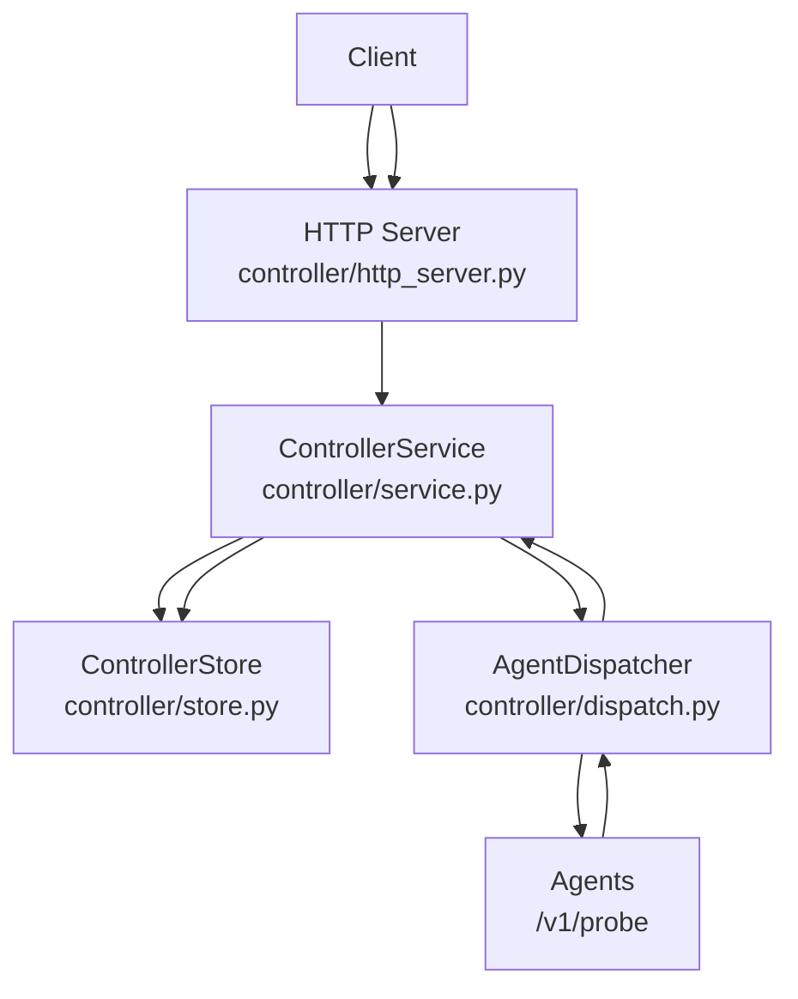
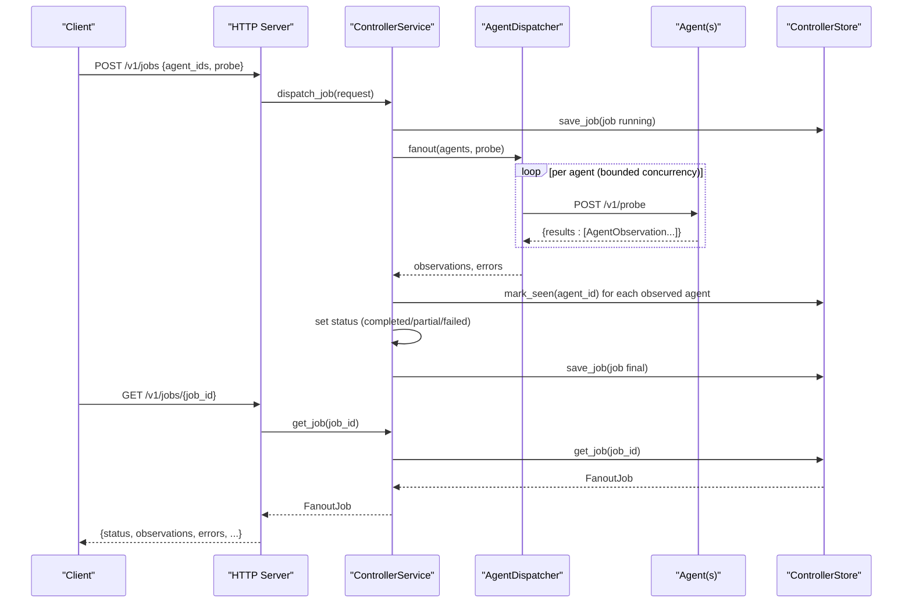
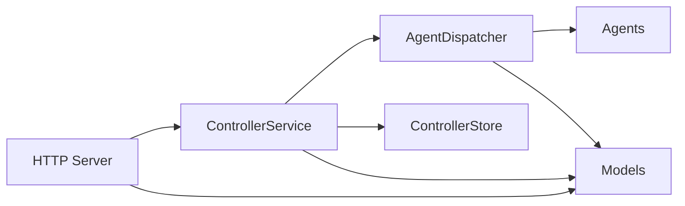

# Result Aggregation

<cite>
**Referenced Files in This Document**
- [controller/store.py](file://controller/store.py)
- [controller/service.py](file://controller/service.py)
- [controller/http_server.py](file://controller/http_server.py)
- [controller/models.py](file://controller/models.py)
- [controller/dispatch.py](file://controller/dispatch.py)
- [core/remote_observation.py](file://core/remote_observation.py)
- [core/result.py](file://core/result.py)
- [agent/models.py](file://agent/models.py)
- [tests/test_controller_service.py](file://tests/test_controller_service.py)
- [tests/test_controller_http.py](file://tests/test_controller_http.py)
</cite>

## Table of Contents
1. [Introduction](#introduction)
2. [Project Structure](#project-structure)
3. [Core Components](#core-components)
4. [Architecture Overview](#architecture-overview)
5. [Detailed Component Analysis](#detailed-component-analysis)
6. [Dependency Analysis](#dependency-analysis)
7. [Performance Considerations](#performance-considerations)
8. [Troubleshooting Guide](#troubleshooting-guide)
9. [Conclusion](#conclusion)
10. [Appendices](#appendices)

## Introduction
This document explains the NetForge Controller’s result aggregation system: how observations from multiple agents are collected, stored, and retrieved via the get_job endpoint; how jobs are persisted using ControllerStore with status updates, observation storage, and error tracking; and how data flows from agent responses back to the controller, including partial success scenarios where some agents complete successfully while others fail. It also provides examples of result retrieval workflows, querying patterns, and best practices for handling large volumes of diagnostic results.

## Project Structure
The result aggregation spans several modules:
- HTTP API layer exposes endpoints for job creation and retrieval.
- Service orchestrates job dispatching and persistence.
- Dispatcher fans out probes to agents concurrently and collects observations or errors.
- Store persists jobs and agent metadata to SQLite.
- Models define request/response contracts and observation envelopes.

**Diagram sources**
- [controller/http_server.py:16-68](file://controller/http_server.py#L16-L68)
- [controller/service.py:17-51](file://controller/service.py#L17-L51)
- [controller/dispatch.py:19-52](file://controller/dispatch.py#L19-L52)
- [controller/store.py:13-78](file://controller/store.py#L13-L78)

**Section sources**
- [controller/http_server.py:16-68](file://controller/http_server.py#L16-L68)
- [controller/service.py:17-51](file://controller/service.py#L17-L51)
- [controller/dispatch.py:19-52](file://controller/dispatch.py#L19-L52)
- [controller/store.py:13-78](file://controller/store.py#L13-L78)

## Core Components
- ControllerStore: SQLite-backed persistence for agents and jobs. Provides upserts for agents and save/get for jobs. Jobs store payload as JSON, enabling full reconstruction on retrieval.
- ControllerService: Orchestrates agent registration, job dispatch, and job retrieval. Validates agents, creates jobs, runs fanout, updates status, and persists final state.
- AgentDispatcher: Concurrently probes registered agents and aggregates per-agent observations and errors.
- HTTP Server: Exposes authenticated endpoints for health, agent management, job creation, and job retrieval.
- Models: Define request/response types (FanoutJobRequest, FanoutJob), agent registration, and observation envelopes (AgentObservation, RemoteObservationContext, DiagnosticResult).

Key responsibilities:
- Job lifecycle: create (running), update (partial/completed/failed), retrieve.
- Observation storage: per-agent list of AgentObservation attached to the job.
- Error tracking: per-agent error messages when probing fails.
- Status determination: completed if no errors; failed if no observations; partial otherwise.

**Section sources**
- [controller/store.py:13-78](file://controller/store.py#L13-L78)
- [controller/service.py:17-51](file://controller/service.py#L17-L51)
- [controller/dispatch.py:19-52](file://controller/dispatch.py#L19-L52)
- [controller/models.py:13-38](file://controller/models.py#L13-L38)
- [core/remote_observation.py:15-59](file://core/remote_observation.py#L15-L59)
- [core/result.py:9-47](file://core/result.py#L9-L47)

## Architecture Overview
End-to-end flow from client to aggregated results:

**Diagram sources**
- [controller/http_server.py:30-55](file://controller/http_server.py#L30-L55)
- [controller/service.py:30-51](file://controller/service.py#L30-L51)
- [controller/dispatch.py:24-52](file://controller/dispatch.py#L24-L52)
- [controller/store.py:64-78](file://controller/store.py#L64-L78)

## Detailed Component Analysis

### ControllerStore: Job Persistence and Retrieval
- Schema: Two tables—agents and jobs. Jobs include job_id, created_at, completed_at, status, and payload (JSON).
- Upsert semantics: Agents are upserted by agent_id; jobs are upserted by job_id to support status transitions and finalization.
- Retrieval: get_job returns a fully reconstructed FanoutJob from stored JSON payload.

Status and observation storage:
- On dispatch, a job is saved with status "running".
- After fanout, observations and errors are attached to the job, timestamps updated, and status set based on outcomes.
- Final state is persisted again so clients can poll or fetch later.

Best practices:
- Use get_job to retrieve finalized results.
- For large payloads, consider pagination at the API layer if needed (not implemented here).
- Monitor database size and consider archival strategies for long-lived histories.

**Section sources**
- [controller/store.py:23-78](file://controller/store.py#L23-L78)
- [controller/service.py:30-51](file://controller/service.py#L30-L51)

### ControllerService: Orchestration and Status Logic
- Validates requested agents exist and are enabled before dispatch.
- Creates a job record immediately to ensure traceability.
- Calls dispatcher.fanout to collect observations and errors concurrently.
- Updates last seen timestamps for agents that responded.
- Determines final status:
  - "completed" if no errors
  - "failed" if no observations
  - "partial" if some agents succeeded and some failed
- Persists the final job state.

Partial success handling:
- Observations map agent_id -> list of AgentObservation.
- Errors map agent_id -> error message string.
- Clients can inspect both maps to understand which agents contributed results and which failed.

**Section sources**
- [controller/service.py:17-51](file://controller/service.py#L17-L51)

### AgentDispatcher: Concurrent Fan-out and Aggregation
- Bounded concurrency via ThreadPoolExecutor to avoid overwhelming agents or the host.
- For each agent, sends a POST to /v1/probe with the ProbeRequest.
- Parses response into a list of AgentObservation.
- Aggregates per-agent results and exceptions into two maps: observations and errors.
- Returns both maps to the service for finalization.

Error handling:
- Network errors, timeouts, and HTTP errors are captured and recorded per agent without failing the entire job.

**Section sources**
- [controller/dispatch.py:19-52](file://controller/dispatch.py#L19-L52)
- [agent/models.py:23-41](file://agent/models.py#L23-L41)

### HTTP Server: Endpoints and Authentication
- Authenticated via Bearer token; rejects unauthorized requests.
- Endpoints:
  - GET /v1/health
  - GET /v1/agents
  - POST /v1/agents
  - POST /v1/jobs
  - GET /v1/jobs/{job_id}
- The get_job endpoint retrieves the persisted FanoutJob and returns it as JSON.

Validation and error mapping:
- Validation errors and unknown agent errors are mapped to appropriate HTTP status codes.

**Section sources**
- [controller/http_server.py:16-68](file://controller/http_server.py#L16-L68)
- [tests/test_controller_http.py:17-39](file://tests/test_controller_http.py#L17-L39)

### Data Models and Observation Envelope
- FanoutJobRequest: specifies target agents and the probe to run.
- FanoutJob: includes job identity, timestamps, request, status, observations, errors, and optional metadata.
- AgentObservation: wraps RemoteObservationContext and a DiagnosticResult.
- RemoteObservationContext: provenance fields such as agent_id, hostname, timestamp, probe_type, target, topology tags, evidence quality, and confidence.
- DiagnosticResult: standardized module output with status, severity, summary, metrics, evidence, warnings, errors, and metadata.

These models ensure consistent serialization and validation across the controller and agents.

**Section sources**
- [controller/models.py:13-38](file://controller/models.py#L13-L38)
- [core/remote_observation.py:15-59](file://core/remote_observation.py#L15-L59)
- [core/result.py:9-47](file://core/result.py#L9-L47)

## Dependency Analysis
High-level dependencies among core components:

**Diagram sources**
- [controller/http_server.py:16-68](file://controller/http_server.py#L16-L68)
- [controller/service.py:17-51](file://controller/service.py#L17-L51)
- [controller/dispatch.py:19-52](file://controller/dispatch.py#L19-L52)
- [controller/models.py:13-38](file://controller/models.py#L13-L38)

**Section sources**
- [controller/http_server.py:16-68](file://controller/http_server.py#L16-L68)
- [controller/service.py:17-51](file://controller/service.py#L17-L51)
- [controller/dispatch.py:19-52](file://controller/dispatch.py#L19-L52)
- [controller/models.py:13-38](file://controller/models.py#L13-L38)

## Performance Considerations
- Concurrency: Dispatcher uses bounded thread pools to limit concurrent probes. Tune max_workers to balance throughput and resource usage.
- Payload size: Each job stores all observations and errors in JSON. For large volumes, consider:
  - Archiving completed jobs after retrieval.
  - Implementing server-side pagination or filtering at the API layer.
  - Compressing payloads if necessary.
- Database I/O: Jobs are written twice (initial and final). Ensure SQLite file is on reliable storage and consider WAL mode for better concurrency if scaling beyond single-process usage.
- Timeouts: ProbeRequest timeout_seconds influences network latency and overall job duration. Adjust based on network conditions.

[No sources needed since this section provides general guidance]

## Troubleshooting Guide
Common issues and resolutions:
- Unauthorized access: Ensure Authorization header matches the configured bearer token.
- Unknown or disabled agent: Validate agent registration and enabled flag before dispatching.
- Partial failures: Inspect job.errors to identify failed agents and their error messages.
- Missing observations: If job.status is "failed", check whether any agents responded; verify connectivity and agent availability.
- Large responses: If retrieving very large jobs, consider limiting polling frequency and caching results locally.

Relevant behaviors:
- Status logic: completed if no errors; failed if no observations; partial otherwise.
- Last seen updates: Only agents that respond successfully have their last_seen_at updated.

**Section sources**
- [controller/service.py:30-51](file://controller/service.py#L30-L51)
- [controller/http_server.py:30-55](file://controller/http_server.py#L30-L55)
- [tests/test_controller_service.py:18-34](file://tests/test_controller_service.py#L18-L34)

## Conclusion
The NetForge Controller’s result aggregation system provides robust, persistent, and queryable collection of multi-agent diagnostic results. Jobs are created immediately, dispatched concurrently, and finalized with clear status semantics that capture partial successes. Observations and errors are stored per agent within the job payload, enabling detailed post-mortem analysis and flexible querying. Following the recommended best practices ensures scalability and reliability when handling large volumes of diagnostic data.

[No sources needed since this section summarizes without analyzing specific files]

## Appendices

### Example Workflows

#### Create a Job and Retrieve Results
- POST /v1/jobs with agent_ids and probe details.
- Poll GET /v1/jobs/{job_id} until status indicates completion or failure.
- Inspect observations and errors to determine per-agent outcomes.

**Section sources**
- [controller/http_server.py:30-55](file://controller/http_server.py#L30-L55)
- [controller/service.py:30-51](file://controller/service.py#L30-L51)

#### Query Patterns
- Filter by job_id to retrieve a specific job.
- Within the returned job, iterate over observations by agent_id to aggregate metrics.
- Use errors map to identify problematic agents and correlate with topology tags in context.

**Section sources**
- [controller/models.py:29-38](file://controller/models.py#L29-L38)
- [core/remote_observation.py:15-59](file://core/remote_observation.py#L15-L59)

#### Best Practices for Large Volumes
- Limit concurrent workers to match agent capacity and network bandwidth.
- Archive or delete completed jobs after processing to manage storage growth.
- Implement client-side caching and deduplication to reduce repeated retrievals.
- Monitor job sizes and adjust thresholds for alerting on unusually large payloads.

[No sources needed since this section provides general guidance]