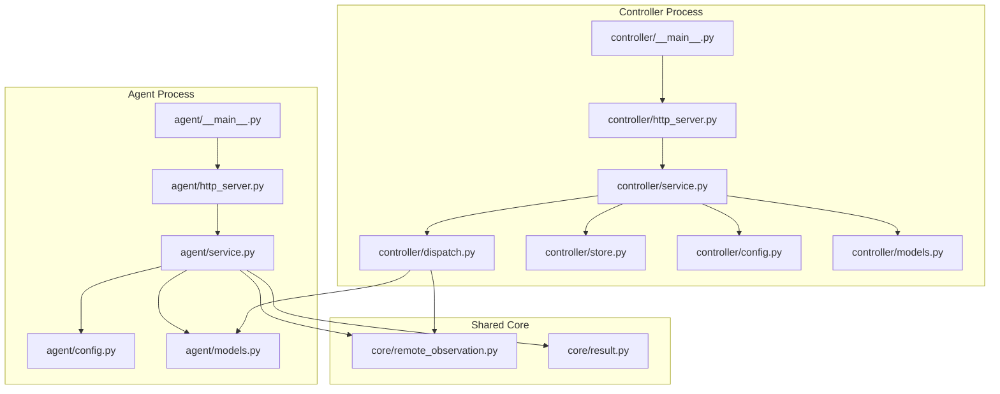
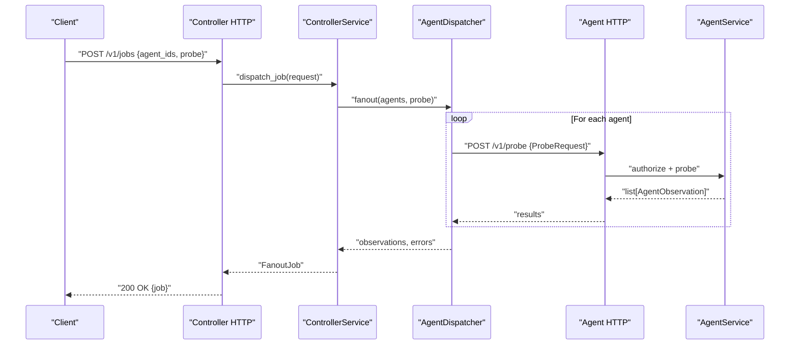
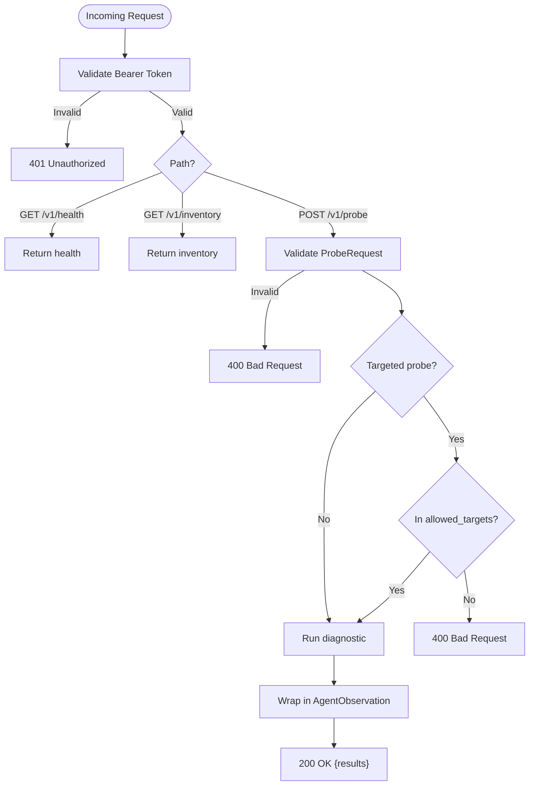
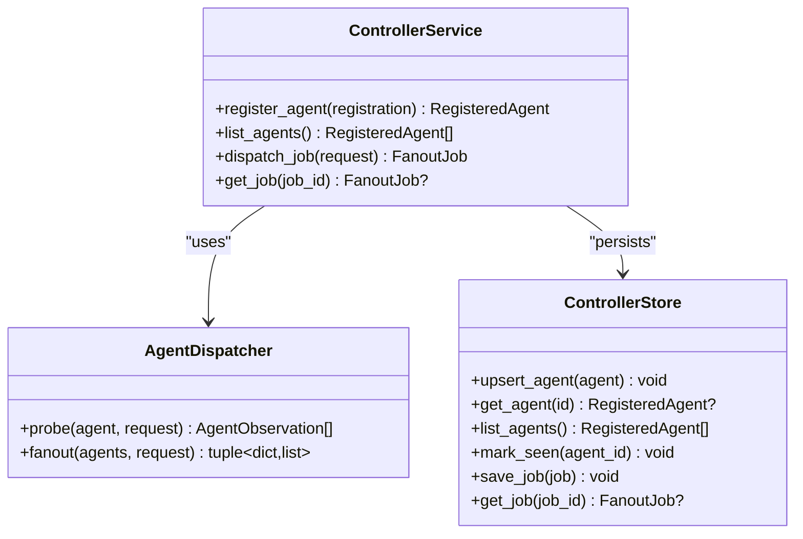
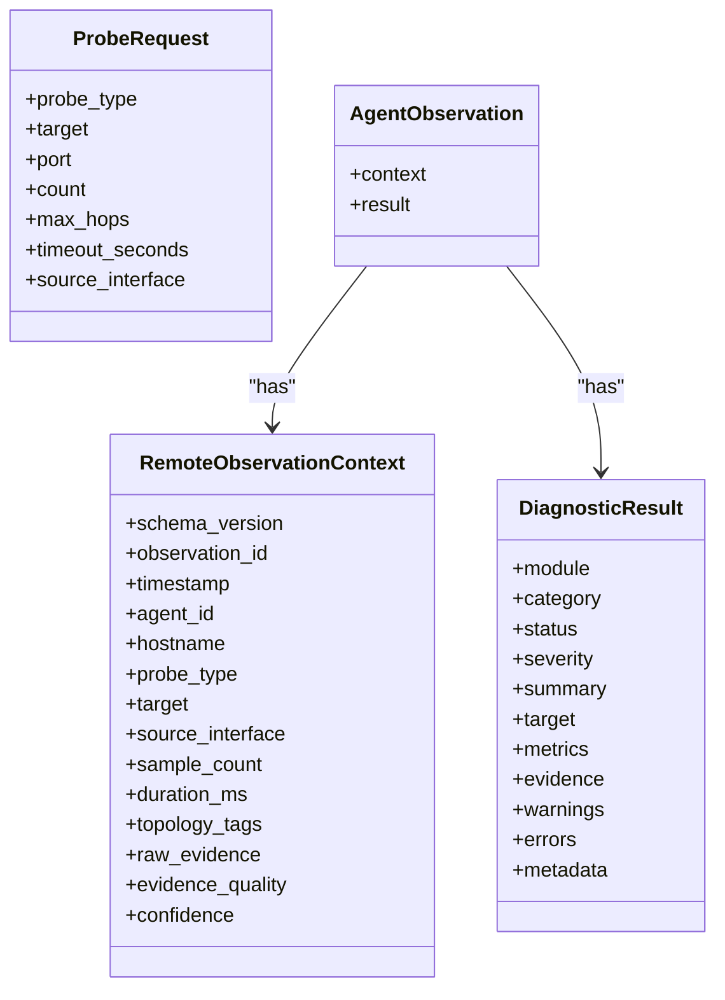
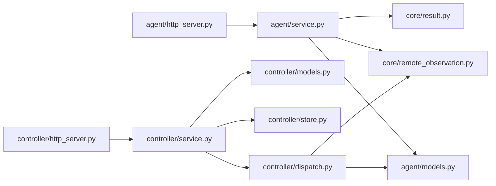

# Distributed Architecture

<cite>
**Referenced Files in This Document**
- [README.md](file://README.md)
- [agent/__main__.py](file://agent/__main__.py)
- [controller/__main__.py](file://controller/__main__.py)
- [agent/config.py](file://agent/config.py)
- [controller/config.py](file://controller/config.py)
- [agent/http_server.py](file://agent/http_server.py)
- [controller/http_server.py](file://controller/http_server.py)
- [agent/service.py](file://agent/service.py)
- [controller/service.py](file://controller/service.py)
- [controller/dispatch.py](file://controller/dispatch.py)
- [agent/models.py](file://agent/models.py)
- [controller/models.py](file://controller/models.py)
- [controller/store.py](file://controller/store.py)
- [core/remote_observation.py](file://core/remote_observation.py)
- [core/result.py](file://core/result.py)
</cite>

## Table of Contents
1. [Introduction](#introduction)
2. [Project Structure](#project-structure)
3. [Core Components](#core-components)
4. [Architecture Overview](#architecture-overview)
5. [Detailed Component Analysis](#detailed-component-analysis)
6. [Dependency Analysis](#dependency-analysis)
7. [Performance Considerations](#performance-considerations)
8. [Troubleshooting Guide](#troubleshooting-guide)
9. [Conclusion](#conclusion)
10. [Appendices](#appendices)

## Introduction
NetForge is a distributed network diagnostics framework that separates data collection from coordination and analysis. Agents run on remote hosts to collect observations (e.g., ICMP, TCP, DNS, traceroute), while controllers orchestrate jobs, dispatch probes to multiple agents concurrently, aggregate results, and persist job outcomes. The system exposes HTTP APIs for both agent health/inventory/probing and controller job management and agent registration.

This document explains the separation of concerns between agents and controllers, the HTTP-based communication protocol, authentication mechanisms, job dispatching patterns, result aggregation strategies, deployment considerations, scaling approaches, security configurations, monitoring strategies, fault tolerance, error handling, and operational best practices for production deployments.

**Section sources**
- [README.md:1-22](file://README.md#L1-L22)

## Project Structure
The repository organizes functionality by role and layer:
- Agent process: configuration, HTTP server, service logic, and request models
- Controller process: configuration, HTTP server, service logic, dispatcher, store, and models
- Shared core types: observation envelopes and diagnostic result schema
- Diagnostics modules: concrete collectors used by agents
- Storage: SQLite-backed persistence for controller state

**Diagram sources**
- [agent/__main__.py:1-22](file://agent/__main__.py#L1-L22)
- [controller/__main__.py:1-26](file://controller/__main__.py#L1-L26)
- [agent/http_server.py:1-63](file://agent/http_server.py#L1-L63)
- [controller/http_server.py:1-73](file://controller/http_server.py#L1-L73)
- [agent/service.py:1-111](file://agent/service.py#L1-L111)
- [controller/service.py:1-51](file://controller/service.py#L1-L51)
- [controller/dispatch.py:1-52](file://controller/dispatch.py#L1-L52)
- [controller/store.py:1-78](file://controller/store.py#L1-L78)
- [agent/config.py:1-35](file://agent/config.py#L1-L35)
- [controller/config.py:1-22](file://controller/config.py#L1-L22)
- [agent/models.py:1-41](file://agent/models.py#L1-L41)
- [controller/models.py:1-38](file://controller/models.py#L1-L38)
- [core/remote_observation.py:1-59](file://core/remote_observation.py#L1-L59)
- [core/result.py:1-47](file://core/result.py#L1-L47)

**Section sources**
- [agent/__main__.py:1-22](file://agent/__main__.py#L1-L22)
- [controller/__main__.py:1-26](file://controller/__main__.py#L1-L26)

## Core Components
- AgentService: Validates authorization, enforces allowed targets, runs diagnostics, and wraps results into standardized observations with provenance metadata.
- ControllerService: Registers agents, lists agents, dispatches fan-out jobs across selected agents, updates last-seen timestamps, and persists job state.
- AgentDispatcher: Concurrently issues HTTP POST requests to agents with bounded concurrency, collects observations, and aggregates errors per agent.
- HTTP Servers: Minimal standard-library servers exposing JSON APIs for health, inventory, probing, agent registration, and job lifecycle.
- Models and Schemas: Pydantic models enforce request/response contracts and ensure consistent serialization across boundaries.
- Store: SQLite-backed persistence for agent registry and job history.

Key responsibilities are cleanly separated:
- Agents own data collection and local validation.
- Controllers own orchestration, dispatch, and persistence.
- Shared core types define the contract at the agent-controller boundary.

**Section sources**
- [agent/service.py:1-111](file://agent/service.py#L1-L111)
- [controller/service.py:1-51](file://controller/service.py#L1-L51)
- [controller/dispatch.py:1-52](file://controller/dispatch.py#L1-L52)
- [agent/http_server.py:1-63](file://agent/http_server.py#L1-L63)
- [controller/http_server.py:1-73](file://controller/http_server.py#L1-L73)
- [agent/models.py:1-41](file://agent/models.py#L1-L41)
- [controller/models.py:1-38](file://controller/models.py#L1-L38)
- [controller/store.py:1-78](file://controller/store.py#L1-L78)
- [core/remote_observation.py:1-59](file://core/remote_observation.py#L1-L59)
- [core/result.py:1-47](file://core/result.py#L1-L47)

## Architecture Overview
The system follows an agent-controller pattern over HTTP:
- Clients authenticate to the controller via a bearer token.
- The controller registers agents and dispatches fan-out jobs to one or more agents.
- Agents validate incoming requests, enforce target allowlists, execute diagnostics, and return standardized observations.
- The controller aggregates results, records errors, and persists job state.

**Diagram sources**
- [controller/http_server.py:30-55](file://controller/http_server.py#L30-L55)
- [controller/service.py:30-47](file://controller/service.py#L30-L47)
- [controller/dispatch.py:40-51](file://controller/dispatch.py#L40-L51)
- [agent/http_server.py:29-45](file://agent/http_server.py#L29-L45)
- [agent/service.py:58-63](file://agent/service.py#L58-L63)

## Detailed Component Analysis

### Agent Service and HTTP API
- Authorization: Bearer token validated using constant-time comparison to prevent timing attacks.
- Target Allowlisting: For targeted probes, the agent enforces a configured allowlist; otherwise, it rejects the request.
- Probes: Executes diagnostics (ICMP, TCP, DNS, traceroute, interfaces, route, gateway) and returns standardized results.
- Observations: Wraps results with RemoteObservationContext including provenance, tags, evidence quality, and confidence.

**Diagram sources**
- [agent/http_server.py:29-45](file://agent/http_server.py#L29-L45)
- [agent/service.py:37-40](file://agent/service.py#L37-L40)
- [agent/service.py:65-71](file://agent/service.py#L65-L71)
- [agent/service.py:73-90](file://agent/service.py#L73-L90)
- [agent/service.py:92-110](file://agent/service.py#L92-L110)

**Section sources**
- [agent/http_server.py:1-63](file://agent/http_server.py#L1-L63)
- [agent/service.py:1-111](file://agent/service.py#L1-L111)
- [agent/models.py:1-41](file://agent/models.py#L1-L41)

### Controller Service, Dispatcher, and Store
- Registration: Accepts agent registration payloads and persists them with enabled flags and topology tags.
- Job Dispatch: Validates requested agents, creates a job record, fans out probes concurrently, marks agents seen, and updates job status based on success/partial/failure.
- Persistence: Uses SQLite to store agents and jobs with upsert semantics and JSON payload storage for jobs.

**Diagram sources**
- [controller/service.py:17-51](file://controller/service.py#L17-L51)
- [controller/dispatch.py:19-51](file://controller/dispatch.py#L19-L51)
- [controller/store.py:13-78](file://controller/store.py#L13-L78)

**Section sources**
- [controller/service.py:1-51](file://controller/service.py#L1-L51)
- [controller/dispatch.py:1-52](file://controller/dispatch.py#L1-L52)
- [controller/store.py:1-78](file://controller/store.py#L1-L78)

### Data Contracts and Envelopes
- ProbeRequest: Defines probe type, target, port, counts, hops, timeouts, and source interface with strict validation rules.
- AgentObservation: Envelope containing RemoteObservationContext and DiagnosticResult, ensuring consistent provenance and metrics.
- DiagnosticResult: Standardized output schema with module/category/status/severity/metrics/evidence/warnings/errors/metadata.

**Diagram sources**
- [agent/models.py:10-41](file://agent/models.py#L10-L41)
- [core/remote_observation.py:15-59](file://core/remote_observation.py#L15-L59)
- [core/result.py:9-47](file://core/result.py#L9-L47)

**Section sources**
- [agent/models.py:1-41](file://agent/models.py#L1-L41)
- [core/remote_observation.py:1-59](file://core/remote_observation.py#L1-L59)
- [core/result.py:1-47](file://core/result.py#L1-L47)

## Dependency Analysis
- Agent depends on diagnostics modules for actual measurements and on core types for standardized outputs.
- Controller depends on dispatcher for concurrent HTTP calls and on store for persistence.
- Both sides share models and core schemas to maintain a stable contract.

**Diagram sources**
- [agent/http_server.py:1-63](file://agent/http_server.py#L1-L63)
- [agent/service.py:1-111](file://agent/service.py#L1-L111)
- [agent/models.py:1-41](file://agent/models.py#L1-L41)
- [controller/http_server.py:1-73](file://controller/http_server.py#L1-L73)
- [controller/service.py:1-51](file://controller/service.py#L1-L51)
- [controller/dispatch.py:1-52](file://controller/dispatch.py#L1-L52)
- [controller/store.py:1-78](file://controller/store.py#L1-L78)
- [controller/models.py:1-38](file://controller/models.py#L1-L38)
- [core/remote_observation.py:1-59](file://core/remote_observation.py#L1-L59)
- [core/result.py:1-47](file://core/result.py#L1-L47)

**Section sources**
- [agent/service.py:1-111](file://agent/service.py#L1-L111)
- [controller/service.py:1-51](file://controller/service.py#L1-L51)
- [controller/dispatch.py:1-52](file://controller/dispatch.py#L1-L52)

## Performance Considerations
- Concurrency: The dispatcher uses a thread pool with bounded workers to avoid resource exhaustion when fanning out to many agents. Tune max_workers based on expected agent count and network conditions.
- Timeouts: Probe timeouts are enforced per request; the dispatcher adds a small buffer to the agent timeout to account for network latency. Ensure timeouts align with SLAs.
- Serialization: All payloads use JSON with Pydantic models for fast validation and minimal overhead.
- Storage: SQLite provides simple, low-overhead persistence for controller state. For high write throughput or multi-process access, consider WAL mode and connection pooling.

[No sources needed since this section provides general guidance]

## Troubleshooting Guide
Common issues and resolutions:
- Authentication failures:
  - Controller requires a valid bearer token; missing or mismatched tokens yield 401 responses.
  - Agents require a matching bearer token; invalid tokens produce 401 responses.
- Validation errors:
  - Invalid ProbeRequest fields (e.g., missing target for targeted probes, invalid port) return 400 with descriptive errors.
  - Unknown endpoints return 404.
- Target restrictions:
  - If an agent has no allowed targets configured or the requested target is not allowed, the agent returns 400.
- Dispatch errors:
  - Network errors, HTTP errors, and timeouts during agent probing are captured per agent and surfaced in job errors.
- Job status:
  - Jobs report completed, partial, or failed based on presence of observations and errors.

Operational checks:
- Use GET /v1/health on both controller and agent to verify liveness.
- Use GET /v1/agents to inspect registered agents and their last-seen timestamps.
- Use GET /v1/jobs/{id} to retrieve job details and review observations and errors.

**Section sources**
- [controller/http_server.py:30-55](file://controller/http_server.py#L30-L55)
- [agent/http_server.py:29-45](file://agent/http_server.py#L29-L45)
- [controller/service.py:30-47](file://controller/service.py#L30-L47)
- [controller/dispatch.py:24-38](file://controller/dispatch.py#L24-L38)
- [controller/dispatch.py:40-51](file://controller/dispatch.py#L40-L51)

## Conclusion
NetForge’s distributed architecture cleanly separates data collection (agents) from coordination and analysis (controllers). The HTTP-based protocol with bearer token authentication ensures secure, well-defined interactions. The controller’s fan-out dispatcher enables scalable, concurrent probing across many agents, while standardized observation envelopes guarantee consistent provenance and metrics. SQLite-backed persistence supports simple deployments, and clear error handling facilitates robust operations. With careful tuning of timeouts, concurrency, and security settings, NetForge can be deployed reliably in production environments.

[No sources needed since this section summarizes without analyzing specific files]

## Appendices

### Deployment Considerations
- Environment variables:
  - Agent: NETFORGE_AGENT_ID, NETFORGE_AGENT_TOKEN, optional NETFORGE_ALLOWED_TARGETS, and NETFORGE_TAG_* for topology tags.
  - Controller: NETFORGE_CONTROLLER_TOKEN, NETFORGE_AGENT_TOKEN, optional NETFORGE_CONTROLLER_DB path.
- Ports: Default controller listens on 8080; agent on 8081. Configure reverse proxies and firewall rules accordingly.
- Secrets management: Store tokens securely and rotate regularly. Avoid embedding secrets in images; inject at runtime.

**Section sources**
- [agent/config.py:18-35](file://agent/config.py#L18-L35)
- [controller/config.py:15-22](file://controller/config.py#L15-L22)
- [agent/__main__.py:12-17](file://agent/__main__.py#L12-L17)
- [controller/__main__.py:14-21](file://controller/__main__.py#L14-L21)

### Scaling Approaches
- Horizontal scaling of agents: Deploy agents near network segments to reduce latency and capture localized views.
- Controller scaling: Stateless controller services can be horizontally scaled behind a load balancer if multiple instances are used; however, shared SQLite store may become a bottleneck. Consider sharding by tenant or moving to a database with better concurrency support.
- Concurrency tuning: Adjust dispatcher max_workers to match available CPU and network capacity. Monitor queue lengths and response times.

[No sources needed since this section provides general guidance]

### Security Configurations
- Authentication:
  - Controller API requires a bearer token; use HTTPS in front of the controller.
  - Agent API validates bearer tokens; restrict exposure to trusted networks or VPNs.
- Target allowlists:
  - Configure allowed targets per agent to limit blast radius and enforce least privilege.
- Transport security:
  - Place agents and controllers behind TLS-terminating proxies.
  - Consider mTLS for mutual authentication in future iterations.

**Section sources**
- [controller/http_server.py:30-34](file://controller/http_server.py#L30-L34)
- [agent/service.py:37-40](file://agent/service.py#L37-L40)
- [agent/service.py:65-71](file://agent/service.py#L65-L71)

### Monitoring Strategies
- Health endpoints:
  - Poll GET /v1/health on both controller and agents for liveness and readiness.
- Agent discovery and freshness:
  - Periodically query GET /v1/agents to check last_seen_at and enable/disable agents as needed.
- Job observability:
  - Track job creation, completion, and status transitions. Inspect observations and errors for anomalies.
- Metrics:
  - Instrument dispatcher concurrency, error rates, and latencies.
  - Capture agent-side durations and evidence quality to assess data reliability.

**Section sources**
- [controller/http_server.py:36-42](file://controller/http_server.py#L36-L42)
- [controller/service.py:30-47](file://controller/service.py#L30-L47)
- [agent/http_server.py:32-39](file://agent/http_server.py#L32-L39)