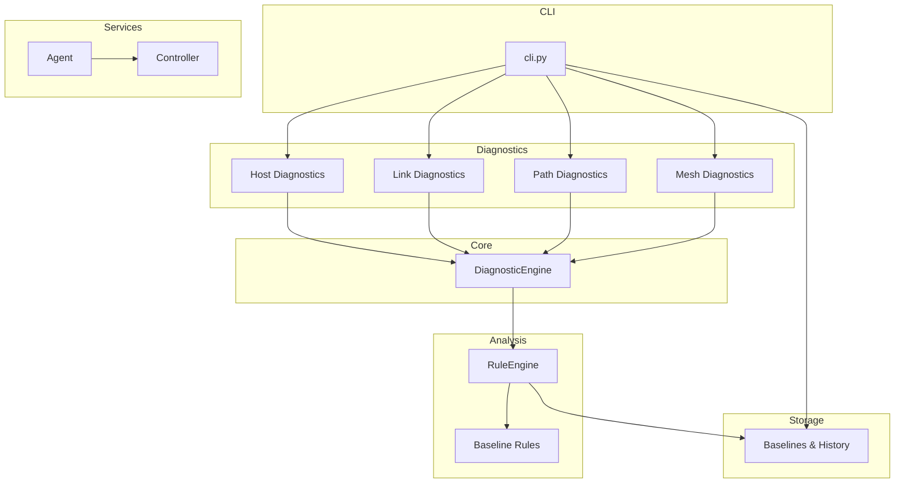
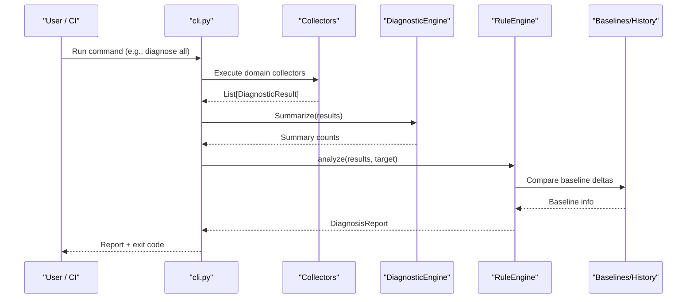
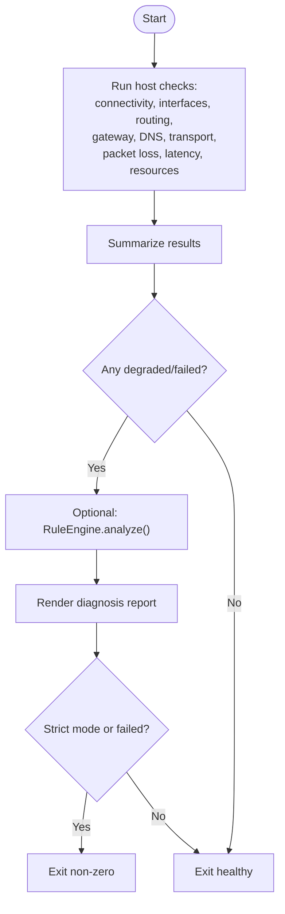
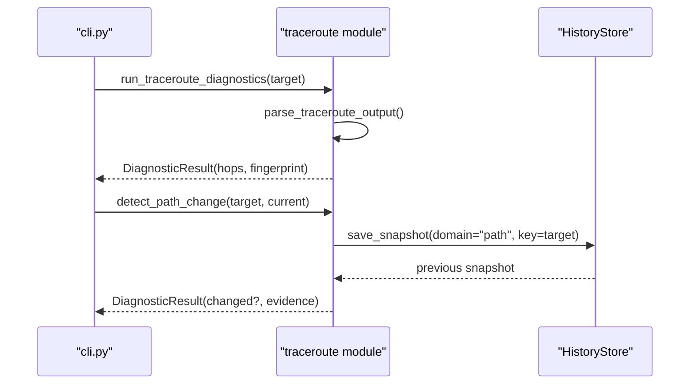
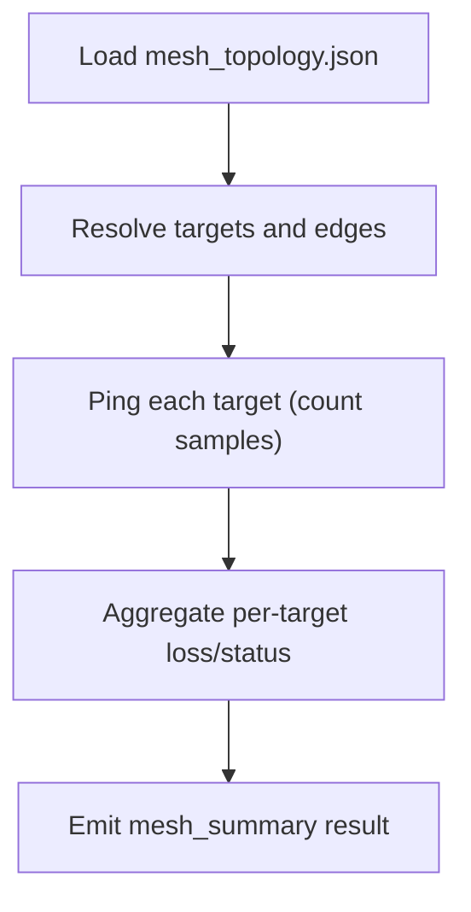
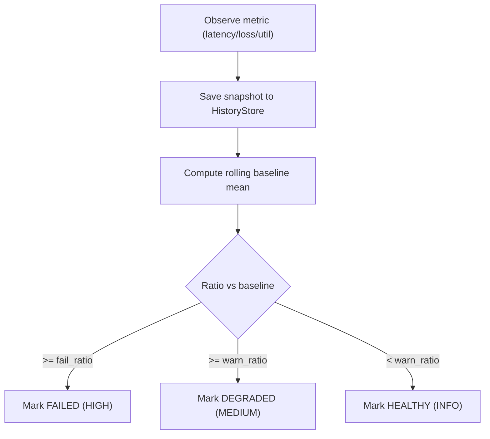
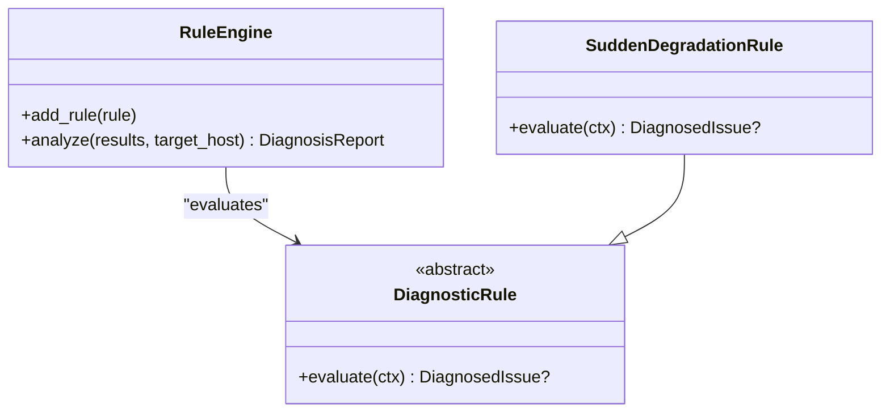
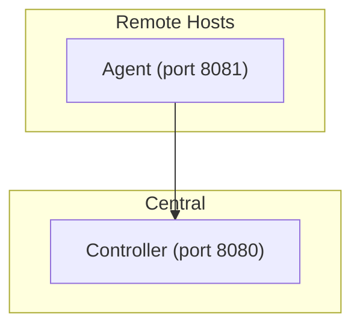
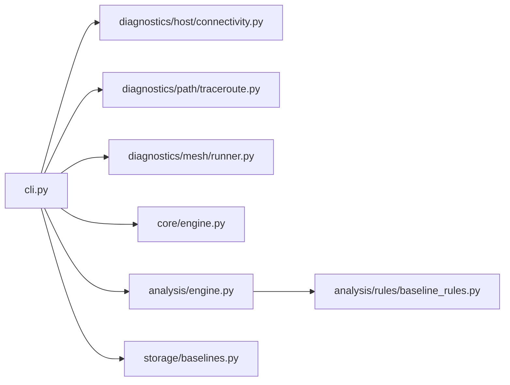

# Examples and Use Cases

<cite>
**Referenced Files in This Document**
- [README.md](file://README.md)
- [cli.py](file://cli.py)
- [pyproject.toml](file://pyproject.toml)
- [core/engine.py](file://core/engine.py)
- [analysis/engine.py](file://analysis/engine.py)
- [analysis/rules/baseline_rules.py](file://analysis/rules/baseline_rules.py)
- [collectors/local.py](file://collectors/local.py)
- [storage/baselines.py](file://storage/baselines.py)
- [diagnostics/host/connectivity.py](file://diagnostics/host/connectivity.py)
- [diagnostics/path/traceroute.py](file://diagnostics/path/traceroute.py)
- [diagnostics/mesh/runner.py](file://diagnostics/mesh/runner.py)
- [agent/__main__.py](file://agent/__main__.py)
- [controller/__main__.py](file://controller/__main__.py)
- [agent/config.py](file://agent/config.py)
- [controller/config.py](file://controller/config.py)
- [examples/flows_sample.json](file://examples/flows_sample.json)
- [examples/mesh_topology.json](file://examples/mesh_topology.json)
</cite>

## Table of Contents
1. Introduction
2. Project Structure
3. Core Components
4. Architecture Overview
5. Detailed Component Analysis
6. Dependency Analysis
7. Performance Considerations
8. Troubleshooting Guide
9. Conclusion
10. Appendices

## Introduction
This document provides practical examples and use cases for NetForge, focusing on common troubleshooting workflows, automated health checks, integration patterns, and advanced scenarios such as custom rule development, performance tuning, and large-scale deployments. It includes step-by-step guides for typical network diagnostic tasks, sample configurations, test data references, and guidance for integrating with monitoring systems, CI/CD pipelines, and dashboards.

NetForge offers host, link, path, traffic, flow, and mesh diagnostics with a shared rule engine to synthesize root-cause findings from multi-layer observations.

**Section sources**
- [README.md:1-22](file://README.md#L1-L22)

## Project Structure
NetForge is organized into modular domains:
- CLI entry points for interactive and scripted usage
- Diagnostic collectors per domain (host, link, path, traffic, flow, mesh)
- A core result model and summary engine
- An analysis layer with a rule engine and default rules
- Optional agent/controller services for distributed operation
- Storage utilities for baselines and history
- Example data files for flows and mesh topologies

**Diagram sources**
- [cli.py:18-38](file://cli.py#L18-L38)
- [core/engine.py:10-83](file://core/engine.py#L10-L83)
- [analysis/engine.py:15-130](file://analysis/engine.py#L15-L130)
- [analysis/rules/baseline_rules.py:9-49](file://analysis/rules/baseline_rules.py#L9-L49)
- [storage/baselines.py:9-137](file://storage/baselines.py#L9-L137)
- [agent/__main__.py:12-21](file://agent/__main__.py#L12-L21)
- [controller/__main__.py:14-25](file://controller/__main__.py#L14-L25)

**Section sources**
- [cli.py:18-38](file://cli.py#L18-L38)
- [pyproject.toml:21-23](file://pyproject.toml#L21-L23)

## Core Components
- CLI commands orchestrate domain-specific diagnostics and optional diagnosis via the Rule Engine.
- DiagnosticEngine summarizes results and generates human-readable findings.
- RuleEngine evaluates modular rules against observations, resolves conflicts, and synthesizes a verdict.
- Baseline comparison helpers persist metrics and compare against rolling baselines to detect deviations.
- Collectors gather host, link, path, and mesh observations that feed the engines.

Key capabilities demonstrated by the codebase:
- Host connectivity, interface, routing, gateway, DNS, transport, packet loss, latency, and resource checks
- Link utilization, errors, and congestion assessment
- Traceroute-based path discovery, hop metrics, and path-change detection
- Mesh ping probes across multiple targets
- Flow analysis over offline exports
- Integrated diagnosis combining multiple domains

**Section sources**
- [cli.py:46-196](file://cli.py#L46-L196)
- [core/engine.py:10-83](file://core/engine.py#L10-L83)
- [analysis/engine.py:15-130](file://analysis/engine.py#L15-L130)
- [storage/baselines.py:9-137](file://storage/baselines.py#L9-L137)
- [diagnostics/host/connectivity.py:16-111](file://diagnostics/host/connectivity.py#L16-L111)
- [diagnostics/path/traceroute.py:138-359](file://diagnostics/path/traceroute.py#L138-L359)
- [diagnostics/mesh/runner.py:18-114](file://diagnostics/mesh/runner.py#L18-L114)

## Architecture Overview
The system supports both local and distributed modes:
- Local mode: CLI runs collectors directly and feeds results to DiagnosticEngine and RuleEngine.
- Distributed mode: Agent exposes endpoints; Controller dispatches and stores results.

**Diagram sources**
- [cli.py:470-573](file://cli.py#L470-L573)
- [collectors/local.py:16-40](file://collectors/local.py#L16-L40)
- [core/engine.py:10-83](file://core/engine.py#L10-L83)
- [analysis/engine.py:29-130](file://analysis/engine.py#L29-L130)
- [storage/baselines.py:9-137](file://storage/baselines.py#L9-L137)

## Detailed Component Analysis

### End-to-End Host Diagnosis Workflow
This workflow demonstrates running a comprehensive host diagnostic suite and optionally invoking the Rule Engine for root-cause analysis.

- The CLI orchestrates host checks and prints a summary panel.
- If enabled, it invokes the Rule Engine to produce a diagnosis report.
- Exit codes support strict CI gating.

**Diagram sources**
- [cli.py:112-196](file://cli.py#L112-L196)
- [core/engine.py:18-83](file://core/engine.py#L18-L83)
- [analysis/engine.py:29-130](file://analysis/engine.py#L29-L130)

**Section sources**
- [cli.py:112-196](file://cli.py#L112-L196)
- [core/engine.py:18-83](file://core/engine.py#L18-L83)
- [analysis/engine.py:29-130](file://analysis/engine.py#L29-L130)

### Path Change Detection and Hop Metrics
Traceroute-based diagnostics provide hop-level insights and detect forwarding path changes compared to stored baselines.

- Path fingerprints enable change detection.
- Aggregated hop metrics summarize per-hop loss and RTT across multiple traces.

**Diagram sources**
- [diagnostics/path/traceroute.py:138-359](file://diagnostics/path/traceroute.py#L138-L359)

**Section sources**
- [diagnostics/path/traceroute.py:138-359](file://diagnostics/path/traceroute.py#L138-L359)

### Mesh Probes and Topology-Driven Testing
Run ICMP probes to multiple targets using either inline targets or a JSON topology file.

- Supports explicit target lists or topology definitions.
- Produces per-target and aggregate results suitable for dashboards and alerts.

**Diagram sources**
- [diagnostics/mesh/runner.py:18-114](file://diagnostics/mesh/runner.py#L18-L114)
- [examples/mesh_topology.json:1-8](file://examples/mesh_topology.json#L1-L8)

**Section sources**
- [diagnostics/mesh/runner.py:18-114](file://diagnostics/mesh/runner.py#L18-L114)
- [examples/mesh_topology.json:1-8](file://examples/mesh_topology.json#L1-L8)

### Baseline Deviation Detection
Baseline comparison detects sudden metric degradation relative to recent rolling averages.

- Used automatically for host and link metrics during collection.
- Feeds the Rule Engine to generate actionable issues.

**Diagram sources**
- [storage/baselines.py:9-137](file://storage/baselines.py#L9-L137)

**Section sources**
- [storage/baselines.py:9-137](file://storage/baselines.py#L9-L137)

### Custom Rule Development
Extend diagnosis by adding custom rules to the Rule Engine.

- Implement a subclass of DiagnosticRule and register it via RuleEngine.add_rule().
- Default rules include baseline deviation detection.

**Diagram sources**
- [analysis/engine.py:15-130](file://analysis/engine.py#L15-L130)
- [analysis/rules/baseline_rules.py:9-49](file://analysis/rules/baseline_rules.py#L9-L49)

**Section sources**
- [analysis/engine.py:15-130](file://analysis/engine.py#L15-L130)
- [analysis/rules/baseline_rules.py:9-49](file://analysis/rules/baseline_rules.py#L9-L49)

### Distributed Mode: Agent and Controller
For large-scale deployments, run agents on remote hosts and a central controller to coordinate and store results.

- Agents expose endpoints and can be configured via environment variables.
- Controller manages tokens, dispatching, and storage.

**Diagram sources**
- [agent/__main__.py:12-21](file://agent/__main__.py#L12-L21)
- [controller/__main__.py:14-25](file://controller/__main__.py#L14-L25)
- [agent/config.py:10-35](file://agent/config.py#L10-L35)
- [controller/config.py:9-22](file://controller/config.py#L9-L22)

**Section sources**
- [agent/__main__.py:12-21](file://agent/__main__.py#L12-L21)
- [controller/__main__.py:14-25](file://controller/__main__.py#L14-L25)
- [agent/config.py:10-35](file://agent/config.py#L10-L35)
- [controller/config.py:9-22](file://controller/config.py#L9-L22)

## Dependency Analysis
High-level dependencies among components used in example workflows:

**Diagram sources**
- [cli.py:46-196](file://cli.py#L46-L196)
- [diagnostics/host/connectivity.py:16-111](file://diagnostics/host/connectivity.py#L16-L111)
- [diagnostics/path/traceroute.py:138-359](file://diagnostics/path/traceroute.py#L138-L359)
- [diagnostics/mesh/runner.py:18-114](file://diagnostics/mesh/runner.py#L18-L114)
- [core/engine.py:10-83](file://core/engine.py#L10-L83)
- [analysis/engine.py:15-130](file://analysis/engine.py#L15-L130)
- [analysis/rules/baseline_rules.py:9-49](file://analysis/rules/baseline_rules.py#L9-L49)
- [storage/baselines.py:9-137](file://storage/baselines.py#L9-L137)

**Section sources**
- [cli.py:46-196](file://cli.py#L46-L196)
- [core/engine.py:10-83](file://core/engine.py#L10-L83)
- [analysis/engine.py:15-130](file://analysis/engine.py#L15-L130)
- [storage/baselines.py:9-137](file://storage/baselines.py#L9-L137)

## Performance Considerations
- Prefer targeted commands in CI to reduce overhead (e.g., diagnose host vs diagnose all).
- Tune probe counts and intervals for high-throughput environments to balance accuracy and load.
- Use baseline comparisons to avoid alert fatigue; rely on ratio thresholds rather than absolute values.
- For large-scale deployments, leverage agents to distribute probing and centralize storage.

[No sources needed since this section provides general guidance]

## Troubleshooting Guide
Common issues and resolutions grounded in the codebase behavior:

- Connectivity failures
  - Symptom: TCP connection attempts to well-known hosts fail.
  - Action: Check firewall rules, DNS resolution, and default gateway reachability.
  - Evidence source: Connectivity checks return FAILED status with error details when connections time out or raise OS errors.

- Traceroute not available or failing
  - Symptom: Traceroute returns UNKNOWN or no hops discovered.
  - Action: Ensure traceroute/tracert is installed and permitted; verify permissions and timeouts.
  - Evidence source: Traceroute module captures subprocess errors and reports UNKNOWN or FAILED accordingly.

- Path changes detected
  - Symptom: Path fingerprint differs from baseline.
  - Action: Investigate routing changes, policy updates, or upstream provider shifts.
  - Evidence source: Path change detection compares stored fingerprint with current and emits DEGRADED with evidence.

- High baseline deviation
  - Symptom: Metrics significantly worse than rolling baseline.
  - Action: Identify recent changes (config, load, path), re-run diagnostics to localize scope.
  - Evidence source: Baseline comparison marks DEGRADED or FAILED based on ratios; Rule Engine surfaces recommendations.

- Mesh targets unreachable
  - Symptom: All or many mesh targets show failure.
  - Action: Validate local egress, NAT/firewall policies, and upstream reachability.
  - Evidence source: Mesh runner aggregates per-target results and emits a critical summary when all targets fail.

**Section sources**
- [diagnostics/host/connectivity.py:16-111](file://diagnostics/host/connectivity.py#L16-L111)
- [diagnostics/path/traceroute.py:138-359](file://diagnostics/path/traceroute.py#L138-L359)
- [storage/baselines.py:9-137](file://storage/baselines.py#L9-L137)
- [diagnostics/mesh/runner.py:18-114](file://diagnostics/mesh/runner.py#L18-L114)

## Conclusion
NetForge provides a cohesive set of tools for diagnosing networks across layers, with strong defaults for automation, reporting, and integration. By combining CLI-driven diagnostics, baseline-aware analytics, and optional distributed agents/controllers, teams can implement robust health checks, CI gates, and operational dashboards. Advanced users can extend the system with custom rules and scale out via agents and controllers.

[No sources needed since this section summarizes without analyzing specific files]

## Appendices

### Quick Start Commands
- Install and run basic diagnostics:
  - See installation and CLI examples in the project README.
- Run full host diagnostics:
  - Use the host all command to execute the complete suite.
- Run path diagnostics:
  - Use path trace and path hops for traceroute and hop metrics.
- Run link diagnostics:
  - Use link util, link errors, and link all for interface-level insights.
- Run traffic diagnostics:
  - Use traffic speed, jitter, and bandwidth commands.
- Run flow analysis:
  - Use flow top and flow analyze with a JSON/JSONL export.
- Run mesh diagnostics:
  - Use mesh run with targets or a topology file.

**Section sources**
- [README.md:5-21](file://README.md#L5-L21)
- [cli.py:46-456](file://cli.py#L46-L456)

### Sample Data References
- Flow sample:
  - See examples/flows_sample.json for a minimal flow export structure.
- Mesh topology:
  - See examples/mesh_topology.json for defining targets and edges.

**Section sources**
- [examples/flows_sample.json:1-6](file://examples/flows_sample.json#L1-L6)
- [examples/mesh_topology.json:1-8](file://examples/mesh_topology.json#L1-L8)

### Integration Patterns

- Monitoring systems
  - Export JSON reports from diagnose commands and ingest into your monitoring stack.
  - Use baseline delta results to trigger alerts on significant deviations.

- CI/CD pipelines
  - Run lightweight commands (e.g., diagnose host) as pipeline steps.
  - Gate builds on exit codes from strict mode to enforce network health.

- Custom dashboards
  - Parse structured outputs (JSON) from diagnose commands to visualize trends.
  - Track path fingerprints over time to detect routing changes.

[No sources needed since this section provides general guidance]