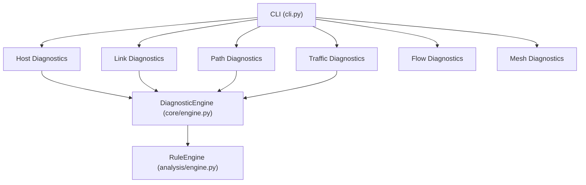
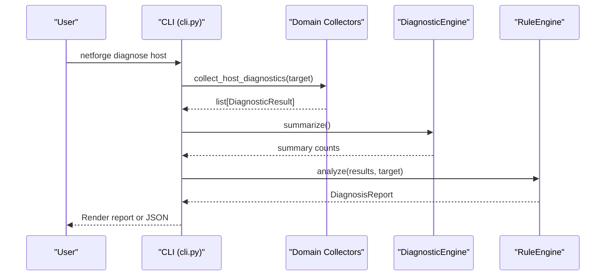
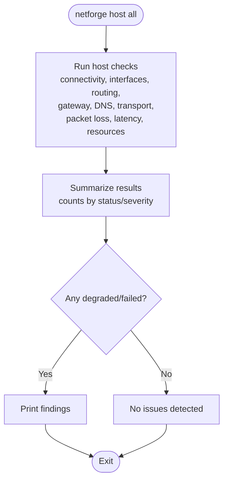
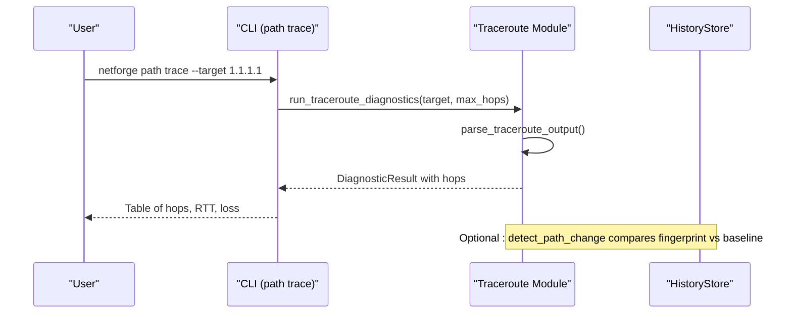
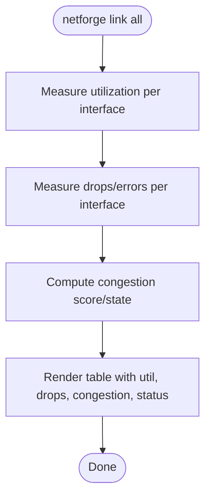
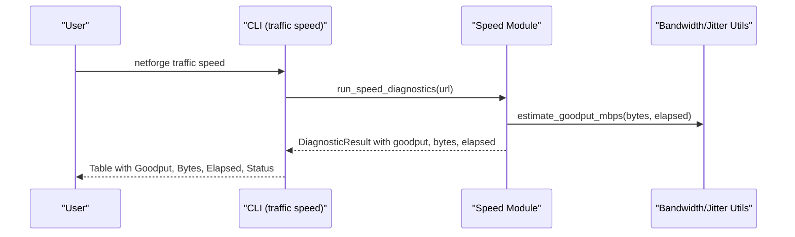
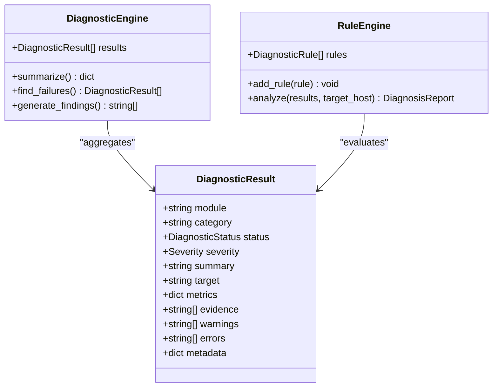
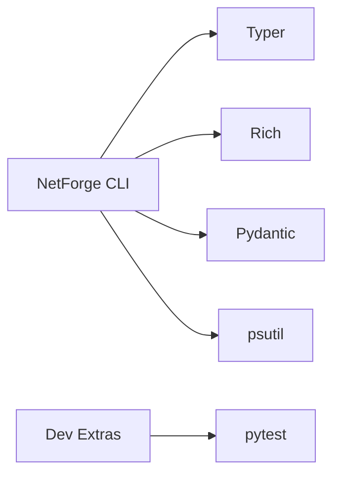

# Getting Started

<cite>
**Referenced Files in This Document**
- [README.md](file://README.md)
- [pyproject.toml](file://pyproject.toml)
- [requirements.txt](file://requirements.txt)
- [cli.py](file://cli.py)
- [core/engine.py](file://core/engine.py)
- [analysis/engine.py](file://analysis/engine.py)
- [diagnostics/host/collector.py](file://diagnostics/host/collector.py)
- [diagnostics/path/traceroute.py](file://diagnostics/path/traceroute.py)
- [diagnostics/traffic/speed.py](file://diagnostics/traffic/speed.py)
- [diagnostics/link/collector.py](file://diagnostics/link/collector.py)
- [core/result.py](file://core/result.py)
- [IMPLEMENTATION_PLAN.md](file://IMPLEMENTATION_PLAN.md)
</cite>

## Table of Contents
1. Introduction
2. Project Structure
3. Core Components
4. Architecture Overview
5. Detailed Component Analysis
6. Dependency Analysis
7. Performance Considerations
8. Troubleshooting Guide
9. Conclusion
10. Appendices

## Introduction
NetForge is a multi-domain network diagnostics framework that unifies host, link, path, traffic, flow, and mesh diagnostics under a shared rule engine. It provides a CLI to run targeted probes and an analysis engine to synthesize root-cause reports from the collected observations. The project ships with a Python-based CLI entry point and modular diagnostic collectors for different layers of the network stack.

Key goals:
- Provide consistent, structured diagnostic results across domains
- Offer quick commands for common tasks (host checks, path tracing, link analysis, speed tests)
- Enable intelligent diagnosis by correlating evidence through a rule engine

**Section sources**
- [README.md:1-22](file://README.md#L1-L22)
- [IMPLEMENTATION_PLAN.md:1-14](file://IMPLEMENTATION_PLAN.md#L1-L14)

## Project Structure
The repository is organized into logical modules:
- cli: Command-line interface using Typer
- core: Shared result models, metrics utilities, and a basic diagnostic summarizer
- diagnostics: Domain-specific collectors (host, link, path, traffic, flow, mesh)
- analysis: Rule engine and rules for cross-domain diagnosis
- collectors: Data collection helpers (local and agent API stubs)
- storage: Baselines and history for comparisons
- ingest: Passive telemetry ingestion (IPFIX, sFlow, SNMP counters)

**Diagram sources**
- [cli.py:18-38](file://cli.py#L18-L38)
- [core/engine.py:10-83](file://core/engine.py#L10-L83)
- [analysis/engine.py:15-130](file://analysis/engine.py#L15-L130)

**Section sources**
- [cli.py:18-38](file://cli.py#L18-L38)
- [pyproject.toml:24-35](file://pyproject.toml#L24-L35)

## Core Components
- DiagnosticResult: A standardized model for all diagnostic outputs, including status, severity, summary, metrics, evidence, warnings, errors, and metadata.
- DiagnosticEngine: Aggregates results, summarizes counts, finds failures, and generates human-readable findings.
- RuleEngine: Executes modular rules against results, correlates evidence across domains, resolves conflicts/subsumption, and produces a DiagnosisReport with verdict and key observations.

These components enable consistent data flow from domain collectors to unified reporting and diagnosis.

**Section sources**
- [core/result.py:9-47](file://core/result.py#L9-L47)
- [core/engine.py:10-83](file://core/engine.py#L10-L83)
- [analysis/engine.py:15-130](file://analysis/engine.py#L15-L130)

## Architecture Overview
NetForge’s architecture combines multiple diagnostic domains with a shared rule engine:
- Host diagnostics: connectivity, interfaces, routing, gateway, DNS, transport (TCP/UDP), packet loss, latency, resource/network activity
- Link diagnostics: per-interface utilization, errors/drops, congestion scoring
- Path diagnostics: traceroute, hop metrics, path change detection via fingerprinting
- Traffic diagnostics: download goodput estimation, jitter measurement
- Flow diagnostics: offline analysis of flow exports
- Mesh diagnostics: local ping-mesh to multiple targets

**Diagram sources**
- [cli.py:470-492](file://cli.py#L470-L492)
- [diagnostics/host/collector.py:16-61](file://diagnostics/host/collector.py#L16-L61)
- [core/engine.py:18-83](file://core/engine.py#L18-L83)
- [analysis/engine.py:29-130](file://analysis/engine.py#L29-L130)

## Detailed Component Analysis

### Installation and System Requirements
- Python version: Requires Python 3.10 or newer
- Install with development dependencies:
  - pip install -e ".[dev]"
- Key runtime dependencies include Typer, Rich, Pydantic, and psutil; dev dependency includes pytest

Quick setup steps:
1. Ensure Python >= 3.10 is installed
2. Clone or navigate to the project directory
3. Install editable package with dev extras: pip install -e ".[dev]"
4. Verify installation by running netforge --help

**Section sources**
- [pyproject.toml:5-19](file://pyproject.toml#L5-L19)
- [README.md:5-19](file://README.md#L5-L19)
- [requirements.txt:1-15](file://requirements.txt#L1-L15)

### Basic CLI Usage Examples
Run these commands to get started:
- Host diagnostics suite:
  - netforge host all
- Intelligent host diagnosis:
  - netforge diagnose host
- Path tracing to a target:
  - netforge path trace --target 1.1.1.1
- Full link diagnostics:
  - netforge link all
- Traffic speed test:
  - netforge traffic speed

Additional useful commands:
- Host subcommands: connectivity, interface, routing, gateway, dns, transport, packet-loss, latency, resources
- Path subcommands: hops, diff, all
- Traffic subcommands: jitter, bandwidth
- Flow subcommands: top, analyze
- Mesh subcommands: run, status

**Section sources**
- [README.md:11-19](file://README.md#L11-L19)
- [cli.py:46-196](file://cli.py#L46-L196)
- [cli.py:203-333](file://cli.py#L203-L333)
- [cli.py:340-388](file://cli.py#L340-L388)
- [cli.py:396-455](file://cli.py#L396-L455)
- [cli.py:470-573](file://cli.py#L470-L573)

### Host Diagnostics
The host diagnostic suite runs a comprehensive set of checks:
- Connectivity to multiple hosts
- Interface inspection
- Routing table and default gateway reachability
- DNS resolution and configured DNS servers
- Transport tests (TCP/UDP to common ports)
- Packet loss and latency/jitter measurements
- Resource and network activity inspection

You can also run the intelligent diagnosis to correlate results and produce a root-cause report.

**Diagram sources**
- [cli.py:112-196](file://cli.py#L112-L196)

**Section sources**
- [diagnostics/host/collector.py:16-61](file://diagnostics/host/collector.py#L16-L61)
- [cli.py:112-196](file://cli.py#L112-L196)

### Path Tracing
Path diagnostics provide traceroute capabilities with per-hop metrics and path change detection:
- Trace route to a target with configurable max hops
- Aggregate per-hop latency and loss over multiple probes
- Detect path changes by comparing fingerprints against stored baselines

**Diagram sources**
- [cli.py:269-278](file://cli.py#L269-L278)
- [diagnostics/path/traceroute.py:115-213](file://diagnostics/path/traceroute.py#L115-L213)
- [diagnostics/path/traceroute.py:279-339](file://diagnostics/path/traceroute.py#L279-L339)

**Section sources**
- [diagnostics/path/traceroute.py:19-359](file://diagnostics/path/traceroute.py#L19-L359)
- [cli.py:269-333](file://cli.py#L269-L333)

### Link Analysis
Link diagnostics measure per-interface utilization, errors/drops, and congestion:
- Utilization: RX/TX throughput and percentage of link capacity
- Errors: Drops and errors per second
- Congestion: Composite score combining utilization, error rates, and optional latency delta

**Diagram sources**
- [cli.py:254-262](file://cli.py#L254-L262)
- [diagnostics/link/collector.py:29-179](file://diagnostics/link/collector.py#L29-L179)
- [diagnostics/link/collector.py:182-210](file://diagnostics/link/collector.py#L182-L210)

**Section sources**
- [diagnostics/link/collector.py:29-210](file://diagnostics/link/collector.py#L29-L210)
- [cli.py:203-262](file://cli.py#L203-L262)

### Traffic Speed Testing
Traffic diagnostics estimate download goodput and measure jitter:
- Download speed: Measures bytes transferred over time to compute Mbps
- Jitter: Uses ICMP pings to compute RFC 3550 jitter metrics

**Diagram sources**
- [cli.py:340-352](file://cli.py#L340-L352)
- [diagnostics/traffic/speed.py:22-70](file://diagnostics/traffic/speed.py#L22-L70)
- [diagnostics/traffic/speed.py:124-134](file://diagnostics/traffic/speed.py#L124-L134)

**Section sources**
- [diagnostics/traffic/speed.py:22-152](file://diagnostics/traffic/speed.py#L22-L152)
- [cli.py:340-388](file://cli.py#L340-L388)

### Intelligent Diagnosis with Rule Engine
The diagnose commands collect observations and run them through the RuleEngine to produce a DiagnosisReport:
- Host diagnosis: collects host-layer observations and analyzes them
- Path diagnosis: collects path-layer observations and analyzes them
- Link diagnosis: collects link-layer observations and analyzes them
- All diagnosis: merges host + link + path observations into one report

**Diagram sources**
- [core/result.py:9-47](file://core/result.py#L9-L47)
- [core/engine.py:10-83](file://core/engine.py#L10-L83)
- [analysis/engine.py:15-130](file://analysis/engine.py#L15-L130)

**Section sources**
- [cli.py:470-573](file://cli.py#L470-L573)
- [analysis/engine.py:29-130](file://analysis/engine.py#L29-L130)

## Dependency Analysis
NetForge depends on several libraries:
- Typer: CLI framework
- Rich: Console output formatting
- Pydantic: Data validation and modeling
- psutil: System and network statistics

Optional dev dependency:
- pytest: Testing framework

Runtime dependencies are declared in pyproject.toml and pinned versions are listed in requirements.txt.

**Diagram sources**
- [pyproject.toml:5-19](file://pyproject.toml#L5-L19)
- [requirements.txt:1-15](file://requirements.txt#L1-L15)

**Section sources**
- [pyproject.toml:5-19](file://pyproject.toml#L5-L19)
- [requirements.txt:1-15](file://requirements.txt#L1-L15)

## Performance Considerations
- Link utilization and error measurements sample network counters over a configurable interval; longer intervals smooth out bursts but increase latency between samples.
- Traceroute operations invoke system tools and may be slow if many hops or probes are used; adjust max_hops and probes to balance detail and speed.
- Speed tests depend on remote server availability and network conditions; consider custom URLs for internal endpoints when appropriate.
- RuleEngine processes all registered rules; adding many complex rules increases analysis time.

[No sources needed since this section provides general guidance]

## Troubleshooting Guide
Common issues and resolutions:
- Traceroute fails due to missing system tool or permissions:
  - Ensure traceroute/tracert is available and executable
  - Check firewall rules that may block ICMP or UDP probes
- Speed test fails:
  - Verify internet connectivity and HTTPS access to the speed endpoint
  - Adjust timeout or use a different URL for internal testing
- Link diagnostics show no interfaces:
  - Confirm psutil can read network stats; loopback interfaces are intentionally skipped
- Diagnosis report shows UNKNOWN status:
  - Inspect errors and warnings in the DiagnosticResult for specific failure details

Use strict mode to exit with non-zero codes when issues are detected, enabling automation and CI integration.

**Section sources**
- [diagnostics/path/traceroute.py:115-136](file://diagnostics/path/traceroute.py#L115-L136)
- [diagnostics/traffic/speed.py:22-70](file://diagnostics/traffic/speed.py#L22-L70)
- [diagnostics/link/collector.py:29-129](file://diagnostics/link/collector.py#L29-L129)
- [cli.py:112-196](file://cli.py#L112-L196)
- [cli.py:470-573](file://cli.py#L470-L573)

## Conclusion
NetForge provides a cohesive, multi-domain approach to network diagnostics with a powerful rule engine for root-cause analysis. Start with the quick commands to validate connectivity, trace paths, analyze links, and measure traffic performance. Use the diagnose commands for deeper insights and integrate strict mode into automated workflows for reliable health checks.

[No sources needed since this section summarizes without analyzing specific files]

## Appendices

### Quick Start Commands Reference
- Host diagnostics:
  - netforge host all
  - netforge diagnose host
- Path tracing:
  - netforge path trace --target 1.1.1.1
- Link analysis:
  - netforge link all
- Traffic speed:
  - netforge traffic speed

**Section sources**
- [README.md:11-19](file://README.md#L11-L19)
- [cli.py:112-196](file://cli.py#L112-L196)
- [cli.py:269-278](file://cli.py#L269-L278)
- [cli.py:254-262](file://cli.py#L254-L262)
- [cli.py:340-352](file://cli.py#L340-L352)