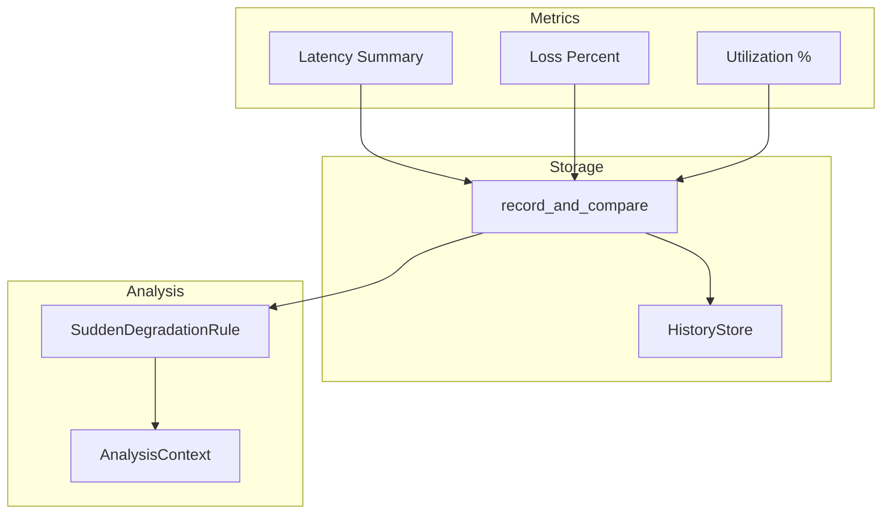
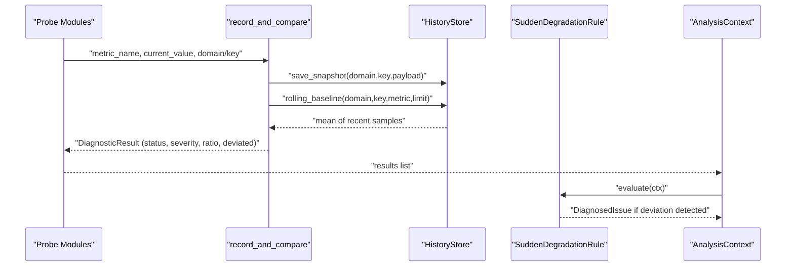
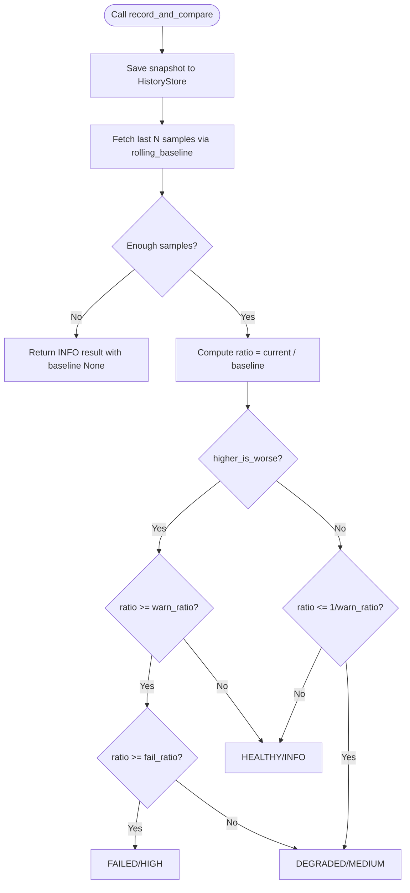
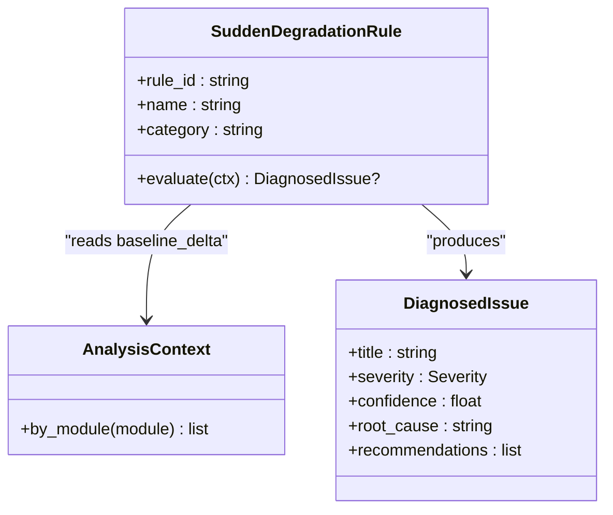
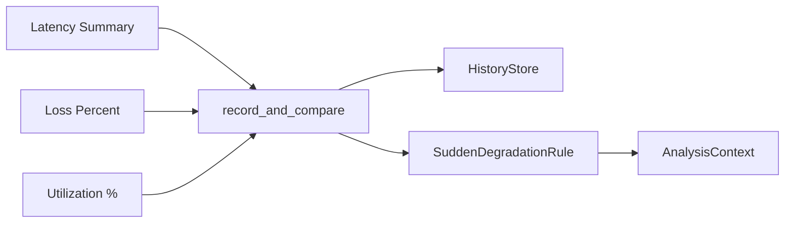

# Baseline Comparison

<cite>
**Referenced Files in This Document**
- [storage/baselines.py](file://storage/baselines.py)
- [storage/history.py](file://storage/history.py)
- [analysis/rules/baseline_rules.py](file://analysis/rules/baseline_rules.py)
- [core/result.py](file://core/result.py)
- [analysis/context.py](file://analysis/context.py)
- [analysis/models.py](file://analysis/models.py)
- [core/metrics/latency_jitter.py](file://core/metrics/latency_jitter.py)
- [core/metrics/loss.py](file://core/metrics/loss.py)
- [core/metrics/throughput.py](file://core/metrics/throughput.py)
- [tests/test_baselines.py](file://tests/test_baselines.py)
</cite>

## Table of Contents
1. [Introduction](#introduction)
2. [Project Structure](#project-structure)
3. [Core Components](#core-components)
4. [Architecture Overview](#architecture-overview)
5. [Detailed Component Analysis](#detailed-component-analysis)
6. [Dependency Analysis](#dependency-analysis)
7. [Performance Considerations](#performance-considerations)
8. [Troubleshooting Guide](#troubleshooting-guide)
9. [Conclusion](#conclusion)
10. [Appendices](#appendices)

## Introduction
This document explains NetForge’s baseline comparison and anomaly detection system. It covers how baselines are created, stored, and updated using rolling calculations; how thresholds and sensitivity levels are configured; the statistical methods used to detect deviations from normal behavior; and how trend analysis is supported through historical snapshots. It also provides guidance on configuring alerting thresholds and interpreting results to identify performance regressions and anomalies.

## Project Structure
The baseline system spans storage, metrics, and analysis layers:
- Storage layer persists metric samples and computes rolling baselines.
- Metrics layer produces normalized values (e.g., latency summaries, loss percentages, utilization).
- Analysis layer consumes baseline comparisons and higher-level rules to generate issues and recommendations.

**Diagram sources**
- [storage/baselines.py:9-91](file://storage/baselines.py#L9-L91)
- [storage/history.py:15-114](file://storage/history.py#L15-L114)
- [core/metrics/latency_jitter.py:28-40](file://core/metrics/latency_jitter.py#L28-L40)
- [core/metrics/loss.py:4-9](file://core/metrics/loss.py#L4-L9)
- [core/metrics/throughput.py:16-23](file://core/metrics/throughput.py#L16-L23)
- [analysis/rules/baseline_rules.py:9-48](file://analysis/rules/baseline_rules.py#L9-L48)
- [analysis/context.py:7-24](file://analysis/context.py#L7-L24)

**Section sources**
- [storage/baselines.py:9-136](file://storage/baselines.py#L9-L136)
- [storage/history.py:15-114](file://storage/history.py#L15-L114)
- [analysis/rules/baseline_rules.py:9-48](file://analysis/rules/baseline_rules.py#L9-L48)
- [core/metrics/latency_jitter.py:28-40](file://core/metrics/latency_jitter.py#L28-L40)
- [core/metrics/loss.py:4-23](file://core/metrics/loss.py#L4-L23)
- [core/metrics/throughput.py:4-23](file://core/metrics/throughput.py#L4-L23)
- [analysis/context.py:7-24](file://analysis/context.py#L7-L24)

## Core Components
- Rolling baseline computation and comparison:
  - Persists each sample and compares current value against a rolling mean of recent samples.
  - Emits DiagnosticResult with module “baseline_delta” including ratio, deviation flag, and severity.
- Threshold configuration:
  - warn_ratio and fail_ratio control sensitivity for degradation and failure states.
  - higher_is_worse controls directionality for beneficial vs harmful metrics.
- Statistical analysis:
  - Rolling mean over a fixed window of recent samples.
  - Latency jitter and standard deviation computed per batch for richer context.
  - Loss percentage and link utilization provide normalized metrics for comparison.
- Trend analysis:
  - HistoryStore stores time-stamped snapshots enabling retrieval of latest and previous snapshots and rolling windows for trend observation.

**Section sources**
- [storage/baselines.py:9-91](file://storage/baselines.py#L9-L91)
- [storage/history.py:45-114](file://storage/history.py#L45-L114)
- [core/metrics/latency_jitter.py:28-40](file://core/metrics/latency_jitter.py#L28-L40)
- [core/metrics/loss.py:4-23](file://core/metrics/loss.py#L4-L23)
- [core/metrics/throughput.py:16-23](file://core/metrics/throughput.py#L16-L23)

## Architecture Overview
The baseline pipeline integrates probe outputs into a consistent comparison workflow:

**Diagram sources**
- [storage/baselines.py:9-91](file://storage/baselines.py#L9-L91)
- [storage/history.py:45-114](file://storage/history.py#L45-L114)
- [analysis/rules/baseline_rules.py:14-48](file://analysis/rules/baseline_rules.py#L14-L48)
- [analysis/context.py:7-24](file://analysis/context.py#L7-L24)

## Detailed Component Analysis

### Rolling Baseline Creation, Storage, and Update
- Creation and persistence:
  - Each call records a snapshot containing the metric payload and timestamp.
  - Snapshots are indexed by domain and key for efficient retrieval.
- Rolling calculation:
  - The rolling baseline is the arithmetic mean of the last N samples (default limit=20).
  - If insufficient data exists, the first call seeds the baseline and returns an informational result.
- Update behavior:
  - New samples shift the window forward, maintaining a moving average that adapts to recent behavior.

**Diagram sources**
- [storage/baselines.py:9-91](file://storage/baselines.py#L9-L91)
- [storage/history.py:92-114](file://storage/history.py#L92-L114)

**Section sources**
- [storage/baselines.py:9-91](file://storage/baselines.py#L9-L91)
- [storage/history.py:45-114](file://storage/history.py#L45-L114)

### Threshold Configuration and Sensitivity Levels
- Parameters:
  - warn_ratio: triggers DEGRADED when exceeded (or underperformed for beneficial metrics).
  - fail_ratio: triggers FAILED when exceeded.
  - higher_is_worse: boolean to invert logic for beneficial metrics (e.g., throughput).
- Default values:
  - warn_ratio defaults to 1.5; fail_ratio defaults to 2.5.
- Customization:
  - Callers can pass custom ratios and direction flags per metric to tune sensitivity.

Interpretation:
- Ratio near 1.0 indicates no change relative to baseline.
- Ratios above warn_ratio indicate potential regression; above fail_ratio indicate severe regression.
- For beneficial metrics (lower is better), ratios below 1/warn_ratio trigger warnings.

**Section sources**
- [storage/baselines.py:9-91](file://storage/baselines.py#L9-L91)

### Statistical Analysis Methods
- Rolling mean:
  - Computed over the last N snapshots for stability and responsiveness.
- Latency statistics:
  - Mean, min, max, jitter (RFC-style), and standard deviation summarize latency batches.
- Loss classification:
  - Packet loss percentage computed and mapped to coarse severity labels for quick triage.
- Utilization normalization:
  - Link utilization expressed as a percentage of negotiated capacity for meaningful comparisons.

These statistics feed into baseline comparisons and rule evaluation to contextualize anomalies.

**Section sources**
- [core/metrics/latency_jitter.py:28-40](file://core/metrics/latency_jitter.py#L28-L40)
- [core/metrics/loss.py:4-23](file://core/metrics/loss.py#L4-L23)
- [core/metrics/throughput.py:16-23](file://core/metrics/throughput.py#L16-L23)

### Trend Analysis Capabilities
- Snapshot history:
  - Time-stamped payloads enable retrieval of latest and previous snapshots.
  - Rolling windows support trend observation across recent periods.
- Use cases:
  - Compare current vs previous snapshot to detect sudden changes.
  - Analyze rolling means to smooth noise and reveal trends.
  - Correlate path fingerprints or other metadata to understand context around changes.

**Section sources**
- [storage/history.py:60-114](file://storage/history.py#L60-L114)

### Alerting Rules and Issue Generation
- Sudden Degradation Rule:
  - Scans baseline_delta results for deviations where ratio meets or exceeds threshold.
  - Generates a DiagnosedIssue with severity based on worst-case ratio.
  - Provides actionable recommendations to investigate recent changes and re-run diagnostics.

**Diagram sources**
- [analysis/rules/baseline_rules.py:9-48](file://analysis/rules/baseline_rules.py#L9-L48)
- [analysis/context.py:7-24](file://analysis/context.py#L7-L24)
- [analysis/models.py:37-50](file://analysis/models.py#L37-L50)

**Section sources**
- [analysis/rules/baseline_rules.py:9-48](file://analysis/rules/baseline_rules.py#L9-L48)
- [analysis/context.py:7-24](file://analysis/context.py#L7-L24)
- [analysis/models.py:37-50](file://analysis/models.py#L37-L50)

## Dependency Analysis
Key dependencies and relationships:
- Baseline comparison depends on HistoryStore for persistence and rolling calculations.
- Metrics utilities produce normalized inputs for baseline comparison.
- Analysis rules consume baseline_delta results to synthesize higher-level issues.

**Diagram sources**
- [core/metrics/latency_jitter.py:28-40](file://core/metrics/latency_jitter.py#L28-L40)
- [core/metrics/loss.py:4-23](file://core/metrics/loss.py#L4-L23)
- [core/metrics/throughput.py:16-23](file://core/metrics/throughput.py#L16-L23)
- [storage/baselines.py:9-91](file://storage/baselines.py#L9-L91)
- [storage/history.py:45-114](file://storage/history.py#L45-L114)
- [analysis/rules/baseline_rules.py:9-48](file://analysis/rules/baseline_rules.py#L9-L48)
- [analysis/context.py:7-24](file://analysis/context.py#L7-L24)

**Section sources**
- [storage/baselines.py:9-136](file://storage/baselines.py#L9-L136)
- [storage/history.py:45-114](file://storage/history.py#L45-L114)
- [analysis/rules/baseline_rules.py:9-48](file://analysis/rules/baseline_rules.py#L9-L48)
- [analysis/context.py:7-24](file://analysis/context.py#L7-L24)

## Performance Considerations
- Window size:
  - Rolling window limit affects responsiveness vs stability. Larger windows smooth noise but delay detection of rapid changes.
- I/O overhead:
  - Each sample writes a snapshot row; ensure appropriate database location and retention policies to avoid excessive disk usage.
- Metric selection:
  - Prefer normalized metrics (utilization %, loss %) for cross-environment comparability.
- Batch processing:
  - Aggregating multiple probes before baseline comparison reduces redundant computations.

[No sources needed since this section provides general guidance]

## Troubleshooting Guide
Common scenarios and resolutions:
- No deviation detected initially:
  - First samples seed the baseline; subsequent samples are compared against the rolling mean. Expect informational results until enough history accumulates.
- Unexpected alerts:
  - Verify warn_ratio and fail_ratio settings; adjust sensitivity for beneficial vs harmful metrics using higher_is_worse.
- High false positives:
  - Increase window size or raise warn_ratio to reduce sensitivity; review metric normalization (e.g., utilization vs raw bytes/sec).
- Missing baseline data:
  - Ensure snapshots are being saved and queries use correct domain/key identifiers.

Validation examples:
- Tests demonstrate seeding baseline and detecting deviation when current value significantly increases relative to baseline.

**Section sources**
- [storage/baselines.py:33-91](file://storage/baselines.py#L33-L91)
- [tests/test_baselines.py:9-22](file://tests/test_baselines.py#L9-L22)

## Conclusion
NetForge’s baseline comparison system provides a robust mechanism for detecting performance regressions and anomalies by comparing current metrics against a rolling baseline derived from recent history. Thresholds and sensitivity levels allow fine-tuning for diverse environments, while statistical summaries and trend analysis offer deeper insights. The integration with analysis rules enables automated issue generation and actionable remediation steps.

[No sources needed since this section summarizes without analyzing specific files]

## Appendices

### Configuring Sensitivity and Alerting Thresholds
- Adjust warn_ratio and fail_ratio per metric to balance early detection and false positives.
- Use higher_is_worse=False for beneficial metrics (e.g., throughput) so improvements do not trigger warnings.
- Combine baseline_delta results with other diagnostic modules via AnalysisContext for comprehensive assessments.

**Section sources**
- [storage/baselines.py:9-91](file://storage/baselines.py#L9-L91)
- [analysis/context.py:7-24](file://analysis/context.py#L7-L24)

### Interpreting Baseline Comparison Results
- Status and severity:
  - HEALTHY/INFO: within normal range.
  - DEGRADED/MEDIUM: warning threshold exceeded.
  - FAILED/HIGH: failure threshold exceeded.
- Metrics fields:
  - ratio: current/baseline; indicates magnitude of deviation.
  - deviated: boolean flag for warning-level deviation.
  - higher_is_worse: clarifies directionality for interpretation.
- Evidence:
  - Includes baseline mean and current value for transparency.

**Section sources**
- [storage/baselines.py:33-91](file://storage/baselines.py#L33-L91)
- [core/result.py:24-47](file://core/result.py#L24-L47)