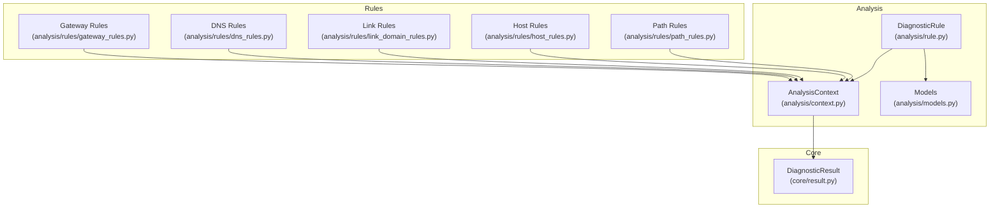
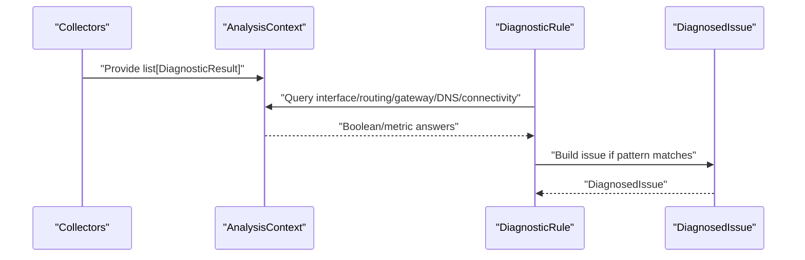
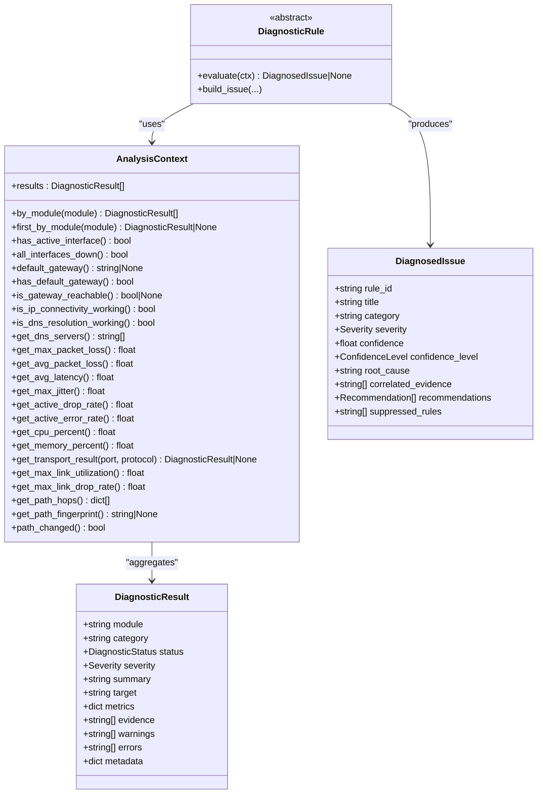

# Context Management

<cite>
**Referenced Files in This Document**
- [context.py](file://analysis/context.py)
- [rule.py](file://analysis/rule.py)
- [models.py](file://analysis/models.py)
- [result.py](file://core/result.py)
- [gateway_rules.py](file://analysis/rules/gateway_rules.py)
- [dns_rules.py](file://analysis/rules/dns_rules.py)
- [link_domain_rules.py](file://analysis/rules/link_domain_rules.py)
- [host_rules.py](file://analysis/rules/host_rules.py)
- [path_rules.py](file://analysis/rules/path_rules.py)
</cite>

## Table of Contents
1. [Introduction](#introduction)
2. [Project Structure](#project-structure)
3. [Core Components](#core-components)
4. [Architecture Overview](#architecture-overview)
5. [Detailed Component Analysis](#detailed-component-analysis)
6. [Dependency Analysis](#dependency-analysis)
7. [Performance Considerations](#performance-considerations)
8. [Troubleshooting Guide](#troubleshooting-guide)
9. [Conclusion](#conclusion)

## Introduction
This document explains the AnalysisContext class that centralizes cross-domain correlation data for NetForge diagnostics. It aggregates DiagnosticResult observations from multiple modules (interface, routing, gateway, DNS, connectivity, latency, packet loss, link, path, and host resources), exposes query methods to inspect network state at each layer, and enables rules to make informed decisions based on a unified view of the environment. You will find how rules consume context methods to detect issues such as missing gateways, unreachable gateways, DNS failures with healthy IP transit, link saturation, and path changes.

## Project Structure
The context lives under analysis and is consumed by rule implementations across layers. The core result model defines the standardized observation structure used by all diagnostic modules.

**Diagram sources**
- [context.py:7-19](file://analysis/context.py#L7-L19)
- [rule.py:9-26](file://analysis/rule.py#L9-L26)
- [models.py:27-68](file://analysis/models.py#L27-L68)
- [result.py:24-47](file://core/result.py#L24-L47)
- [gateway_rules.py:9-198](file://analysis/rules/gateway_rules.py#L9-L198)
- [dns_rules.py:9-160](file://analysis/rules/dns_rules.py#L9-L160)
- [link_domain_rules.py:9-82](file://analysis/rules/link_domain_rules.py#L9-L82)
- [host_rules.py:9-56](file://analysis/rules/host_rules.py#L9-L56)
- [path_rules.py:9-138](file://analysis/rules/path_rules.py#L9-L138)

**Section sources**
- [context.py:7-19](file://analysis/context.py#L7-L19)
- [rule.py:9-26](file://analysis/rule.py#L9-L26)
- [models.py:27-68](file://analysis/models.py#L27-L68)
- [result.py:24-47](file://core/result.py#L24-L47)

## Core Components
- AnalysisContext: An indexed cache over a list of DiagnosticResult objects. It groups results by module and provides high-level queries spanning interface, routing, gateway, IP connectivity, DNS, latency/jitter, resource usage, transport, link, and path layers.
- DiagnosticResult: The canonical observation returned by every diagnostic module, carrying status, severity, metrics, target, summary, evidence, warnings, errors, and metadata.
- DiagnosticRule: Abstract base for rules; each rule evaluates an AnalysisContext and returns a DiagnosedIssue when a pattern matches.

Key responsibilities:
- Aggregate multi-module observations into a single context.
- Provide concise boolean or scalar queries for common conditions (e.g., active interface, default gateway reachable, DNS working).
- Expose raw accessors for advanced correlation (e.g., per-hop traceroute hops, transport probe by port/protocol).

**Section sources**
- [context.py:7-199](file://analysis/context.py#L7-L199)
- [result.py:24-47](file://core/result.py#L24-L47)
- [rule.py:9-51](file://analysis/rule.py#L9-L51)

## Architecture Overview
Rules receive an AnalysisContext populated with DiagnosticResult instances collected from various probes. Each rule composes simple context queries to form higher-level diagnoses. For example, a “Total Internet Outage” rule combines interface, routing, gateway reachability, IP connectivity, and packet loss signals to produce a precise diagnosis.

**Diagram sources**
- [context.py:13-24](file://analysis/context.py#L13-L24)
- [rule.py:20-26](file://analysis/rule.py#L20-L26)
- [models.py:37-68](file://analysis/models.py#L37-L68)

## Detailed Component Analysis

### AnalysisContext: Aggregation and Indexing
- Construction: Accepts a list of DiagnosticResult and builds an internal index mapping module names to their results.
- Module access:
  - by_module(module): Returns all results for a given module.
  - first_by_module(module): Returns the first result for a module or None.

These primitives are the foundation for all higher-level queries.

**Section sources**
- [context.py:13-24](file://analysis/context.py#L13-L24)

### Interface Layer Queries
- has_active_interface(): True if any non-loopback interface is UP.
- all_interfaces_down(): True if no active interface exists (or no interface results).

Usage examples in rules:
- Gateway rules skip certain diagnoses when all interfaces are down to avoid false positives.

**Section sources**
- [context.py:27-39](file://analysis/context.py#L27-L39)
- [gateway_rules.py:14-19](file://analysis/rules/gateway_rules.py#L14-L19)

### Routing & Gateway Layer Queries
- default_gateway(): Returns configured default gateway address or None.
- has_default_gateway(): True if a valid default gateway is present.
- is_gateway_reachable(): Returns True/False/None depending on gateway probe status and loss thresholds.

Usage examples in rules:
- Detect missing default gateway route.
- Detect unreachable gateway.
- Distinguish local gateway healthy but upstream WAN outage.
- Detect total internet outage when IP connectivity fails broadly.

**Section sources**
- [context.py:42-68](file://analysis/context.py#L42-L68)
- [gateway_rules.py:9-198](file://analysis/rules/gateway_rules.py#L9-L198)

### IP Connectivity Layer Query
- is_ip_connectivity_working(): True if TCP/ICMP connectivity to public IPs (e.g., 1.1.1.1, 8.8.8.8) succeeded, or if ICMP ping shows less than 100% loss.

Used to differentiate DNS-only failures from broader outages.

**Section sources**
- [context.py:71-83](file://analysis/context.py#L71-L83)
- [dns_rules.py:14-22](file://analysis/rules/dns_rules.py#L14-L22)

### DNS Layer Queries
- is_dns_resolution_working(): True if DNS module reports HEALTHY.
- get_dns_servers(): Returns configured DNS servers list if available.

Used to diagnose DNS resolution failures while IP transit is healthy, and to identify slow or timed-out DNS.

**Section sources**
- [context.py:86-96](file://analysis/context.py#L86-L96)
- [dns_rules.py:9-160](file://analysis/rules/dns_rules.py#L9-L160)

### Latency, Jitter, and Packet Loss Metrics
- get_max_packet_loss(): Maximum observed packet loss percent across packet_loss results.
- get_avg_packet_loss(): Average packet loss percent across packet_loss results.
- get_avg_latency(): Average RTT across latency results.
- get_max_jitter(): Maximum jitter across latency results.

Used to assess general link health and to distinguish DNS slowness from overall latency problems.

**Section sources**
- [context.py:99-129](file://analysis/context.py#L99-L129)
- [dns_rules.py:65-110](file://analysis/rules/dns_rules.py#L65-L110)

### Resource and Activity Layer Queries
- get_active_drop_rate(): Active drops per second from resource_network.
- get_active_error_rate(): Active errors per second from resource_network.
- get_cpu_percent(): CPU utilization percentage.
- get_memory_percent(): Memory utilization percentage.

Used to detect host resource exhaustion that can degrade networking performance.

**Section sources**
- [context.py:132-154](file://analysis/context.py#L132-L154)
- [host_rules.py:9-56](file://analysis/rules/host_rules.py#L9-L56)

### Transport Layer Query
- get_transport_result(port, protocol="tcp"): Finds a transport probe result for a specific port and protocol.

Useful for service-specific reachability checks.

**Section sources**
- [context.py:157-162](file://analysis/context.py#L157-L162)

### Link Layer Queries
- get_max_link_utilization(): Highest observed utilization percent across link_utilization results.
- get_max_link_drop_rate(): Highest observed drops per second across link_errors or fallback to resource_network drop rate.

Used to detect link saturation and physical-layer errors.

**Section sources**
- [context.py:165-179](file://analysis/context.py#L165-L179)
- [link_domain_rules.py:9-82](file://analysis/rules/link_domain_rules.py#L9-L82)

### Path Layer Queries
- get_path_hops(): Returns traceroute hop list if available.
- get_path_fingerprint(): Returns stored path fingerprint string if available.
- path_changed(): True if a path_change result indicates a change.

Used to detect forwarding path changes and to analyze where degradation occurs along the path.

**Section sources**
- [context.py:182-199](file://analysis/context.py#L182-L199)
- [path_rules.py:9-138](file://analysis/rules/path_rules.py#L9-L138)

### Cross-Layer Decision Patterns in Rules
- Missing Default Gateway: Uses interface and routing signals to confirm absence of a default route.
- Unreachable Gateway: Combines routing presence with gateway reachability and interface state.
- WAN Outage with Healthy Local Gateway: Confirms local gateway reachability but failure beyond it using IP connectivity and loss metrics.
- Total Internet Outage: Requires no successful IP connectivity despite having interface and route.
- DNS Failure with Healthy IP Transit: Confirms DNS failure while IP transit works.
- Slow DNS Resolution: Compares DNS resolution time against average network latency.
- Link Saturation and Errors: Uses link utilization and error counters to flag congestion or physical issues.
- Host Resource Exhaustion: Correlates CPU/memory pressure with jitter to attribute performance degradation.
- Path Change and Degradation: Uses traceroute hops and fingerprints to detect routing shifts and localize loss/latency.

**Section sources**
- [gateway_rules.py:9-198](file://analysis/rules/gateway_rules.py#L9-L198)
- [dns_rules.py:9-160](file://analysis/rules/dns_rules.py#L9-L160)
- [link_domain_rules.py:9-82](file://analysis/rules/link_domain_rules.py#L9-L82)
- [host_rules.py:9-56](file://analysis/rules/host_rules.py#L9-L56)
- [path_rules.py:9-138](file://analysis/rules/path_rules.py#L9-L138)

## Dependency Analysis
AnalysisContext depends on the standardized DiagnosticResult model. Rules depend on AnalysisContext to abstract away direct inspection of raw results, promoting cohesion and reducing coupling between rule logic and collection details.

**Diagram sources**
- [context.py:7-199](file://analysis/context.py#L7-L199)
- [result.py:24-47](file://core/result.py#L24-L47)
- [rule.py:9-51](file://analysis/rule.py#L9-L51)
- [models.py:27-68](file://analysis/models.py#L27-L68)

**Section sources**
- [context.py:7-199](file://analysis/context.py#L7-L199)
- [result.py:24-47](file://core/result.py#L24-L47)
- [rule.py:9-51](file://analysis/rule.py#L9-L51)
- [models.py:27-68](file://analysis/models.py#L27-L68)

## Performance Considerations
- Indexing: AnalysisContext builds a module-to-results index once at construction, enabling O(1) lookups by module during rule evaluation.
- Minimal allocations: Most query methods return scalars or small lists derived from cached results, avoiding repeated parsing or network calls.
- Threshold-based short-circuits: Many queries use early returns (e.g., first match for IP connectivity) to minimize iteration.
- Fallbacks: Some queries combine multiple modules (e.g., IP connectivity via connectivity and packet_loss) to reduce false negatives without heavy computation.

[No sources needed since this section provides general guidance]

## Troubleshooting Guide
Common scenarios and how to interpret context responses:

- No active interface detected:
  - Use all_interfaces_down() to guard other rules; if true, many routing and gateway rules intentionally return None to avoid misleading diagnoses.
  - Check interface module results for reasons why interfaces are down.

- Missing default gateway:
  - has_default_gateway() returning False indicates no route for 0.0.0.0/0.
  - Combine with has_active_interface() to ensure the host is not offline.

- Unreachable gateway:
  - is_gateway_reachable() returning False implies ~100% loss or explicit failure.
  - Verify local subnet mask and gateway address; check router/AP status.

- DNS failure with healthy IP transit:
  - is_dns_resolution_working() False while is_ip_connectivity_working() True points to resolver or port 53 filtering.
  - Use get_dns_servers() to validate configured resolvers.

- High packet loss or latency:
  - Use get_max_packet_loss(), get_avg_latency(), and get_max_jitter() to quantify impact.
  - Correlate with link utilization and error rates to distinguish congestion vs. physical issues.

- Path changes:
  - path_changed() True suggests routing shift; compare current and baseline fingerprints via get_path_fingerprint().
  - Inspect get_path_hops() to locate problematic hops.

**Section sources**
- [context.py:27-199](file://analysis/context.py#L27-L199)
- [gateway_rules.py:9-198](file://analysis/rules/gateway_rules.py#L9-L198)
- [dns_rules.py:9-160](file://analysis/rules/dns_rules.py#L9-L160)
- [link_domain_rules.py:9-82](file://analysis/rules/link_domain_rules.py#L9-L82)
- [path_rules.py:9-138](file://analysis/rules/path_rules.py#L9-L138)

## Conclusion
AnalysisContext is the backbone of cross-domain correlation in NetForge. It consolidates heterogeneous diagnostic results into a uniform API that rules can compose to detect complex, multi-layered network issues. By providing clear, high-level queries—such as checking interface status, gateway reachability, DNS resolution, IP connectivity, and path changes—it enables precise, actionable diagnoses with minimal coupling to underlying collectors. Rules leverage these capabilities to generate targeted remediation steps and to suppress overlapping findings, ensuring focused and efficient troubleshooting.

[No sources needed since this section summarizes without analyzing specific files]