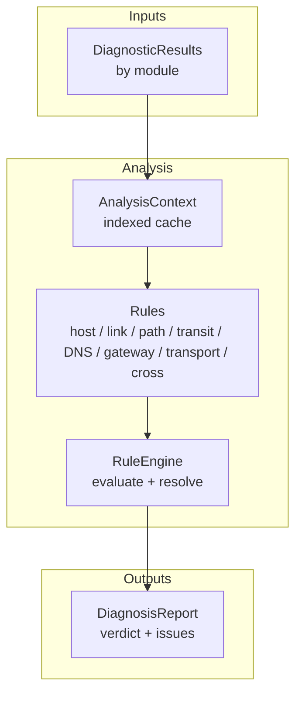
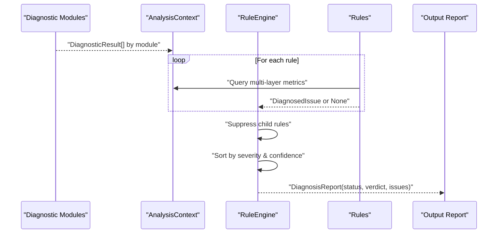
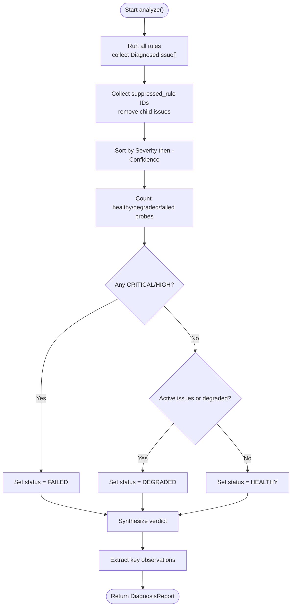
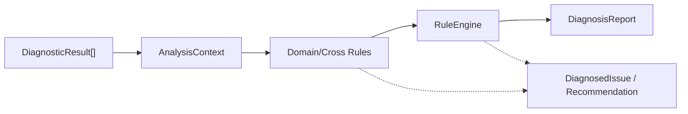

# Cross-Domain Correlation

<cite>
**Referenced Files in This Document**
- [analysis/engine.py](file://analysis/engine.py)
- [analysis/context.py](file://analysis/context.py)
- [analysis/models.py](file://analysis/models.py)
- [analysis/rules/__init__.py](file://analysis/rules/__init__.py)
- [analysis/rules/cross_rules.py](file://analysis/rules/cross_rules.py)
- [analysis/rules/host_rules.py](file://analysis/rules/host_rules.py)
- [analysis/rules/link_rules.py](file://analysis/rules/link_rules.py)
- [analysis/rules/path_rules.py](file://analysis/rules/path_rules.py)
- [analysis/rules/transport_rules.py](file://analysis/rules/transport_rules.py)
- [analysis/rules/gateway_rules.py](file://analysis/rules/gateway_rules.py)
- [analysis/rules/dns_rules.py](file://analysis/rules/dns_rules.py)
- [analysis/rules/transit_rules.py](file://analysis/rules/transit_rules.py)
- [core/result.py](file://core/result.py)
</cite>

## Table of Contents
1. Introduction
2. Project Structure
3. Core Components
4. Architecture Overview
5. Detailed Component Analysis
6. Dependency Analysis
7. Performance Considerations
8. Troubleshooting Guide
9. Conclusion

## Introduction
This document explains how the system correlates issues across network layers to identify root causes and contributing factors. It focuses on cross-domain correlation that ties host-level symptoms to link-level problems, path-level failures, and transport-layer behavior. The documentation covers built-in correlation rules, their logic for synthesizing multi-layer evidence into actionable insights, and complex scenarios where single-layer analysis would miss underlying issues.

## Project Structure
The correlation engine is implemented as a modular rule-based system:
- Diagnostic modules produce standardized results (status, metrics, evidence).
- A context object indexes these results by module for efficient cross-layer queries.
- Rules evaluate conditions across multiple modules to detect correlated issues.
- The engine runs all rules, resolves conflicts via suppression, sorts by severity/confidence, and synthesizes a final verdict with key observations.

**Diagram sources**
- [analysis/engine.py:15-130](file://analysis/engine.py#L15-L130)
- [analysis/context.py:7-199](file://analysis/context.py#L7-L199)
- [analysis/models.py:27-68](file://analysis/models.py#L27-L68)
- [analysis/rules/__init__.py:49-73](file://analysis/rules/__init__.py#L49-L73)

**Section sources**
- [analysis/engine.py:15-130](file://analysis/engine.py#L15-L130)
- [analysis/context.py:7-199](file://analysis/context.py#L7-L199)
- [analysis/models.py:27-68](file://analysis/models.py#L27-L68)
- [analysis/rules/__init__.py:49-73](file://analysis/rules/__init__.py#L49-L73)

## Core Components
- AnalysisContext: Provides indexed access to diagnostic results by module and helper methods to query interface state, routing, DNS, latency/jitter, packet loss, link utilization/errors, traceroute hops, and path changes.
- RuleEngine: Executes rules, collects DiagnosedIssue objects, suppresses lower-priority child rules when higher-order issues apply, sorts active issues by severity and confidence, and synthesizes a report with status and verdict.
- DiagnosedIssue and Recommendation: Encapsulate identified issues, confidence levels, root cause narratives, correlated evidence, and prioritized remediation steps.
- Rules: Domain-specific and cross-domain rules that combine multi-layer signals to infer root causes versus contributing factors.

Key capabilities:
- Multi-layer synthesis: Combine host resource metrics, link utilization/errors, path hop loss/RTT, DNS resolution, gateway reachability, and transport port connectivity.
- Suppression hierarchy: Higher-order issues suppress redundant or less specific child issues to avoid noise.
- Actionable output: Each issue includes recommendations with rationale and priority.

**Section sources**
- [analysis/context.py:7-199](file://analysis/context.py#L7-L199)
- [analysis/engine.py:15-130](file://analysis/engine.py#L15-L130)
- [analysis/models.py:27-68](file://analysis/models.py#L27-L68)
- [analysis/rules/__init__.py:49-73](file://analysis/rules/__init__.py#L49-L73)

## Architecture Overview
The correlation pipeline integrates diagnostics from multiple layers and applies rules to synthesize a coherent diagnosis.

**Diagram sources**
- [analysis/engine.py:29-111](file://analysis/engine.py#L29-L111)
- [analysis/context.py:13-199](file://analysis/context.py#L13-L199)
- [analysis/models.py:27-68](file://analysis/models.py#L27-L68)

## Detailed Component Analysis

### Cross-Domain Correlation Engine
The engine orchestrates correlation by:
- Running all registered rules against an AnalysisContext.
- Collecting DiagnosedIssue outputs and suppressing child rules indicated by parent issues.
- Sorting active issues by severity then confidence to prioritize findings.
- Synthesizing a verdict that highlights primary root cause and secondary contributing factors.
- Extracting key positive observations (interface up, default gateway active, DNS working, IP connectivity working).

**Diagram sources**
- [analysis/engine.py:29-111](file://analysis/engine.py#L29-L111)
- [analysis/engine.py:113-130](file://analysis/engine.py#L113-L130)

**Section sources**
- [analysis/engine.py:29-130](file://analysis/engine.py#L29-L130)

### Context Layer: Multi-Layer Evidence Aggregation
AnalysisContext provides unified access to multi-layer data:
- Interface layer: Active interfaces, all-down detection.
- Routing & gateway: Default gateway presence and reachability.
- IP connectivity: Reachability to public IPs and ICMP fallback.
- DNS: Resolution success/failure and server list.
- Latency & jitter: Average RTT and max jitter.
- Resource activity: CPU/memory usage and active drop/error rates.
- Transport: Per-port TCP/UDP connectivity checks.
- Link layer: Max utilization and drop rate.
- Path layer: Traceroute hops, fingerprint, and change detection.

These helpers enable rules to correlate signals across layers without manual parsing.

**Section sources**
- [analysis/context.py:27-199](file://analysis/context.py#L27-L199)

### Built-In Correlation Rules

#### Host-Level Correlation
- HostSaturationBufferbloatRule: Detects severe CPU/memory saturation that degrades network stack performance and correlates with elevated jitter. Produces high-confidence issues with prioritized remediation steps.

**Section sources**
- [analysis/rules/host_rules.py:9-56](file://analysis/rules/host_rules.py#L9-L56)

#### Link-Level Correlation
- AllInterfacesDownRule: Identifies complete physical link disconnection; suppresses broader outage rules to avoid redundancy.
- ActivePacketDropsRule: Flags active NIC drops/errors indicating hardware or RF issues.

**Section sources**
- [analysis/rules/link_rules.py:9-96](file://analysis/rules/link_rules.py#L9-L96)

#### Path-Level Correlation
- PathChangeRule: Detects forwarding path changes relative to baseline.
- HighHopLossRule: Identifies per-hop packet loss spikes; can be suppressed by cross-domain congestion rules.
- LastMileVsCoreRule: Differentiates last-mile vs core degradation using early vs late hop loss/RTT patterns.

**Section sources**
- [analysis/rules/path_rules.py:9-138](file://analysis/rules/path_rules.py#L9-L138)

#### Transit and Jitter Correlation
- SeverePacketLossRule: Detects intermittent WAN loss and distinguishes local vs upstream causes using interface drop rates.
- HighJitterLatencySpikeRule: Identifies bufferbloat or ISP-induced delay variance while excluding host CPU saturation cases.

**Section sources**
- [analysis/rules/transit_rules.py:9-99](file://analysis/rules/transit_rules.py#L9-L99)

#### Gateway and DNS Correlation
- NoDefaultGatewayRule: Missing default route; suppresses total outage and DNS failure rules.
- GatewayUnreachableRule: Next-hop router unreachable; suppresses broader outage/DNS rules.
- GatewayHealthyWANOutageRule: Local gateway reachable but upstream WAN down; suppresses DNS rules.
- TotalInternetOutageRule: Broad Internet outage when no public targets reachable and loss near 100%.
- DNSFailureWithHealthyIPRule: DNS fails while IP transit works; suggests resolver/port 53 filtering.
- SlowDNSResolutionRule: High DNS latency despite low IP latency.
- DNSTimeoutRule: DNS timeouts with working IP transit.

**Section sources**
- [analysis/rules/gateway_rules.py:9-198](file://analysis/rules/gateway_rules.py#L9-L198)
- [analysis/rules/dns_rules.py:9-160](file://analysis/rules/dns_rules.py#L9-L160)

#### Transport-Level Correlation
- PortBlockedByFirewallRule: Selective port blocking detected when some ports fail while others succeed; confirms basic IP reachability.
- TargetSpecificFailureRule: Remote destination outage when public baselines are healthy but specific targets fail.

**Section sources**
- [analysis/rules/transport_rules.py:9-109](file://analysis/rules/transport_rules.py#L9-L109)

#### Cross-Domain Correlation
- LinkCongestionWithPathLossRule: Correlates high local link utilization with elevated path or end-to-end loss to attribute congestion-induced drops rather than remote failure; suppresses high hop loss rule to avoid duplication.

**Section sources**
- [analysis/rules/cross_rules.py:9-49](file://analysis/rules/cross_rules.py#L9-L49)

### Root Cause vs Contributing Factors Logic
- Primary root cause selection: The highest-severity, highest-confidence issue becomes the primary root cause.
- Secondary contributing factors: Additional issues are listed after the primary to provide context and additional remediation steps.
- Suppression mechanism: Parent issues explicitly suppress child rules to prevent overlapping or redundant findings.

**Section sources**
- [analysis/engine.py:50-71](file://analysis/engine.py#L50-L71)
- [analysis/engine.py:113-130](file://analysis/engine.py#L113-L130)
- [analysis/models.py:37-51](file://analysis/models.py#L37-L51)

### Complex Scenarios Where Correlation Reveals Underlying Issues
- Congestion masquerading as remote failure: High local link utilization combined with path/end-to-end loss indicates congestion at the edge; single-layer path analysis might blame remote routers, but cross-domain correlation identifies local congestion as root cause.
- Host saturation causing apparent network jitter: Severe CPU/memory exhaustion leads to delayed packet processing; correlation with jitter isolates host resource saturation as root cause rather than network jitter alone.
- Selective port blocking behind functional IP transit: Some ports blocked while others succeed points to firewall/security group filtering; single-layer connectivity tests would not reveal port-specific policy issues.
- Last-mile vs core degradation: Early hop loss with healthy deeper hops indicates access network issues; deep hop loss with healthy early hops suggests ISP/core problems; path-only analysis benefits from this differentiation.
- DNS failure with healthy transit: When IP connectivity is fine but DNS fails, the issue is likely resolver configuration or port 53 filtering; single-layer DNS analysis misses the broader context of working transit.

[No sources needed since this section synthesizes concepts from previously cited files]

## Dependency Analysis
The correlation system depends on standardized diagnostic results and a consistent context API. Rules depend on AnalysisContext to aggregate multi-layer evidence. The engine coordinates rule execution and result synthesis.

**Diagram sources**
- [analysis/context.py:7-199](file://analysis/context.py#L7-L199)
- [analysis/engine.py:15-130](file://analysis/engine.py#L15-L130)
- [analysis/models.py:27-68](file://analysis/models.py#L27-L68)
- [analysis/rules/__init__.py:49-73](file://analysis/rules/__init__.py#L49-L73)

**Section sources**
- [analysis/context.py:7-199](file://analysis/context.py#L7-L199)
- [analysis/engine.py:15-130](file://analysis/engine.py#L15-L130)
- [analysis/models.py:27-68](file://analysis/models.py#L27-L68)
- [analysis/rules/__init__.py:49-73](file://analysis/rules/__init__.py#L49-L73)

## Performance Considerations
- Rule isolation: Each rule runs independently; failures do not crash the engine, improving robustness.
- Indexed context: AnalysisContext pre-indexes results by module, enabling fast cross-layer queries during rule evaluation.
- Suppression reduces noise: By suppressing child rules under higher-order issues, the engine minimizes redundant findings and improves clarity.
- Sorting efficiency: Issues are sorted by severity and confidence to quickly surface the most critical findings.

[No sources needed since this section provides general guidance]

## Troubleshooting Guide
Common issues and how the system handles them:
- Rule evaluation errors: Captured and included in metadata for debugging without halting analysis.
- Conflicting findings: Resolved via suppression to present a coherent diagnosis.
- Ambiguous symptoms: Multi-layer context helps distinguish between host, link, path, transit, DNS, gateway, and transport causes.

Recommended actions:
- Review the report’s key observations to confirm baseline health (interface, gateway, DNS, IP connectivity).
- Examine the primary root cause and secondary contributing factors for targeted remediation.
- Use recommendations’ priorities to focus on immediate fixes first.

**Section sources**
- [analysis/engine.py:39-48](file://analysis/engine.py#L39-L48)
- [analysis/engine.py:88-111](file://analysis/engine.py#L88-L111)

## Conclusion
The cross-domain correlation system synthesizes multi-layer evidence to identify root causes and contributing factors accurately. By combining host, link, path, transit, DNS, gateway, and transport signals, it reveals underlying issues that single-layer analysis would miss. The suppression mechanism and prioritized recommendations ensure actionable insights, helping operators quickly resolve complex network problems.

[No sources needed since this section summarizes without analyzing specific files]