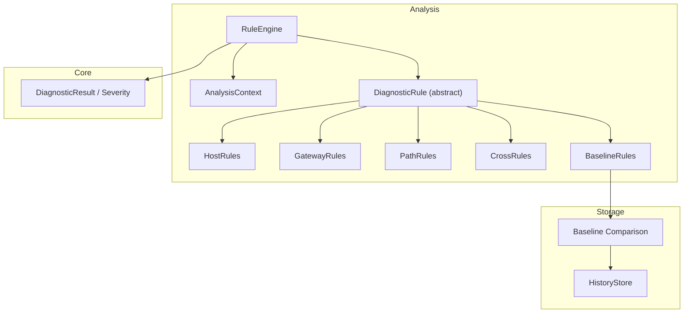
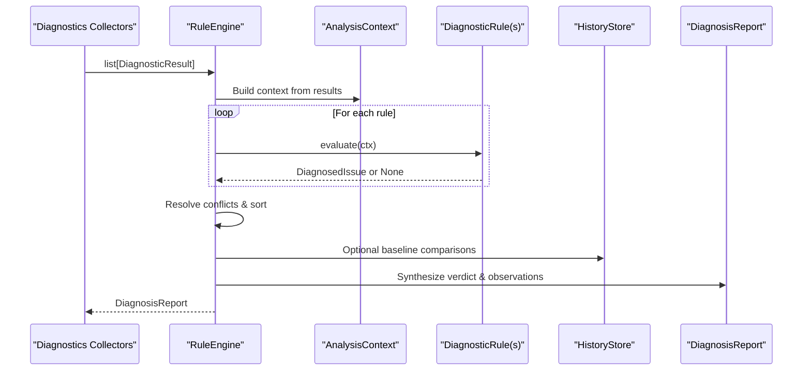
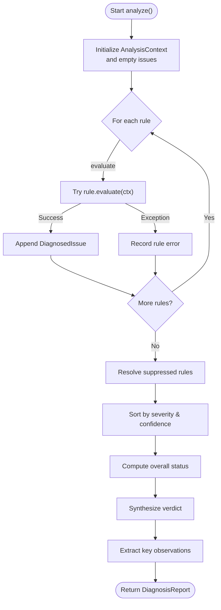
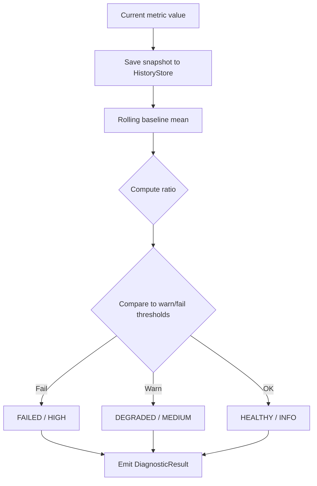
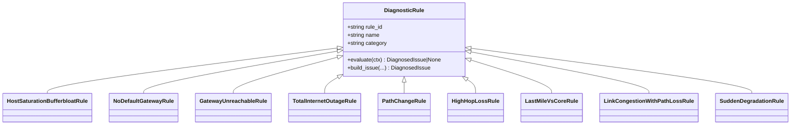
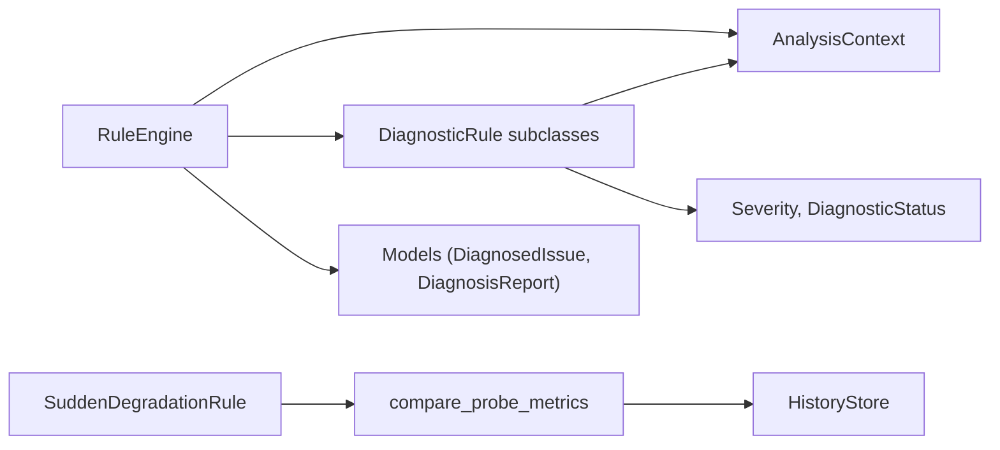

# Intelligent Diagnosis

<cite>
**Referenced Files in This Document**
- [engine.py](file://analysis/engine.py)
- [context.py](file://analysis/context.py)
- [rule.py](file://analysis/rule.py)
- [models.py](file://analysis/models.py)
- [__init__.py](file://analysis/rules/__init__.py)
- [host_rules.py](file://analysis/rules/host_rules.py)
- [cross_rules.py](file://analysis/rules/cross_rules.py)
- [gateway_rules.py](file://analysis/rules/gateway_rules.py)
- [path_rules.py](file://analysis/rules/path_rules.py)
- [baseline_rules.py](file://analysis/rules/baseline_rules.py)
- [baselines.py](file://storage/baselines.py)
- [history.py](file://storage/history.py)
- [result.py](file://core/result.py)
- [README.md](file://README.md)
</cite>

## Table of Contents
1. Introduction
2. Project Structure
3. Core Components
4. Architecture Overview
5. Detailed Component Analysis
6. Dependency Analysis
7. Performance Considerations
8. Troubleshooting Guide
9. Conclusion
10. Appendices

## Introduction
NetForge’s intelligent diagnosis system transforms raw diagnostic probes into actionable root-cause insights. It uses a modular rule engine to evaluate cross-domain evidence, correlates issues across network layers (interface, routing, DNS, transport, path, link), and synthesizes a prioritized diagnosis report with recommendations. Baseline comparison detects sudden degradation by comparing current metrics against rolling historical means. The system supports configurable thresholds, customizable rules, and clear interpretation of results for effective troubleshooting.

## Project Structure
The diagnosis subsystem is organized around:
- Rule Engine: orchestrates evaluation, conflict resolution, and synthesis
- Context: indexed view over probe results for multi-layer correlation
- Rules: domain-specific and cross-domain diagnostic logic
- Models: standardized issue and report structures
- Baselines: history-backed metric comparisons
- Storage: persistent snapshots for trend analysis

**Diagram sources**
- [engine.py:15-130](file://analysis/engine.py#L15-L130)
- [context.py:7-199](file://analysis/context.py#L7-L199)
- [rule.py:9-51](file://analysis/rule.py#L9-L51)
- [baselines.py:9-137](file://storage/baselines.py#L9-L137)
- [history.py:15-115](file://storage/history.py#L15-L115)
- [result.py:9-47](file://core/result.py#L9-L47)

**Section sources**
- [README.md:1-22](file://README.md#L1-L22)

## Core Components
- RuleEngine: Executes registered rules against DiagnosticResult observations, resolves conflicts/subsumption, sorts by severity and confidence, and synthesizes a DiagnosisReport with verdict and key observations.
- AnalysisContext: Provides fast queries over results grouped by module (e.g., interface, routing, dns, connectivity, packet_loss, latency, link_utilization, traceroute).
- DiagnosticRule: Abstract base class defining the evaluate contract and helper to build DiagnosedIssue instances with bounded confidence and recommendations.
- Models: Standardized structures for ConfidenceLevel, Recommendation, DiagnosedIssue, and DiagnosisReport.
- Baseline Comparison: Persists metric samples and compares against rolling baseline means to detect deviations; emits baseline_delta results used by rules.
- HistoryStore: SQLite-backed storage for snapshots enabling rolling baselines and trend analysis.

Key responsibilities:
- Cross-domain correlation via AnalysisContext
- Conflict resolution through suppressed_rules
- Trend detection via baseline deltas
- Actionable output via recommendations and verdicts

**Section sources**
- [engine.py:15-130](file://analysis/engine.py#L15-L130)
- [context.py:7-199](file://analysis/context.py#L7-L199)
- [rule.py:9-51](file://analysis/rule.py#L9-L51)
- [models.py:10-68](file://analysis/models.py#L10-L68)
- [baselines.py:9-137](file://storage/baselines.py#L9-L137)
- [history.py:15-115](file://storage/history.py#L15-L115)

## Architecture Overview
The diagnosis pipeline processes raw DiagnosticResult objects from multiple modules, evaluates them through a curated set of rules, and produces a consolidated DiagnosisReport.

**Diagram sources**
- [engine.py:29-111](file://analysis/engine.py#L29-L111)
- [context.py:13-199](file://analysis/context.py#L13-L199)
- [rule.py:20-51](file://analysis/rule.py#L20-L51)
- [baselines.py:94-137](file://storage/baselines.py#L94-L137)

## Detailed Component Analysis

### Rule Engine
Responsibilities:
- Execute all registered rules against the AnalysisContext
- Capture rule errors without crashing the engine
- Apply conflict resolution using suppressed_rules
- Sort active issues by severity then confidence
- Compute overall status and synthesize a human-readable verdict
- Extract key positive observations (interface up, gateway route, DNS success, IP connectivity)

Evaluation flow:
1. Initialize context and collect raw issues
2. Run each rule; record exceptions per rule
3. Remove suppressed rules from active issues
4. Sort by severity order and descending confidence
5. Determine overall status based on active issues and probe counts
6. Generate verdict summarizing primary and secondary causes
7. Return DiagnosisReport with metadata including rule_errors

**Diagram sources**
- [engine.py:29-111](file://analysis/engine.py#L29-L111)

**Section sources**
- [engine.py:15-130](file://analysis/engine.py#L15-L130)

### Context Management for Cross-Domain Correlation
AnalysisContext indexes results by module and provides high-level helpers:
- Interface layer: active interface detection, all interfaces down
- Routing & gateway: default gateway presence and reachability
- IP connectivity: checks public IP reachability and ICMP fallback
- DNS: resolution status and server list
- Latency & loss: aggregate averages and maxima
- Resources: CPU/memory usage and drop/error rates
- Transport: lookup by port/protocol
- Link: utilization and drops
- Path: hops, fingerprint, change detection

These helpers enable rules to correlate evidence across layers without manual result parsing.

**Section sources**
- [context.py:7-199](file://analysis/context.py#L7-L199)

### Baseline Comparison and Trend Analysis
Baseline comparison persists metric samples and computes rolling means to detect deviations:
- Records snapshots per domain/key/metric
- Computes ratio of current value to baseline mean
- Classifies status/severity based on warn/fail ratios
- Emits baseline_delta results used by rules like SuddenDegradationRule

Trend analysis benefits:
- Early warning before failures occur
- Distinguishes transient spikes from sustained regressions
- Supports “what changed recently” investigations

**Diagram sources**
- [baselines.py:9-91](file://storage/baselines.py#L9-L91)
- [history.py:45-115](file://storage/history.py#L45-L115)

**Section sources**
- [baselines.py:9-137](file://storage/baselines.py#L9-L137)
- [history.py:15-115](file://storage/history.py#L15-L115)

### Rule Evaluation and Conflict Resolution
Rules implement pattern matching across modules and produce DiagnosedIssue instances with:
- Title, category, severity, confidence, confidence_level
- Root cause explanation
- Correlated evidence strings
- Prioritized recommendations
- Suppressed rules to avoid redundant or lower-priority findings

Conflict resolution:
- Higher-order issues can suppress child rules via suppressed_rules
- Engine removes suppressed IDs from active issues
- Sorting ensures critical/high issues surface first

Examples:
- GatewayUnreachableRule suppresses broader outage rules when local gateway failure is identified
- LinkCongestionWithPathLossRule suppresses hop-loss rule when congestion explains loss

**Section sources**
- [rule.py:9-51](file://analysis/rule.py#L9-L51)
- [engine.py:50-71](file://analysis/engine.py#L50-L71)
- [gateway_rules.py:9-94](file://analysis/rules/gateway_rules.py#L9-L94)
- [cross_rules.py:9-49](file://analysis/rules/cross_rules.py#L9-L49)

### Root Cause Identification, Anomaly Detection, and Cross-Layer Correlation
- Host resource saturation: Detects CPU/memory pressure that degrades network stack performance and correlates with jitter
- Gateway issues: Identifies missing routes, unreachable gateways, WAN outages, and total internet outage
- Path anomalies: Detects forwarding path changes, high per-hop loss, and last-mile vs core degradation patterns
- Cross-domain correlation: Combines link utilization, congestion scores, and path loss to attribute congestion-induced drops
- Baseline-based anomaly detection: Flags sudden degradation relative to recent healthy windows

**Diagram sources**
- [rule.py:9-51](file://analysis/rule.py#L9-L51)
- [host_rules.py:9-56](file://analysis/rules/host_rules.py#L9-L56)
- [gateway_rules.py:9-198](file://analysis/rules/gateway_rules.py#L9-L198)
- [path_rules.py:9-138](file://analysis/rules/path_rules.py#L9-L138)
- [cross_rules.py:9-49](file://analysis/rules/cross_rules.py#L9-L49)
- [baseline_rules.py:9-49](file://analysis/rules/baseline_rules.py#L9-L49)

**Section sources**
- [host_rules.py:9-56](file://analysis/rules/host_rules.py#L9-L56)
- [gateway_rules.py:9-198](file://analysis/rules/gateway_rules.py#L9-L198)
- [path_rules.py:9-138](file://analysis/rules/path_rules.py#L9-L138)
- [cross_rules.py:9-49](file://analysis/rules/cross_rules.py#L9-L49)
- [baseline_rules.py:9-49](file://analysis/rules/baseline_rules.py#L9-L49)

### Alerting Mechanisms and Output Interpretation
- DiagnosisReport includes:
  - Overall status (healthy/degraded/failed)
  - Verdict text summarizing primary and secondary causes
  - Issues list with severity, confidence, root cause, evidence, and recommendations
  - Key observations highlighting positive health indicators
  - Metadata capturing rule evaluation errors for debugging
- Recommendations provide actionable steps, optional commands, rationale, and priority ordering
- Rule errors are captured to help diagnose misbehaving rules without halting analysis

Interpretation guidance:
- Focus on highest-severity, highest-confidence issues first
- Use correlated evidence to understand contributing factors
- Follow prioritized recommendations to remediate root causes
- Review key observations to confirm baseline health areas

**Section sources**
- [engine.py:73-111](file://analysis/engine.py#L73-L111)
- [models.py:27-68](file://analysis/models.py#L27-L68)

## Dependency Analysis
The diagnosis system exhibits clear separation of concerns:
- RuleEngine depends on AnalysisContext and DiagnosticRule implementations
- Rules depend on AnalysisContext for cross-module queries
- Baseline rules depend on baseline comparison utilities and HistoryStore
- All components use shared models and result types

**Diagram sources**
- [engine.py:15-130](file://analysis/engine.py#L15-L130)
- [context.py:7-199](file://analysis/context.py#L7-L199)
- [baseline_rules.py:9-49](file://analysis/rules/baseline_rules.py#L9-L49)
- [baselines.py:94-137](file://storage/baselines.py#L94-L137)
- [history.py:15-115](file://storage/history.py#L15-L115)
- [models.py:10-68](file://analysis/models.py#L10-L68)
- [result.py:9-47](file://core/result.py#L9-L47)

**Section sources**
- [__init__.py:1-74](file://analysis/rules/__init__.py#L1-L74)

## Performance Considerations
- Rule isolation: Each rule runs independently; exceptions are captured and do not crash the engine
- Context indexing: Results are grouped by module for efficient lookups
- Baseline computation: Rolling baseline uses a limited window (default 20 samples) to keep calculations lightweight
- Sorting and filtering: Active issues are sorted once after conflict resolution to minimize overhead
- Storage: SQLite snapshots are persisted efficiently with indexes for domain/key/time queries

Optimization opportunities:
- Cache frequently accessed context queries if running many rules
- Tune baseline window size based on deployment cadence
- Batch baseline comparisons to reduce I/O

[No sources needed since this section provides general guidance]

## Troubleshooting Guide
Common issues and resolutions:
- Rule evaluation failures: Check metadata.rule_errors in DiagnosisReport to identify problematic rules and their exceptions
- Missing baseline data: First-time metrics seed the baseline; subsequent evaluations compare against rolling mean
- Conflicting diagnoses: Verify suppressed_rules to ensure higher-priority issues take precedence
- Unexpected path changes: Compare traceroute fingerprints and re-run diagnostics to confirm stability

Debugging steps:
- Inspect key_observations to validate healthy areas
- Review correlated_evidence in DiagnosedIssue entries for root-cause clues
- Re-run diagnostics after applying recommended actions to confirm remediation

**Section sources**
- [engine.py:40-48](file://analysis/engine.py#L40-L48)
- [engine.py:99-111](file://analysis/engine.py#L99-L111)
- [history.py:60-90](file://storage/history.py#L60-L90)

## Conclusion
NetForge’s intelligent diagnosis system provides a robust, extensible framework for diagnosing network issues across multiple layers. Its rule engine correlates evidence, resolves conflicts, and synthesizes actionable reports. Baseline comparison enables proactive detection of degradations, while rich context management simplifies cross-domain analysis. By configuring thresholds, customizing rules, and interpreting diagnosis outputs effectively, operators can rapidly identify root causes and resolve issues.

[No sources needed since this section summarizes without analyzing specific files]

## Appendices

### Configuring Thresholds
- Baseline thresholds:
  - warn_ratio: triggers DEGRADED/MEDIUM when exceeded
  - fail_ratio: triggers FAILED/HIGH when exceeded
  - higher_is_worse: controls directionality for metrics where lower is better
- Rule thresholds:
  - Host saturation: CPU >= 85%, RAM >= 90% (severity increases at 95%)
  - Link congestion: utilization >= 75% or congestion_score >= 45
  - Path loss: hop loss >= 50% for elevated loss detection
  - DNS: timeout and slow resolution rules trigger based on module metrics

Customization tips:
- Adjust thresholds in rule implementations to match environment baselines
- Add new rules by subclassing DiagnosticRule and registering in DEFAULT_RULES
- Use AnalysisContext helpers to query relevant metrics for new patterns

**Section sources**
- [baselines.py:14-18](file://storage/baselines.py#L14-L18)
- [host_rules.py:14-32](file://analysis/rules/host_rules.py#L14-L32)
- [cross_rules.py:14-27](file://analysis/rules/cross_rules.py#L14-L27)
- [path_rules.py:45-54](file://analysis/rules/path_rules.py#L45-L54)
- [__init__.py:49-73](file://analysis/rules/__init__.py#L49-L73)

### Interpreting Diagnosis Results
- Status: HEALTHY, DEGRADED, or FAILED based on active issues and probe outcomes
- Verdict: Natural language summary identifying primary and secondary causes
- Issues: Ordered list with severity, confidence, root cause, evidence, and recommendations
- Key observations: Positive indicators confirming healthy subsystems
- Metadata: Includes rule_errors for troubleshooting rule execution

Best practices:
- Address CRITICAL/HIGH issues first
- Use recommendations to guide remediation
- Validate assumptions by checking key_observations
- Investigate rule_errors if diagnosis seems incomplete

**Section sources**
- [engine.py:73-111](file://analysis/engine.py#L73-L111)
- [models.py:37-68](file://analysis/models.py#L37-L68)