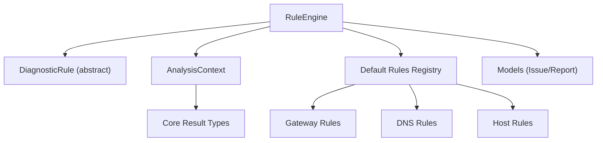
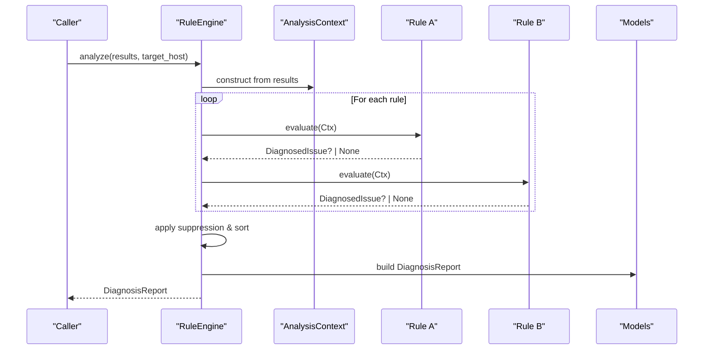
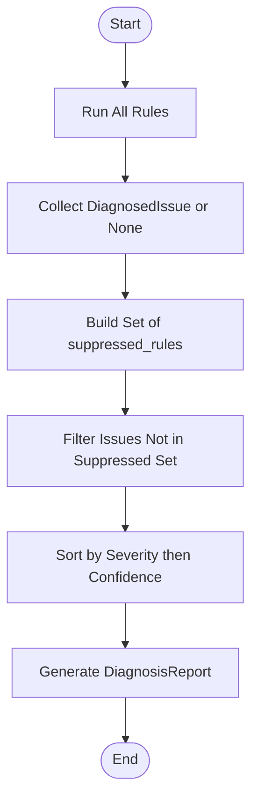
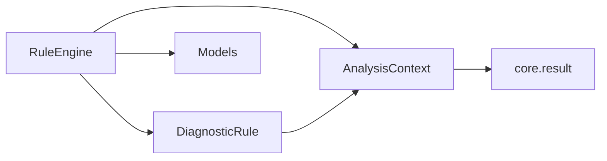

# Rule Engine

<cite>
**Referenced Files in This Document**
- [engine.py](file://analysis/engine.py)
- [rule.py](file://analysis/rule.py)
- [models.py](file://analysis/models.py)
- [context.py](file://analysis/context.py)
- [__init__.py](file://analysis/rules/__init__.py)
- [gateway_rules.py](file://analysis/rules/gateway_rules.py)
- [dns_rules.py](file://analysis/rules/dns_rules.py)
- [host_rules.py](file://analysis/rules/host_rules.py)
- [result.py](file://core/result.py)
- [test_rules.py](file://tests/test_rules.py)
</cite>

## Table of Contents
1. Introduction
2. Project Structure
3. Core Components
4. Architecture Overview
5. Detailed Component Analysis
6. Dependency Analysis
7. Performance Considerations
8. Troubleshooting Guide
9. Conclusion
10. Appendices

## Introduction
This document explains NetForge’s rule-based diagnosis engine: how diagnostic rules are registered, evaluated against collected results, and synthesized into a root-cause verdict. It covers the RuleEngine architecture, the evaluation workflow, conflict resolution and suppression of child rules, severity and confidence-based prioritization, and guidance for developing custom rules and integrating them into the system.

## Project Structure
The rule engine lives under analysis and is composed of:
- A central RuleEngine that orchestrates rule execution and report synthesis
- An abstract DiagnosticRule base class to define consistent rule contracts
- Domain-specific rule modules (e.g., gateway, DNS, host) implementing concrete checks
- An AnalysisContext that indexes and queries DiagnosticResult observations
- Shared models for issues, recommendations, and reports
- A registry of default rules used by the engine

**Diagram sources**
- [engine.py:15-130](file://analysis/engine.py#L15-L130)
- [rule.py:9-51](file://analysis/rule.py#L9-L51)
- [__init__.py:49-73](file://analysis/rules/__init__.py#L49-L73)
- [context.py:7-199](file://analysis/context.py#L7-L199)
- [result.py:9-47](file://core/result.py#L9-L47)

**Section sources**
- [engine.py:15-130](file://analysis/engine.py#L15-L130)
- [__init__.py:49-73](file://analysis/rules/__init__.py#L49-L73)

## Core Components
- RuleEngine: Executes all registered rules against an AnalysisContext, resolves conflicts, sorts issues by severity and confidence, and synthesizes a DiagnosisReport with a root-cause verdict.
- DiagnosticRule: Abstract base defining evaluate(ctx) and a helper build_issue() to create DiagnosedIssue objects with bounded confidence and optional suppressed_rules.
- AnalysisContext: Indexes raw DiagnosticResult observations by module and provides high-level queries (interface status, gateway reachability, DNS working state, transport results, path info).
- Models: ConfidenceLevel, Recommendation, DiagnosedIssue, DiagnosisReport define the structured output of the engine.
- Default Rules Registry: Aggregates built-in rules across categories (gateway, DNS, host, path, link, flow, cross-domain, baseline, mesh).

Key behaviors:
- Rule isolation: exceptions during rule evaluation do not crash the engine; they are captured as rule_errors.
- Suppression: higher-order issues can suppress lower-priority child rules via suppressed_rules lists.
- Prioritization: issues are sorted first by Severity (CRITICAL > HIGH > MEDIUM > LOW > INFO), then by descending confidence.
- Verdict synthesis: primary issue title and confidence drive the narrative; multiple issues produce a multi-factor summary.

**Section sources**
- [engine.py:15-130](file://analysis/engine.py#L15-L130)
- [rule.py:9-51](file://analysis/rule.py#L9-L51)
- [models.py:10-68](file://analysis/models.py#L10-L68)
- [context.py:7-199](file://analysis/context.py#L7-L199)
- [__init__.py:49-73](file://analysis/rules/__init__.py#L49-L73)

## Architecture Overview
The engine follows a pipeline:
1. Build AnalysisContext from DiagnosticResult list
2. Evaluate each rule; collect DiagnosedIssue or None
3. Apply suppression based on suppressed_rules
4. Sort active issues by severity and confidence
5. Compute overall status from probe counts and issues
6. Synthesize verdict and assemble DiagnosisReport

**Diagram sources**
- [engine.py:29-111](file://analysis/engine.py#L29-L111)
- [rule.py:20-51](file://analysis/rule.py#L20-L51)
- [models.py:37-68](file://analysis/models.py#L37-L68)

## Detailed Component Analysis

### RuleEngine
Responsibilities:
- Initialize with a list of DiagnosticRule instances (defaults provided)
- Run all rules against AnalysisContext
- Capture rule errors without failing the entire analysis
- Resolve conflicts using suppressed_rules
- Sort issues by severity and confidence
- Determine overall status from probe metrics and issues
- Synthesize a human-readable verdict
- Return a DiagnosisReport including key positive observations

Evaluation workflow highlights:
- Rule isolation: try/except per rule ensures one failure does not affect others
- Suppression: collects suppressed rule IDs from issues and filters them out
- Sorting: uses a fixed severity order and descending confidence
- Status determination: any CRITICAL/HIGH issue forces FAILED; otherwise DEGRADED if issues exist or degraded probes; else HEALTHY
- Verdict: single-issue vs multi-issue narratives with confidence percentages

Error handling:
- rule_errors accumulates {rule_id, error} entries for diagnostics and reporting

**Section sources**
- [engine.py:15-130](file://analysis/engine.py#L15-L130)

### DiagnosticRule Base Class
Contract:
- Subclasses implement evaluate(ctx) returning DiagnosedIssue or None
- build_issue() standardizes issue creation with bounded confidence and optional suppressed_rules

Design notes:
- Centralizes confidence bounding to avoid extreme values
- Encourages consistent structure for evidence, recommendations, and suppression metadata

**Section sources**
- [rule.py:9-51](file://analysis/rule.py#L9-L51)

### AnalysisContext
Purpose:
- Indexes DiagnosticResult by module for fast lookups
- Provides domain-specific queries:
  - Interface: has_active_interface(), all_interfaces_down()
  - Routing/Gateway: default_gateway(), has_default_gateway(), is_gateway_reachable()
  - IP Connectivity: is_ip_connectivity_working()
  - DNS: is_dns_resolution_working(), get_dns_servers()
  - Latency/Loss: averages and maxima across modules
  - Transport: get_transport_result(port, protocol)
  - Path: get_path_hops(), get_path_fingerprint(), path_changed()
  - Link: utilization and drop rates
  - Resources: CPU/memory usage and network error/drop rates

Complexity:
- Construction O(N) to index results by module
- Queries are typically O(1)–O(k) where k is small per-module result count

**Section sources**
- [context.py:7-199](file://analysis/context.py#L7-L199)

### Models
- ConfidenceLevel: maps numeric confidence to labeled tiers
- Recommendation: actionable remediation steps with priority
- DiagnosedIssue: structured finding with severity, confidence, evidence, recommendations, and suppressed_rules
- DiagnosisReport: final output summarizing status, verdict, issues, observations, and metadata

**Section sources**
- [models.py:10-68](file://analysis/models.py#L10-L68)

### Default Rules Registry
Aggregates built-in rules across categories:
- Gateway: missing route, unreachable gateway, WAN outage, total outage
- DNS: failure with healthy IP, slow resolution, timeout
- Host: resource saturation causing bufferbloat
- Path: changes, hop loss, last-mile vs core
- Link: saturation, interface errors
- Flow: elephant flows
- Cross-domain: congestion correlated with path loss
- Baseline: sudden degradation
- Mesh: partition detection

These are instantiated and passed to RuleEngine by default.

**Section sources**
- [__init__.py:49-73](file://analysis/rules/__init__.py#L49-L73)

### Example Rule Implementations

#### Gateway Rules
- NoDefaultGatewayRule: detects missing default route; suppresses broader outage/DNS rules since this is a more specific cause.
- GatewayUnreachableRule: detects unresponsive next-hop; suppresses downstream/outage rules.
- GatewayHealthyWANOutageRule: local gateway reachable but upstream WAN down; suppresses DNS rules.
- TotalInternetOutageRule: broad Internet failure when no public connectivity despite route; suppresses DNS rules.

Conflict resolution pattern:
- Higher-order rules declare suppressed_rules to prevent redundant or misleading child findings.

**Section sources**
- [gateway_rules.py:9-198](file://analysis/rules/gateway_rules.py#L9-L198)

#### DNS Rules
- DNSFailureWithHealthyIPRule: identifies DNS failures while IP transit works; suggests cache flush and public resolvers.
- SlowDNSResolutionRule: flags high DNS latency when IP latency is low; recommends faster resolvers.
- DNSTimeoutRule: isolates timeouts with working IP transit.

**Section sources**
- [dns_rules.py:9-160](file://analysis/rules/dns_rules.py#L9-L160)

#### Host Rules
- HostSaturationBufferbloatRule: correlates high CPU/memory with elevated jitter to identify host-induced performance degradation.

**Section sources**
- [host_rules.py:9-56](file://analysis/rules/host_rules.py#L9-L56)

### Conflict Resolution and Suppression Mechanism
- Each rule may return suppressed_rules indicating which other rule IDs should be ignored if this rule fires.
- After all rules run, the engine builds a set of suppressed IDs and filters them from active_issues.
- This prevents noise and ensures higher-priority root causes take precedence.

**Diagram sources**
- [engine.py:38-71](file://analysis/engine.py#L38-L71)
- [rule.py:28-51](file://analysis/rule.py#L28-L51)

**Section sources**
- [engine.py:38-71](file://analysis/engine.py#L38-L71)

### Verdict Synthesis
- If no issues: healthy narrative
- Single issue: primary root cause with confidence percentage
- Multiple issues: primary plus up to two secondary contributing factors

**Section sources**
- [engine.py:113-129](file://analysis/engine.py#L113-L129)

## Dependency Analysis
High-level dependencies:
- RuleEngine depends on AnalysisContext for data access, DiagnosticRule subclasses for evaluation, and Models for outputs.
- Rules depend on AnalysisContext to query cross-module observations.
- Context depends on core.result types to interpret statuses and severities.

**Diagram sources**
- [engine.py:15-130](file://analysis/engine.py#L15-L130)
- [rule.py:9-51](file://analysis/rule.py#L9-L51)
- [context.py:7-199](file://analysis/context.py#L7-L199)
- [result.py:9-47](file://core/result.py#L9-L47)

**Section sources**
- [engine.py:15-130](file://analysis/engine.py#L15-L130)
- [context.py:7-199](file://analysis/context.py#L7-L199)
- [result.py:9-47](file://core/result.py#L9-L47)

## Performance Considerations
- Rule evaluation is isolated per rule; exceptions do not short-circuit the pipeline.
- AnalysisContext pre-indexes results by module at construction time for efficient queries.
- Sorting is linearithmic in the number of issues; typical issue counts are small.
- To optimize custom rules:
  - Use targeted context queries rather than scanning all results manually.
  - Avoid heavy computations inside evaluate; prefer lightweight pattern matching.
  - Keep evidence strings concise to reduce memory overhead.

[No sources needed since this section provides general guidance]

## Troubleshooting Guide
Common issues and how the engine handles them:
- Rule exceptions: captured in rule_errors with rule_id and error message; engine continues processing other rules.
- Unexpected behavior: inspect DiagnosisReport.metadata.rule_errors to diagnose problematic rules.
- Conflicting findings: verify suppressed_rules configuration in rules to ensure correct hierarchy.
- Missing data: context queries return safe defaults; rules should handle None/empty cases gracefully.

Validation example:
- Tests demonstrate that a rule raising an exception does not crash the engine and that rule_errors are recorded.

**Section sources**
- [engine.py:38-48](file://analysis/engine.py#L38-L48)
- [test_rules.py:57-71](file://tests/test_rules.py#L57-L71)

## Conclusion
NetForge’s rule engine provides a robust, extensible framework for diagnosing network issues. By standardizing rule development through DiagnosticRule, centralizing observation access via AnalysisContext, and enforcing conflict resolution and prioritization in RuleEngine, it produces clear, actionable DiagnosisReports. Custom rules can be added by subclassing DiagnosticRule and registering them in the default rules registry or passing them directly to RuleEngine.

[No sources needed since this section summarizes without analyzing specific files]

## Appendices

### How to Develop and Integrate a Custom Rule
Steps:
1. Create a new class inheriting from DiagnosticRule.
2. Implement evaluate(ctx) to inspect AnalysisContext and return DiagnosedIssue or None.
3. Use build_issue() to create a standardized issue with severity, confidence, evidence, recommendations, and optionally suppressed_rules.
4. Register your rule:
   - Add an instance to DEFAULT_RULES in the rules registry, or
   - Pass a list containing your rule(s) to RuleEngine(rules=[...]).
5. Test your rule with representative DiagnosticResult inputs and assert expected DiagnosedIssue properties.

Integration patterns:
- Place domain-specific logic in its own module under analysis/rules/.
- Import and register in analysis/rules/__init__.py alongside existing rules.
- Ensure your rule’s suppressed_rules align with higher-priority rules to avoid redundant findings.

**Section sources**
- [rule.py:9-51](file://analysis/rule.py#L9-L51)
- [__init__.py:49-73](file://analysis/rules/__init__.py#L49-L73)
- [engine.py:22-27](file://analysis/engine.py#L22-L27)
- [test_rules.py:20-55](file://tests/test_rules.py#L20-L55)