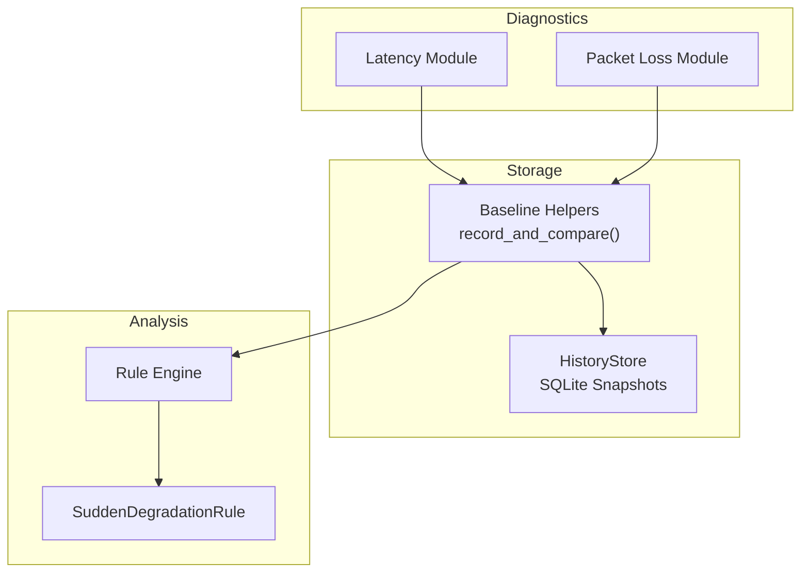
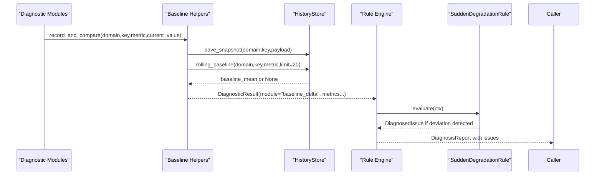
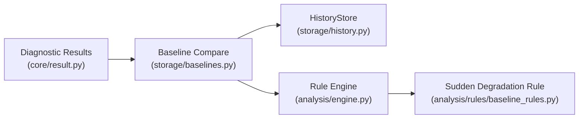

# Baseline Management

<cite>
**Referenced Files in This Document**
- [storage/baselines.py](file://storage/baselines.py)
- [storage/history.py](file://storage/history.py)
- [analysis/rules/baseline_rules.py](file://analysis/rules/baseline_rules.py)
- [analysis/engine.py](file://analysis/engine.py)
- [analysis/rules/__init__.py](file://analysis/rules/__init__.py)
- [core/result.py](file://core/result.py)
- [diagnostics/host/latency.py](file://diagnostics/host/latency.py)
- [diagnostics/host/packet_loss.py](file://diagnostics/host/packet_loss.py)
- [tests/test_baselines.py](file://tests/test_baselines.py)
</cite>

## Table of Contents
1. Introduction
2. Project Structure
3. Core Components
4. Architecture Overview
5. Detailed Component Analysis
6. Dependency Analysis
7. Performance Considerations
8. Troubleshooting Guide
9. Conclusion

## Introduction
This document explains NetForge’s baseline management system for network diagnostics. It covers how baselines are created, stored, and used to compare current measurements against recent history to detect anomalies. It documents the rolling window calculation, deviation thresholds, alerting behavior, integration with the rule engine, and operational guidance for large-scale deployments.

## Project Structure
Baseline functionality spans storage, analysis rules, and diagnostic modules:
- Storage layer persists snapshots and computes rolling baselines from recent samples.
- Baseline comparison helpers convert raw metrics into DiagnosticResult objects that include baseline context and deviation status.
- Rule engine consumes these results to generate higher-level issues when deviations exceed configured thresholds.
- Diagnostic modules (e.g., latency, packet loss) produce metrics that can be fed into baseline comparisons.

**Diagram sources**
- [storage/baselines.py:9-91](file://storage/baselines.py#L9-L91)
- [storage/history.py:15-115](file://storage/history.py#L15-L115)
- [analysis/engine.py:15-130](file://analysis/engine.py#L15-L130)
- [analysis/rules/baseline_rules.py:9-48](file://analysis/rules/baseline_rules.py#L9-L48)
- [diagnostics/host/latency.py:14-81](file://diagnostics/host/latency.py#L14-L81)
- [diagnostics/host/packet_loss.py:14-77](file://diagnostics/host/packet_loss.py#L14-L77)

**Section sources**
- [storage/baselines.py:9-137](file://storage/baselines.py#L9-L137)
- [storage/history.py:15-115](file://storage/history.py#L15-L115)
- [analysis/engine.py:15-130](file://analysis/engine.py#L15-L130)
- [analysis/rules/baseline_rules.py:9-48](file://analysis/rules/baseline_rules.py#L9-L48)
- [diagnostics/host/latency.py:14-81](file://diagnostics/host/latency.py#L14-L81)
- [diagnostics/host/packet_loss.py:14-77](file://diagnostics/host/packet_loss.py#L14-L77)

## Core Components
- Rolling baseline storage: HistoryStore maintains a time-ordered snapshot table and provides methods to save, retrieve latest/previous snapshots, and compute a rolling mean over recent entries.
- Baseline comparison: record_and_compare persists a metric sample, retrieves the rolling baseline mean, computes a ratio, and returns a DiagnosticResult indicating HEALTHY/DEGRADED/FAILED with severity and evidence.
- Rule integration: SuddenDegradationRule inspects baseline_delta results to identify sudden performance degradation relative to baseline and produces a DiagnosedIssue with recommendations.
- Diagnostics integration: Latency and packet loss modules emit metrics that can be compared against baselines via baseline helpers.

Key behaviors:
- First sample seeds baseline; subsequent samples compute ratio vs rolling mean.
- Thresholds: warn_ratio and fail_ratio determine DEGRADED vs FAILED states.
- Directionality: higher_is_worse controls whether increases or decreases indicate worsening.

**Section sources**
- [storage/history.py:15-115](file://storage/history.py#L15-L115)
- [storage/baselines.py:9-91](file://storage/baselines.py#L9-L91)
- [analysis/rules/baseline_rules.py:9-48](file://analysis/rules/baseline_rules.py#L9-L48)
- [diagnostics/host/latency.py:14-81](file://diagnostics/host/latency.py#L14-L81)
- [diagnostics/host/packet_loss.py:14-77](file://diagnostics/host/packet_loss.py#L14-L77)

## Architecture Overview
The baseline system integrates diagnostics, storage, and rule evaluation into a cohesive anomaly detection pipeline.

**Diagram sources**
- [storage/baselines.py:9-91](file://storage/baselines.py#L9-L91)
- [storage/history.py:45-115](file://storage/history.py#L45-L115)
- [analysis/engine.py:29-130](file://analysis/engine.py#L29-L130)
- [analysis/rules/baseline_rules.py:14-48](file://analysis/rules/baseline_rules.py#L14-L48)

## Detailed Component Analysis

### Rolling Baseline Storage (HistoryStore)
Responsibilities:
- Persist each probe result as a JSON payload with domain, key, fingerprint, and timestamp.
- Provide latest and previous snapshot retrieval for change detection.
- Compute rolling baseline mean over the most recent N samples for a given metric.

Data model highlights:
- Snapshot table includes domain, key, fingerprint, payload, created_at.
- Index on (domain, key, created_at DESC) optimizes recent lookups.

Complexity:
- Saving a snapshot is O(1).
- Rolling baseline reads up to limit rows and computes mean: O(limit).

Configuration:
- Database path via environment variable or constructor argument.
- Default limit for rolling baseline is 20 samples.

Operational notes:
- Use separate databases per deployment to avoid cross-tenant contamination.
- Monitor database size and consider archival strategies for long-running deployments.

**Section sources**
- [storage/history.py:15-115](file://storage/history.py#L15-L115)

### Baseline Comparison (record_and_compare)
Algorithm:
- Save current metric sample to storage.
- Retrieve rolling baseline mean for the same domain/key/metric.
- If no baseline exists, seed it and return an informational result.
- Compute ratio = current / baseline.
- Determine worsened based on direction (higher_is_worse) and warn_ratio.
- Assign status and severity:
  - FAILED/HIGH if ratio meets fail_ratio threshold (for higher_is_worse).
  - DEGRADED/MEDIUM if worsened by warn_ratio.
  - Otherwise HEALTHY/INFO.

Outputs:
- DiagnosticResult with module "baseline_delta" and metrics including metric name, current value, baseline, ratio, deviated flag, and directionality.

Integration points:
- Used by diagnostic pipelines to augment results with baseline context.
- Consumed by rule engine to trigger higher-level issues.

**Section sources**
- [storage/baselines.py:9-91](file://storage/baselines.py#L9-L91)

### Baseline Rules (SuddenDegradationRule)
Behavior:
- Inspects baseline_delta results where deviated is true and ratio >= 1.5.
- Aggregates evidence summaries and identifies worst deviation.
- Produces a DiagnosedIssue with title, severity (MEDIUM or HIGH depending on ratio), confidence, root cause explanation, and actionable recommendations.

Integration:
- Included in default rule set and executed by the Rule Engine during analysis.

**Section sources**
- [analysis/rules/baseline_rules.py:9-48](file://analysis/rules/baseline_rules.py#L9-L48)
- [analysis/rules/__init__.py:42-73](file://analysis/rules/__init__.py#L42-L73)

### Diagnostics Integration (Latency and Packet Loss)
- Latency module emits avg_ms, jitter, std_dev, and other statistics.
- Packet loss module emits packet_loss_percent and counts.
- These metrics are suitable inputs for baseline comparison via baseline helpers.

Usage pattern:
- After running diagnostics, feed results into baseline comparison to enrich with historical context.
- The rule engine then evaluates all results, including baseline_delta observations, to synthesize a diagnosis report.

**Section sources**
- [diagnostics/host/latency.py:14-81](file://diagnostics/host/latency.py#L14-L81)
- [diagnostics/host/packet_loss.py:14-77](file://diagnostics/host/packet_loss.py#L14-L77)

### Rule Engine Integration
- The Rule Engine executes registered rules against a set of DiagnosticResult objects.
- It collects issues, resolves conflicts/subsumption, sorts by severity and confidence, and synthesizes a final DiagnosisReport.
- Baseline-related issues appear alongside other diagnostic findings to provide a comprehensive view.

**Section sources**
- [analysis/engine.py:15-130](file://analysis/engine.py#L15-L130)

## Dependency Analysis
High-level dependencies among components:

**Diagram sources**
- [core/result.py:9-47](file://core/result.py#L9-L47)
- [storage/history.py:15-115](file://storage/history.py#L15-L115)
- [storage/baselines.py:9-91](file://storage/baselines.py#L9-L91)
- [analysis/engine.py:15-130](file://analysis/engine.py#L15-L130)
- [analysis/rules/baseline_rules.py:9-48](file://analysis/rules/baseline_rules.py#L9-L48)

**Section sources**
- [core/result.py:9-47](file://core/result.py#L9-L47)
- [storage/history.py:15-115](file://storage/history.py#L15-L115)
- [storage/baselines.py:9-91](file://storage/baselines.py#L9-L91)
- [analysis/engine.py:15-130](file://analysis/engine.py#L15-L130)
- [analysis/rules/baseline_rules.py:9-48](file://analysis/rules/baseline_rules.py#L9-L48)

## Performance Considerations
- Rolling window size: The default limit of 20 samples balances responsiveness and stability. Adjust as needed for your traffic patterns.
- Query efficiency: HistoryStore uses an index on (domain, key, created_at DESC) to optimize recent lookups. Ensure queries target specific domains and keys to minimize scan scope.
- Write throughput: Each diagnostic run writes one snapshot per metric. For high-frequency probes, consider batching or reducing frequency to control write load.
- Storage growth: Over time, the snapshots table grows. Implement periodic archival or retention policies to manage database size.
- Rule evaluation cost: The rule engine processes all results; keep the number of active rules reasonable and ensure each rule is efficient.

[No sources needed since this section provides general guidance]

## Troubleshooting Guide
Common scenarios and resolutions:
- No baseline yet: The first sample seeds the baseline and returns an informational result. Subsequent runs will compare against the rolling mean.
- False positives during warm-up: Early samples may not represent stable conditions. Allow several normal samples to establish a reliable baseline before relying on alerts.
- Unexpected directionality: Ensure higher_is_worse matches the metric semantics (e.g., latency and loss are worse when higher; utilization may also be worse when higher).
- Rule not triggering: Confirm that baseline_delta results have deviated=true and ratio >= 1.5. Check that the rule is included in the default rule set and that the engine processes baseline_delta results.

Validation examples:
- Tests demonstrate seeding a baseline with normal values and detecting a spike as deviated with appropriate status.

**Section sources**
- [storage/baselines.py:33-91](file://storage/baselines.py#L33-L91)
- [tests/test_baselines.py:9-22](file://tests/test_baselines.py#L9-L22)
- [analysis/rules/baseline_rules.py:14-48](file://analysis/rules/baseline_rules.py#L14-L48)

## Conclusion
NetForge’s baseline management system provides robust, history-driven anomaly detection for network diagnostics. By persisting recent samples and comparing current metrics against a rolling baseline, it enables timely detection of performance regressions. Integrated with the rule engine, baseline deviations translate into actionable issues with clear recommendations. With careful configuration of thresholds and storage tuning, the system scales effectively for large deployments while remaining simple to operate.

[No sources needed since this section summarizes without analyzing specific files]