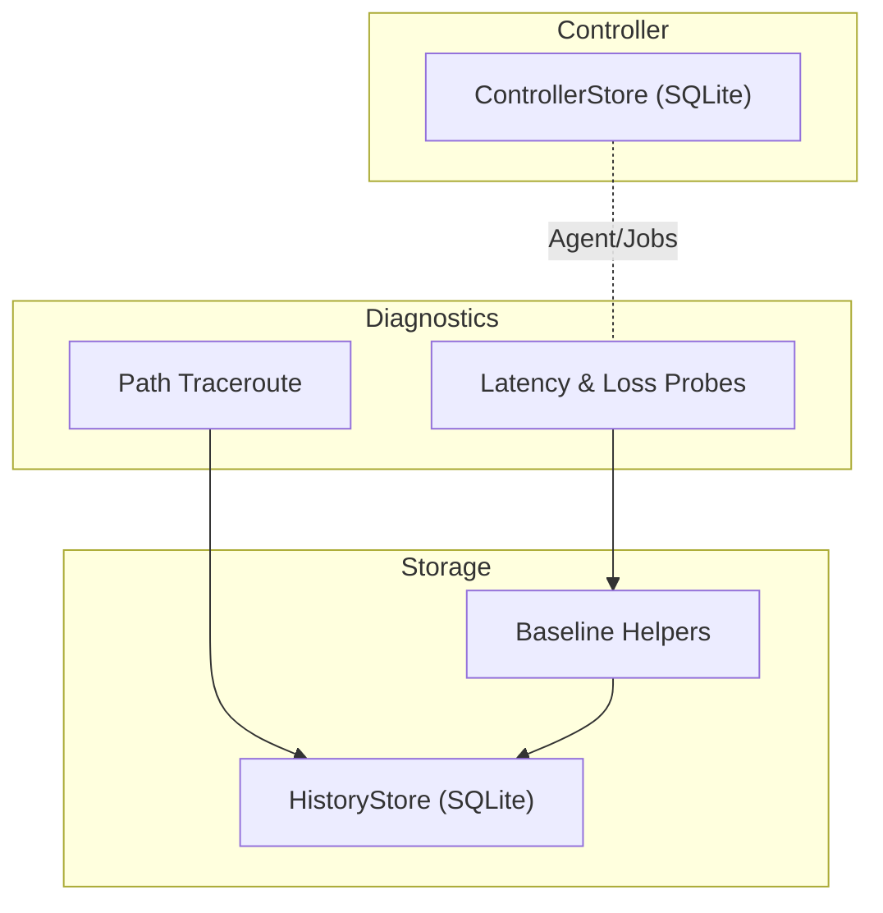
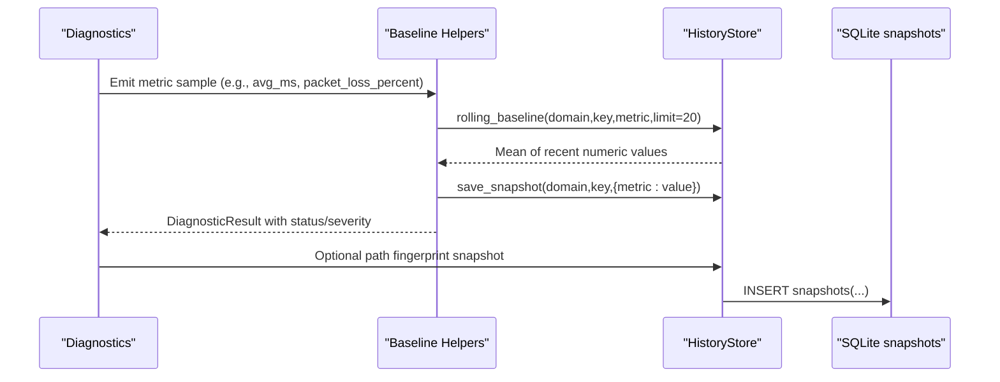
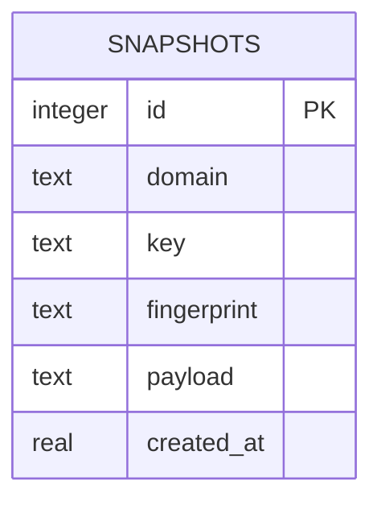
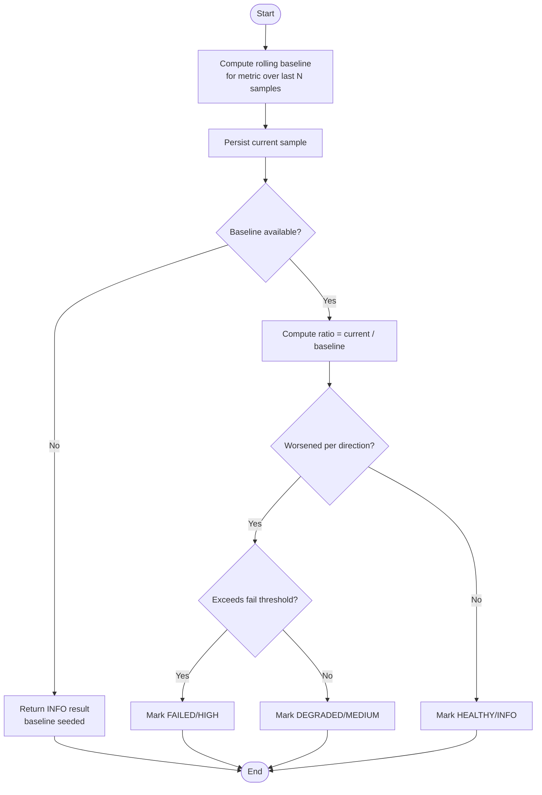
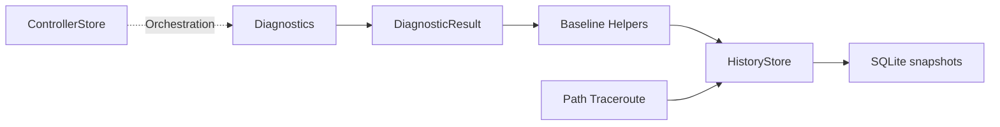

# Historical Data Tracking

<cite>
**Referenced Files in This Document**
- [history.py](file://storage/history.py)
- [baselines.py](file://storage/baselines.py)
- [result.py](file://core/result.py)
- [observation.py](file://core/observation.py)
- [store.py](file://controller/store.py)
- [models.py](file://controller/models.py)
- [latency_jitter.py](file://core/metrics/latency_jitter.py)
- [loss.py](file://core/metrics/loss.py)
- [bandwidth.py](file://core/metrics/bandwidth.py)
- [traceroute.py](file://diagnostics/path/traceroute.py)
- [test_path_flow_storage.py](file://tests/test_path_flow_storage.py)
- [README.md](file://README.md)
</cite>

## Table of Contents
1. [Introduction](#introduction)
2. [Project Structure](#project-structure)
3. [Core Components](#core-components)
4. [Architecture Overview](#architecture-overview)
5. [Detailed Component Analysis](#detailed-component-analysis)
6. [Dependency Analysis](#dependency-analysis)
7. [Performance Considerations](#performance-considerations)
8. [Troubleshooting Guide](#troubleshooting-guide)
9. [Conclusion](#conclusion)
10. [Appendices](#appendices)

## Introduction
This document describes NetForge’s historical data tracking system for network diagnostic results. It explains the storage schema, retention behavior, and query interfaces used to support trend analysis, time-series operations, and aggregation functions. It also covers integration points with diagnostics modules, lifecycle management considerations, archival strategies, performance optimization for large datasets, backup and recovery guidance, migration notes between versions, and scaling considerations for high-volume environments.

## Project Structure
NetForge organizes historical data persistence under the storage package, with baseline comparison helpers that bridge diagnostics outputs into a rolling baseline workflow. Diagnostics produce standardized results that can be persisted as snapshots or compared against recent history. The controller layer maintains its own SQLite store for agent registration and job orchestration, separate from probe history.

**Diagram sources**
- [history.py:15-114](file://storage/history.py#L15-L114)
- [baselines.py:9-136](file://storage/baselines.py#L9-L136)
- [store.py:13-78](file://controller/store.py#L13-L78)
- [traceroute.py:279-291](file://diagnostics/path/traceroute.py#L279-L291)

**Section sources**
- [history.py:1-114](file://storage/history.py#L1-L114)
- [baselines.py:1-136](file://storage/baselines.py#L1-L136)
- [store.py:1-78](file://controller/store.py#L1-L78)
- [README.md:1-22](file://README.md#L1-L22)

## Core Components
- HistoryStore: SQLite-backed snapshot store for domain/key-scoped metric samples and path fingerprints. Provides latest/previous snapshot retrieval and rolling baseline computation over recent samples.
- Baseline Helpers: Persist metric samples and compare current values against a rolling mean to emit DiagnosticResult objects indicating healthy/degraded/failed states based on configurable thresholds.
- Diagnostic Result Model: Standardized result envelope carrying status, severity, metrics, evidence, warnings, errors, and metadata.
- Observation Context: Versioned contract for remote observations including timestamps, provenance, and confidence derived from evidence quality.
- Controller Store: Separate SQLite persistence for agents and fan-out jobs; not part of probe history but relevant for orchestration context.

**Section sources**
- [history.py:15-114](file://storage/history.py#L15-L114)
- [baselines.py:9-136](file://storage/baselines.py#L9-L136)
- [result.py:9-47](file://core/result.py#L9-L47)
- [observation.py:32-63](file://core/observation.py#L32-L63)
- [store.py:13-78](file://controller/store.py#L13-L78)

## Architecture Overview
The historical tracking pipeline integrates diagnostics with a lightweight SQLite store to enable trend detection and baseline comparisons.

**Diagram sources**
- [baselines.py:9-91](file://storage/baselines.py#L9-L91)
- [history.py:45-114](file://storage/history.py#L45-L114)
- [traceroute.py:279-291](file://diagnostics/path/traceroute.py#L279-L291)

## Detailed Component Analysis

### Storage Schema and Retention
- Schema: A single snapshots table stores domain, key, optional fingerprint, JSON payload, and created_at timestamp. An index optimizes queries by domain, key, and recency.
- Retention: No automatic pruning is implemented in the codebase. Records persist indefinitely unless explicitly deleted elsewhere. For long-term growth control, implement periodic cleanup or partitioning strategies outside this module.

**Diagram sources**
- [history.py:25-43](file://storage/history.py#L25-L43)

**Section sources**
- [history.py:25-43](file://storage/history.py#L25-L43)

### Query Interfaces and Time-Series Operations
- Latest Snapshot: Retrieve the most recent snapshot for a given domain/key pair.
- Previous Snapshot: Retrieve the second-most-recent snapshot for change detection.
- Rolling Baseline: Compute the mean of a numeric field across the N most recent snapshots (default limit 20).

These operations support trend analysis and anomaly detection by comparing current measurements to recent history.

**Section sources**
- [history.py:60-114](file://storage/history.py#L60-L114)

### Baseline Comparison Workflow
- record_and_compare persists a metric sample and compares it to the rolling baseline mean.
- Thresholds: Configurable warn_ratio and fail_ratio determine degraded vs failed status. Directionality is controlled via higher_is_worse.
- Integration: Used for latency, packet loss, and link utilization metrics emitted by diagnostics.

**Diagram sources**
- [baselines.py:9-91](file://storage/baselines.py#L9-L91)

**Section sources**
- [baselines.py:9-91](file://storage/baselines.py#L9-L91)

### Path Change Detection and Fingerprinting
- Path traceroute results include a path fingerprint and hop list. Snapshots are saved with the fingerprint to detect changes between runs.
- Previous snapshot retrieval enables diff-based change detection.

**Section sources**
- [traceroute.py:279-291](file://diagnostics/path/traceroute.py#L279-L291)
- [history.py:75-90](file://storage/history.py#L75-L90)

### Metrics Aggregation Utilities
- Latency summarization provides min/avg/max/jitter/stddev and sample counts.
- Loss percentage calculation and severity classification support consistent reporting.
- Bandwidth utilities convert interface speeds and estimate goodput.

These utilities feed metrics into DiagnosticResult objects, which are then stored as snapshots or used for baseline comparisons.

**Section sources**
- [latency_jitter.py:7-40](file://core/metrics/latency_jitter.py#L7-L40)
- [loss.py:4-24](file://core/metrics/loss.py#L4-L24)
- [bandwidth.py:4-17](file://core/metrics/bandwidth.py#L4-L17)

### Integration with Observations and Results
- DiagnosticResult carries structured metrics, evidence, and severity for downstream processing.
- ObservationContext defines versioned metadata for remote observations, including timestamps and confidence derived from evidence quality.

**Section sources**
- [result.py:9-47](file://core/result.py#L9-L47)
- [observation.py:32-63](file://core/observation.py#L32-L63)

### Controller Persistence (Separate Scope)
- ControllerStore manages agent registrations and fan-out jobs in a dedicated SQLite database. While distinct from probe history, it supports orchestration workflows that may trigger diagnostics producing historical data.

**Section sources**
- [store.py:13-78](file://controller/store.py#L13-L78)
- [models.py:13-38](file://controller/models.py#L13-L38)

## Dependency Analysis
- Baseline helpers depend on HistoryStore to compute rolling baselines and persist samples.
- Diagnostics produce DiagnosticResult instances consumed by baseline helpers and optionally persisted as snapshots.
- Path traceroute integration saves path fingerprints and hop lists for change detection.
- ControllerStore is independent but may coordinate probes whose outputs feed into historical tracking.

**Diagram sources**
- [baselines.py:9-136](file://storage/baselines.py#L9-L136)
- [history.py:15-114](file://storage/history.py#L15-L114)
- [traceroute.py:279-291](file://diagnostics/path/traceroute.py#L279-L291)
- [store.py:13-78](file://controller/store.py#L13-L78)

**Section sources**
- [baselines.py:9-136](file://storage/baselines.py#L9-L136)
- [history.py:15-114](file://storage/history.py#L15-L114)
- [traceroute.py:279-291](file://diagnostics/path/traceroute.py#L279-L291)
- [store.py:13-78](file://controller/store.py#L13-L78)

## Performance Considerations
- Indexing: The snapshots table includes an index on (domain, key, created_at DESC), optimizing latest/previous lookups and rolling baseline queries.
- Limiting Windows: Rolling baseline uses a configurable limit (default 20) to bound memory and CPU usage during aggregation.
- Payload Size: JSON payloads can grow; prefer compact metric sets and avoid storing large raw outputs in snapshots.
- Write Frequency: Batch writes where possible to reduce transaction overhead. Each save_snapshot commits individually; consider grouping updates if extending the store.
- Read Patterns: Prefer targeted queries using domain/key filters to leverage indexes.

[No sources needed since this section provides general guidance]

## Troubleshooting Guide
- Missing Baseline: If no prior samples exist, baseline comparison returns an informational result indicating baseline seeding. Ensure sufficient sampling before expecting deviation alerts.
- Unexpected Status: Verify higher_is_worse configuration and threshold ratios when interpreting degraded/failed statuses.
- Empty or Null Metrics: Ensure diagnostics populate expected metric keys (e.g., avg_ms, packet_loss_percent) so baseline helpers can compute ratios.
- Path Changes: Use previous_snapshot to compare fingerprints and identify route alterations.

**Section sources**
- [baselines.py:33-91](file://storage/baselines.py#L33-L91)
- [history.py:60-90](file://storage/history.py#L60-L90)

## Conclusion
NetForge’s historical data tracking leverages a simple, efficient SQLite schema to support trend analysis and baseline-driven alerting. The design emphasizes fast lookups via indexing, bounded aggregation windows, and clear separation between probe history and controller state. For production use, extend retention policies, add export capabilities, and integrate with monitoring systems as needed.

[No sources needed since this section summarizes without analyzing specific files]

## Appendices

### Example Historical Queries
- Latest snapshot for a target:
  - Use latest_snapshot(domain="path", key="<target>") to retrieve the most recent path fingerprint and hops.
- Previous snapshot for change detection:
  - Use previous_snapshot(domain="path", key="<target>") to compare fingerprints between runs.
- Rolling baseline for a metric:
  - Use rolling_baseline(domain="host", key="<key>", metric="avg_ms", limit=20) to compute recent average latency.
  - Use rolling_baseline(domain="host", key="<key>", metric="packet_loss_percent", limit=20) for recent loss trends.

**Section sources**
- [history.py:60-114](file://storage/history.py#L60-L114)

### Export Capabilities
- Current implementation does not provide built-in export APIs. To export:
  - Query snapshots directly via the store methods and serialize results to JSON/CSV.
  - For path fingerprints, iterate snapshots by domain/key and dump payloads.

[No sources needed since this section provides general guidance]

### Integration with Monitoring Systems
- Ingest pattern:
  - Run diagnostics periodically, collect DiagnosticResult objects, and pass them through baseline helpers to generate alerts.
  - Persist snapshots for trend visualization in dashboards.
- Push pattern:
  - Expose HTTP endpoints (via agent/controller) to receive observations and write to the history store.
  - Use ObservationContext fields (timestamps, agent_id, topology_tags) to enrich historical records.

**Section sources**
- [observation.py:32-63](file://core/observation.py#L32-L63)
- [baselines.py:94-136](file://storage/baselines.py#L94-L136)

### Data Lifecycle Management and Archival Strategies
- Retention: Implement scheduled cleanup to remove old snapshots beyond a configured window (e.g., keep last 30 days).
- Archival: Periodically export older snapshots to cold storage (e.g., object storage) and truncate the active database.
- Partitioning: Consider partitioning by date ranges if query patterns benefit from time-bounded scans.

[No sources needed since this section provides general guidance]

### Backup and Recovery Procedures
- Backup:
  - Regularly copy the SQLite history database file (.netforge_history.db) and controller database (.netforge_controller.db).
  - Validate backups by opening the database and running integrity checks.
- Recovery:
  - Restore the database file and restart services.
  - Re-run diagnostics to re-seed baselines if necessary.

**Section sources**
- [history.py:12-23](file://storage/history.py#L12-L23)
- [store.py:13-21](file://controller/store.py#L13-L21)

### Data Migration Between Versions
- Schema evolution:
  - Add new columns or tables incrementally and handle backward compatibility in read paths.
  - Use migrations to transform existing payloads if structure changes occur.
- Validation:
  - Run tests to ensure latest_snapshot, previous_snapshot, and rolling_baseline continue to function after schema updates.

[No sources needed since this section provides general guidance]

### Scaling Considerations for High-Volume Environments
- Database choice:
  - For very high ingestion rates, consider migrating from SQLite to a time-series or relational database with proper sharding/partitioning.
- Concurrency:
  - Increase connection pooling and tune WAL mode for SQLite if retaining it.
- Query Optimization:
  - Maintain indexes on frequently filtered fields (domain, key, created_at).
  - Use materialized views or summary tables for common aggregations.

[No sources needed since this section provides general guidance]

### Tests and Verification
- Unit tests demonstrate saving snapshots, retrieving previous/latest entries, and verifying fingerprint ordering.

**Section sources**
- [test_path_flow_storage.py:30-38](file://tests/test_path_flow_storage.py#L30-L38)