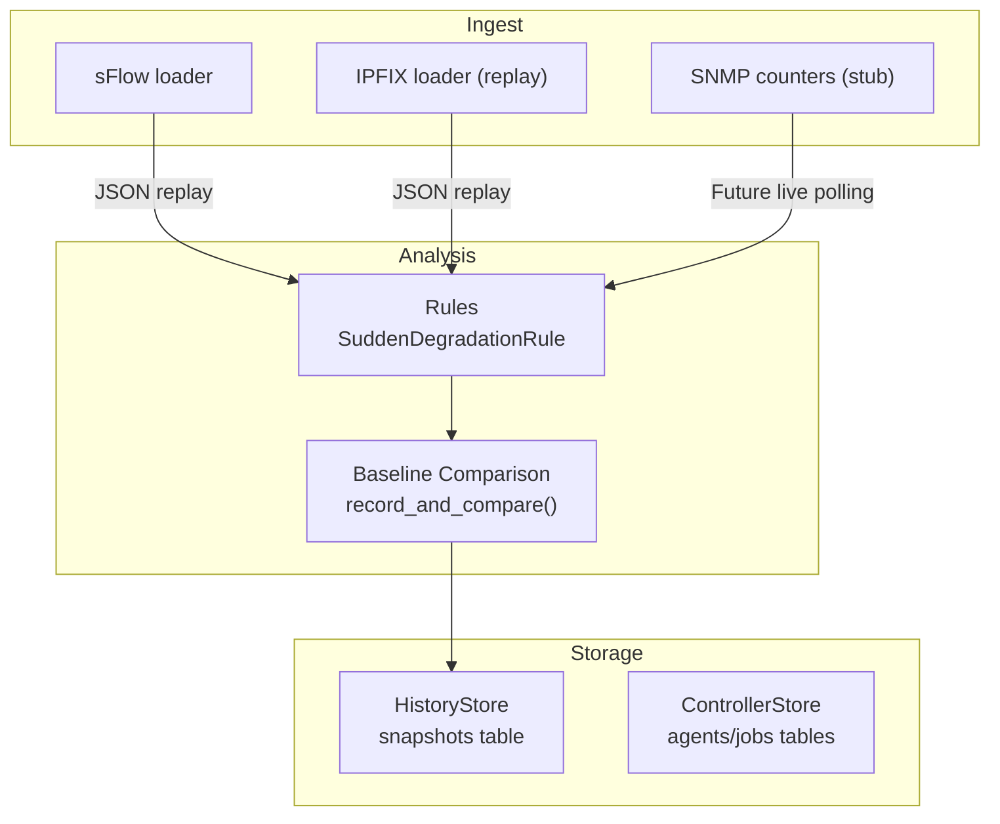
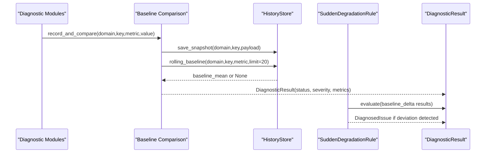
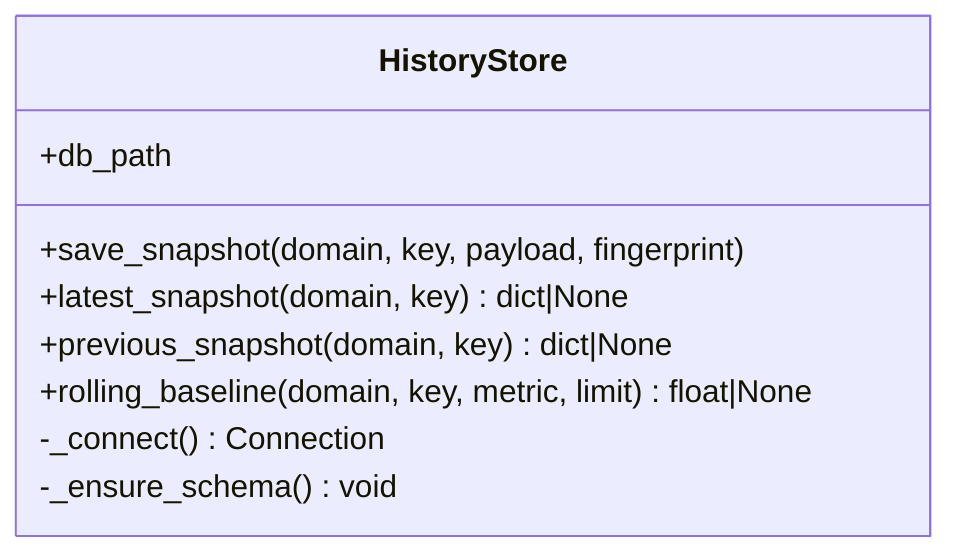
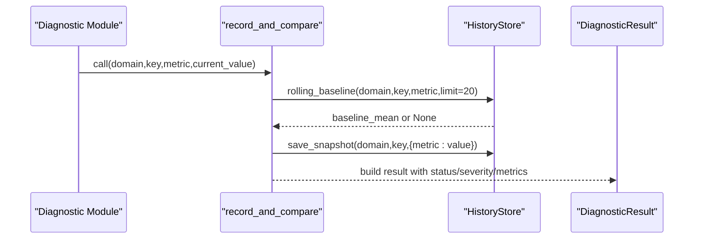
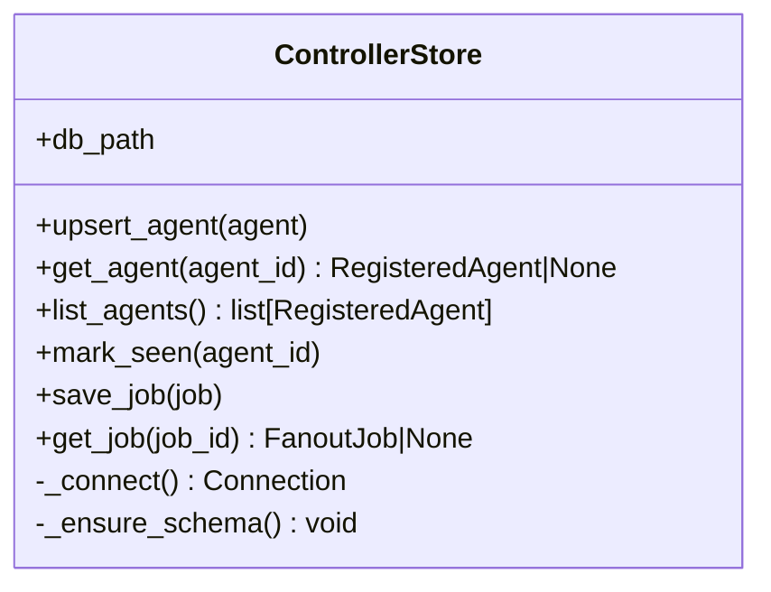
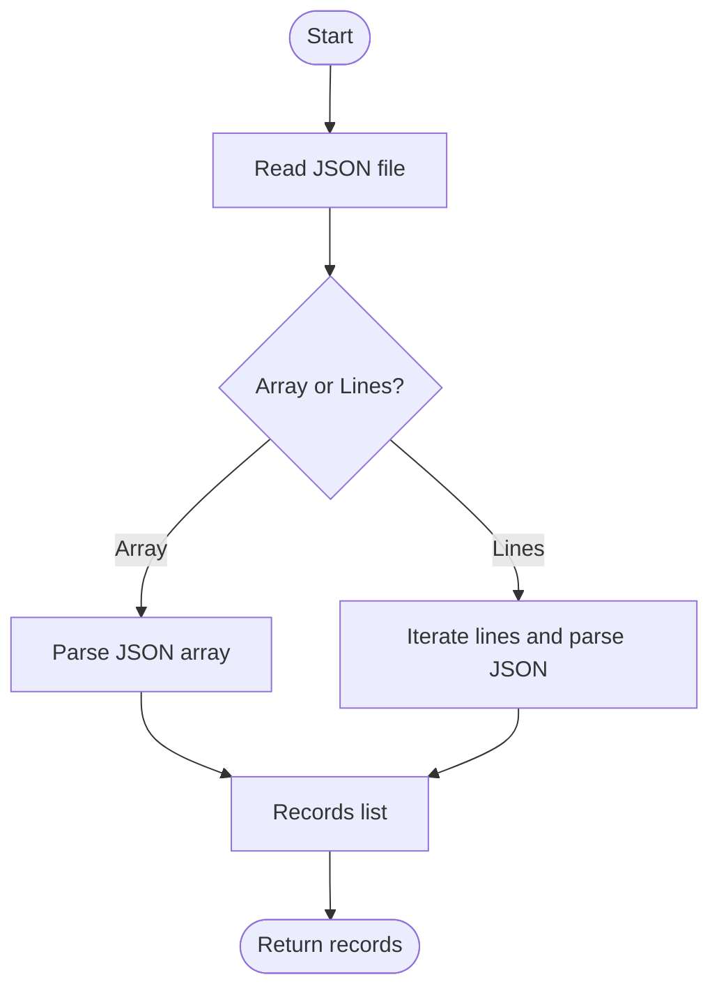
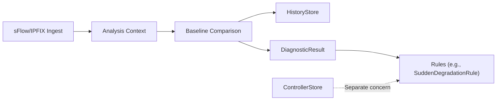

# Storage and Persistence

<cite>
**Referenced Files in This Document**
- [storage/history.py](file://storage/history.py)
- [storage/baselines.py](file://storage/baselines.py)
- [ingest/ipfix.py](file://ingest/ipfix.py)
- [ingest/sflow.py](file://ingest/sflow.py)
- [ingest/snmp_counters.py](file://ingest/snmp_counters.py)
- [controller/store.py](file://controller/store.py)
- [controller/config.py](file://controller/config.py)
- [core/result.py](file://core/result.py)
- [analysis/rules/baseline_rules.py](file://analysis/rules/baseline_rules.py)
- [tests/test_baselines.py](file://tests/test_baselines.py)
- [tests/test_path_flow_storage.py](file://tests/test_path_flow_storage.py)
</cite>

## Table of Contents
1. Introduction
2. Project Structure
3. Core Components
4. Architecture Overview
5. Detailed Component Analysis
6. Dependency Analysis
7. Performance Considerations
8. Troubleshooting Guide
9. Conclusion
10. Appendices

## Introduction
This document describes NetForge’s storage and persistence layer with a focus on:
- Baseline management for threshold comparisons across latency, loss, and utilization metrics
- Historical data tracking to support trend analysis and change detection
- Passive telemetry ingestion from IPFIX, sFlow, and SNMP sources (current status and MVP approach)
- Database schema details, retention considerations, backup and recovery guidance, and performance optimization techniques
- Configuration options for storage backends, query interfaces, and data export capabilities
- Scalability considerations and maintenance procedures for production environments

## Project Structure
The storage and persistence functionality is implemented as lightweight SQLite-backed components with clear separation between:
- Probe history and baselines for diagnostics
- Controller state persistence for agents and jobs
- Ingestion modules for passive telemetry (IPFIX, sFlow, SNMP counters)

**Diagram sources**
- [storage/history.py:15-114](file://storage/history.py#L15-L114)
- [storage/baselines.py:9-91](file://storage/baselines.py#L9-L91)
- [analysis/rules/baseline_rules.py:9-48](file://analysis/rules/baseline_rules.py#L9-L48)
- [ingest/sflow.py:10-30](file://ingest/sflow.py#L10-L30)
- [ingest/ipfix.py:11-22](file://ingest/ipfix.py#L11-L22)
- [ingest/snmp_counters.py:6-10](file://ingest/snmp_counters.py#L6-L10)

**Section sources**
- [storage/history.py:15-114](file://storage/history.py#L15-L114)
- [controller/store.py:13-78](file://controller/store.py#L13-L78)
- [ingest/sflow.py:10-42](file://ingest/sflow.py#L10-L42)
- [ingest/ipfix.py:11-22](file://ingest/ipfix.py#L11-L22)
- [ingest/snmp_counters.py:6-10](file://ingest/snmp_counters.py#L6-L10)

## Core Components
- HistoryStore: SQLite-backed store for probe snapshots used for rolling baseline computation and historical queries.
- Baseline comparison: record_and_compare persists samples and computes deviation against recent rolling mean, emitting standardized DiagnosticResult objects.
- ControllerStore: SQLite-backed persistence for controller-side agent registry and fan-out job state.
- Ingestion modules:
  - sFlow: JSON file replay for offline flow analysis; live UDP collector stub.
  - IPFIX: Reuses sFlow JSON format for offline replay; live collector stub.
  - SNMP counters: Stub for future live polling; current link utilization uses local NIC counters.

Key behaviors:
- Rolling baseline window defaults to the last 20 samples per domain/key/metric.
- Thresholds for warning and failure are configurable via parameters in the baseline comparison function.
- Results are normalized through DiagnosticResult for consistent downstream rule evaluation.

**Section sources**
- [storage/history.py:15-114](file://storage/history.py#L15-L114)
- [storage/baselines.py:9-91](file://storage/baselines.py#L9-L91)
- [controller/store.py:13-78](file://controller/store.py#L13-L78)
- [ingest/sflow.py:10-42](file://ingest/sflow.py#L10-L42)
- [ingest/ipfix.py:11-22](file://ingest/ipfix.py#L11-L22)
- [ingest/snmp_counters.py:6-10](file://ingest/snmp_counters.py#L6-L10)
- [core/result.py:9-47](file://core/result.py#L9-L47)

## Architecture Overview
NetForge’s storage architecture centers on two SQLite databases:
- History database for probe snapshots and baseline calculations
- Controller database for agent registration and job orchestration

Passive telemetry ingestion currently supports offline replay of sFlow/IPFIX records in JSON form, which feed into analysis and baseline comparison. SNMP counter polling is planned for future live collection.

**Diagram sources**
- [storage/baselines.py:9-91](file://storage/baselines.py#L9-L91)
- [storage/history.py:45-114](file://storage/history.py#L45-L114)
- [analysis/rules/baseline_rules.py:9-48](file://analysis/rules/baseline_rules.py#L9-L48)
- [core/result.py:24-47](file://core/result.py#L24-L47)

## Detailed Component Analysis

### HistoryStore (Probe History and Baselines)
Responsibilities:
- Persist snapshots with domain, key, optional fingerprint, payload, and timestamp
- Provide latest/previous snapshot retrieval
- Compute rolling baseline means over recent snapshots for a given metric

Schema highlights:
- Table: snapshots
  - Columns: id (autoincrement), domain, key, fingerprint, payload (JSON), created_at (timestamp)
  - Index: (domain, key, created_at DESC) for efficient time-ordered queries

Operations:
- save_snapshot: inserts a new row with serialized payload and current time
- latest_snapshot: returns most recent snapshot by domain/key
- previous_snapshot: returns second-most-recent snapshot
- rolling_baseline: computes mean of numeric values for a specified metric across the last N snapshots

Performance notes:
- Uses parameterized SQL queries
- Row factory set to sqlite3.Row for named column access
- Index supports fast lookups by domain/key with descending time ordering

Retention:
- No automatic pruning is implemented; retention must be managed externally (e.g., periodic cleanup jobs)

Backup and recovery:
- The database file can be copied when not actively written, or use SQLite’s built-in backup API for consistent snapshots

Configuration:
- Database path configured via environment variable NETFORGE_HISTORY_DB; defaults to .netforge_history.db

**Section sources**
- [storage/history.py:15-114](file://storage/history.py#L15-L114)

#### Class Diagram: HistoryStore

**Diagram sources**
- [storage/history.py:15-114](file://storage/history.py#L15-L114)

### Baseline Comparison
Responsibilities:
- Persist each metric sample and compare against rolling baseline
- Emit DiagnosticResult with module "baseline_delta", including metrics such as current, baseline, ratio, deviated flag, and higher_is_worse semantics
- Support different domains and keys to isolate baselines per target

Threshold logic:
- warn_ratio default: 1.5x deviation triggers DEGRADED
- fail_ratio default: 2.5x deviation triggers FAILED
- higher_is_worse controls directionality for metrics where lower is better

Integration:
- Used by diagnostic modules to generate baseline_delta observations
- Consumed by rules like SuddenDegradationRule to produce actionable issues

**Section sources**
- [storage/baselines.py:9-91](file://storage/baselines.py#L9-L91)
- [analysis/rules/baseline_rules.py:9-48](file://analysis/rules/baseline_rules.py#L9-L48)
- [core/result.py:24-47](file://core/result.py#L24-L47)

#### Sequence Diagram: Baseline Comparison Flow

**Diagram sources**
- [storage/baselines.py:9-91](file://storage/baselines.py#L9-L91)
- [storage/history.py:45-114](file://storage/history.py#L45-L114)
- [core/result.py:24-47](file://core/result.py#L24-L47)

### ControllerStore (Agent and Job State)
Responsibilities:
- Persist registered agents with topology tags and health timestamps
- Track fan-out jobs with lifecycle states and payloads

Schema highlights:
- Table: agents
  - Columns: agent_id (PK), url, tags (JSON), enabled, last_seen_at
- Table: jobs
  - Columns: job_id (PK), created_at, completed_at, status, payload (JSON)

Operations:
- upsert_agent: insert or update agent metadata
- get_agent/list_agents: retrieve agent information
- mark_seen: update last seen timestamp
- save_job/get_job: persist and retrieve job state

Configuration:
- Database path configured via ControllerConfig.from_env(), defaulting to .netforge_controller.db unless overridden by NETFORGE_CONTROLLER_DB

**Section sources**
- [controller/store.py:13-78](file://controller/store.py#L13-L78)
- [controller/config.py:9-21](file://controller/config.py#L9-L21)

#### Class Diagram: ControllerStore

**Diagram sources**
- [controller/store.py:13-78](file://controller/store.py#L13-L78)

### Ingestion Modules (IPFIX, sFlow, SNMP)
Current status:
- sFlow: Offline JSON replay supported; live UDP collector is a stub raising NotImplementedError
- IPFIX: Reuses sFlow JSON schema for offline replay; live collector is a stub
- SNMP counters: Stub for future live polling; current link utilization relies on local NIC counters

Data format expectations:
- sFlow JSON lines or array with fields such as src, dst, bytes, packets, proto (optional)

Operational note:
- For MVP, ingest pipelines consume pre-exported JSON files rather than live packet capture

**Section sources**
- [ingest/sflow.py:10-42](file://ingest/sflow.py#L10-L42)
- [ingest/ipfix.py:11-22](file://ingest/ipfix.py#L11-L22)
- [ingest/snmp_counters.py:6-10](file://ingest/snmp_counters.py#L6-L10)

#### Flowchart: sFlow Replay Processing

**Diagram sources**
- [ingest/sflow.py:10-30](file://ingest/sflow.py#L10-L30)

## Dependency Analysis
- Baseline comparison depends on HistoryStore for persistence and rolling baseline computation
- Rules depend on DiagnosticResult structures produced by baseline comparison
- Ingestion modules provide input data for analysis but do not directly write to storage in this MVP
- ControllerStore is independent of HistoryStore, managing separate concerns (agent/job state)

**Diagram sources**
- [ingest/sflow.py:10-42](file://ingest/sflow.py#L10-L42)
- [ingest/ipfix.py:11-22](file://ingest/ipfix.py#L11-L22)
- [storage/baselines.py:9-91](file://storage/baselines.py#L9-L91)
- [storage/history.py:15-114](file://storage/history.py#L15-L114)
- [analysis/rules/baseline_rules.py:9-48](file://analysis/rules/baseline_rules.py#L9-L48)
- [controller/store.py:13-78](file://controller/store.py#L13-L78)

**Section sources**
- [storage/baselines.py:9-91](file://storage/baselines.py#L9-L91)
- [storage/history.py:15-114](file://storage/history.py#L15-L114)
- [analysis/rules/baseline_rules.py:9-48](file://analysis/rules/baseline_rules.py#L9-L48)
- [controller/store.py:13-78](file://controller/store.py#L13-L78)

## Performance Considerations
- Use indexes: HistoryStore creates an index on (domain, key, created_at DESC) to optimize time-ordered queries
- Limit rolling windows: rolling_baseline defaults to limit=20; tune based on workload and memory constraints
- Batch writes: Each save_snapshot commits immediately; consider batching writes in high-throughput scenarios
- Avoid large payloads: Keep snapshot payloads compact to reduce disk I/O and JSON serialization overhead
- Filesystem placement: Place SQLite files on fast storage (SSD) to minimize latency
- Concurrency: SQLite has limited concurrent writers; serialize writes at application level or use WAL mode if upgrading to a more capable engine later

[No sources needed since this section provides general guidance]

## Troubleshooting Guide
Common issues and resolutions:
- Missing baseline: If no prior samples exist, baseline is None; first samples seed the baseline and return INFO status
- Deviation thresholds: Adjust warn_ratio and fail_ratio in record_and_compare to match operational sensitivity
- Data format errors: Ensure sFlow/IPFIX JSON files conform to expected schema; invalid formats raise ValueError
- Live collectors: start_sflow_collector and start_ipfix_collector raise NotImplementedError; use offline replay until live collection is implemented
- SNMP polling: poll_if_counters raises NotImplementedError; rely on local NIC counters for link utilization

Verification via tests:
- Baseline seeding and deviation detection validated in test suite
- HistoryStore snapshot retrieval verified for latest and previous entries

**Section sources**
- [storage/baselines.py:9-91](file://storage/baselines.py#L9-L91)
- [ingest/sflow.py:33-42](file://ingest/sflow.py#L33-L42)
- [ingest/ipfix.py:18-22](file://ingest/ipfix.py#L18-L22)
- [ingest/snmp_counters.py:6-10](file://ingest/snmp_counters.py#L6-L10)
- [tests/test_baselines.py:9-22](file://tests/test_baselines.py#L9-L22)
- [tests/test_path_flow_storage.py:30-39](file://tests/test_path_flow_storage.py#L30-L39)

## Conclusion
NetForge’s storage and persistence layer provides a pragmatic foundation for baseline-driven diagnostics and historical trend analysis using SQLite. The MVP focuses on offline replay of sFlow/IPFIX telemetry and robust baseline comparison, while controller state is maintained separately. Production deployments should implement retention policies, backups, and performance tuning appropriate to scale and workload characteristics. Future phases will add live collectors and potentially richer storage backends.

[No sources needed since this section summarizes without analyzing specific files]

## Appendices

### Database Schema Reference
- HistoryStore
  - Table: snapshots
    - id: INTEGER PRIMARY KEY AUTOINCREMENT
    - domain: TEXT NOT NULL
    - key: TEXT NOT NULL
    - fingerprint: TEXT
    - payload: TEXT NOT NULL (JSON)
    - created_at: REAL NOT NULL
    - Index: idx_snapshots_domain_key ON (domain, key, created_at DESC)
- ControllerStore
  - Table: agents
    - agent_id: TEXT PRIMARY KEY
    - url: TEXT NOT NULL
    - tags: TEXT NOT NULL (JSON)
    - enabled: INTEGER NOT NULL
    - last_seen_at: REAL
  - Table: jobs
    - job_id: TEXT PRIMARY KEY
    - created_at: REAL NOT NULL
    - completed_at: REAL
    - status: TEXT NOT NULL
    - payload: TEXT NOT NULL (JSON)

**Section sources**
- [storage/history.py:25-43](file://storage/history.py#L25-L43)
- [controller/store.py:23-36](file://controller/store.py#L23-L36)

### Configuration Options
- History database path:
  - Environment variable: NETFORGE_HISTORY_DB
  - Default: .netforge_history.db
- Controller database path:
  - Environment variable: NETFORGE_CONTROLLER_DB
  - Default: .netforge_controller.db
- Authentication tokens:
  - NETFORGE_CONTROLLER_TOKEN
  - NETFORGE_AGENT_TOKEN

**Section sources**
- [storage/history.py:12-18](file://storage/history.py#L12-L18)
- [controller/config.py:9-21](file://controller/config.py#L9-L21)

### Data Retention Policies
- Current implementation does not prune old snapshots; implement periodic cleanup to remove older rows beyond desired retention windows
- Consider partitioning or archiving strategies as data volume grows

[No sources needed since this section provides general guidance]

### Backup and Recovery Procedures
- Stop writers or use SQLite backup API to create consistent snapshots of the database files
- Back up both history and controller databases regularly
- Validate integrity with PRAGMA integrity_check before restoring

[No sources needed since this section provides general guidance]

### Query Interfaces and Data Export
- Direct SQLite queries can be executed against the database files for ad-hoc analysis
- Export snapshots to JSON for external tools by serializing payload fields
- Build read-only views or APIs around HistoryStore methods for controlled access

[No sources needed since this section provides general guidance]

### Scalability Considerations
- For high-volume ingestion, consider:
  - Increasing SQLite page size and enabling WAL mode
  - Batching writes and reducing commit frequency
  - Offloading analytics to a dedicated analytical store (e.g., TimescaleDB, ClickHouse) while retaining SQLite for lightweight operations
- Horizontal scaling:
  - Decouple ingestion from analysis; fan out processed records to multiple consumers
  - Use message queues to buffer bursts and smooth load

[No sources needed since this section provides general guidance]

### Maintenance Procedures for Production
- Monitor disk usage and growth rate of SQLite files
- Schedule regular vacuum and analyze operations to maintain performance
- Rotate logs and archive old data according to retention policy
- Test restore procedures periodically to ensure recoverability

[No sources needed since this section provides general guidance]