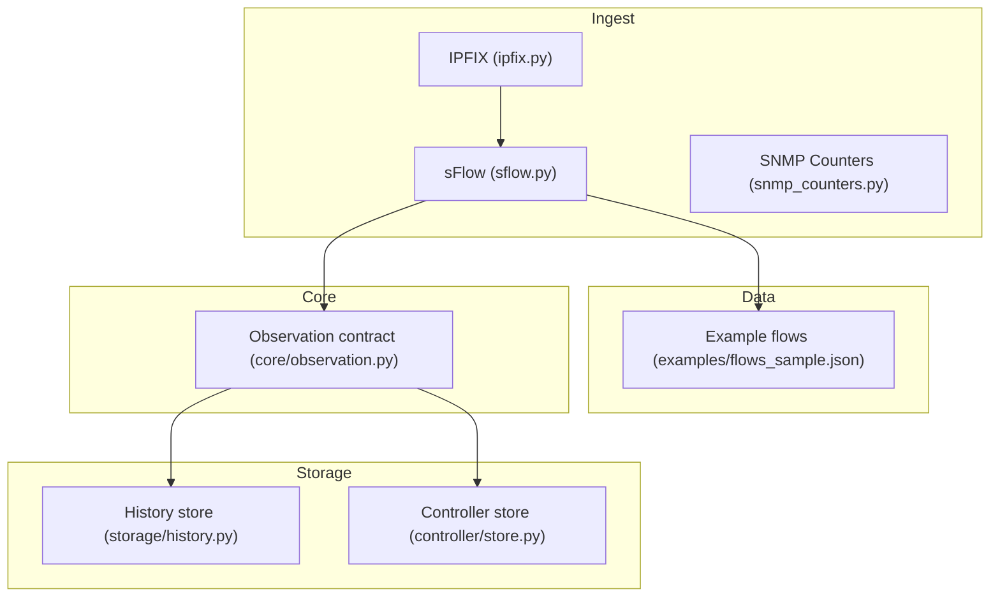
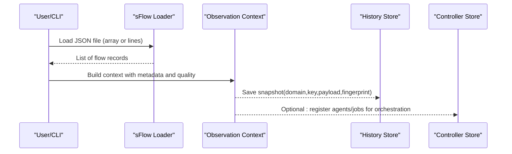
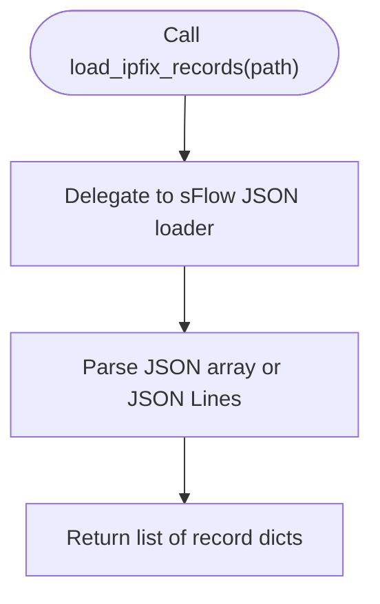
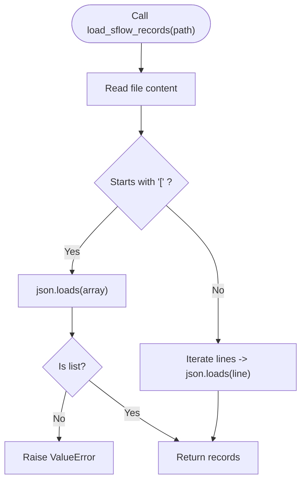
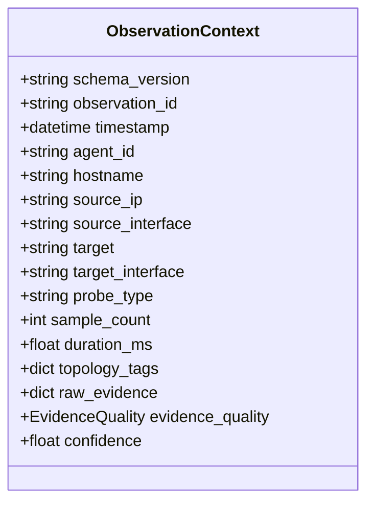
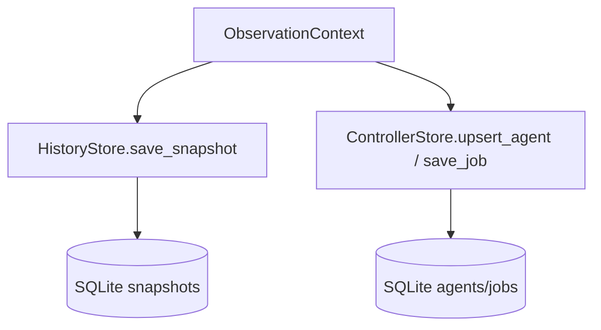
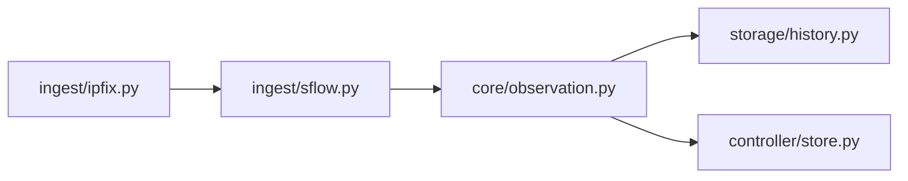
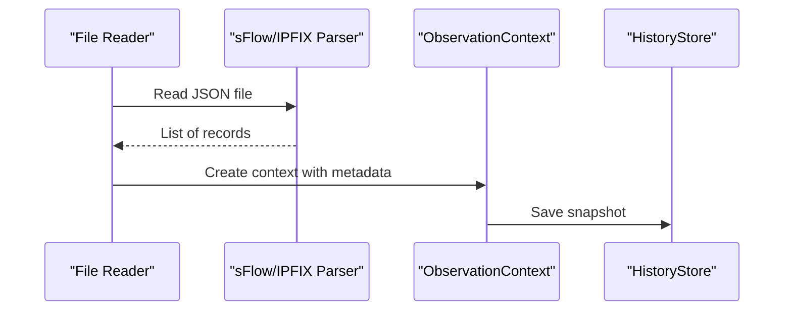

# Telemetry Ingestion

<cite>
**Referenced Files in This Document**
- [ingest/ipfix.py](file://ingest/ipfix.py)
- [ingest/sflow.py](file://ingest/sflow.py)
- [ingest/snmp_counters.py](file://ingest/snmp_counters.py)
- [examples/flows_sample.json](file://examples/flows_sample.json)
- [core/observation.py](file://core/observation.py)
- [storage/history.py](file://storage/history.py)
- [controller/store.py](file://controller/store.py)
- [agent/config.py](file://agent/config.py)
- [controller/config.py](file://controller/config.py)
- [README.md](file://README.md)
</cite>

## Table of Contents
1. [Introduction](#introduction)
2. [Project Structure](#project-structure)
3. [Core Components](#core-components)
4. [Architecture Overview](#architecture-overview)
5. [Detailed Component Analysis](#detailed-component-analysis)
6. [Dependency Analysis](#dependency-analysis)
7. [Performance Considerations](#performance-considerations)
8. [Troubleshooting Guide](#troubleshooting-guide)
9. [Conclusion](#conclusion)
10. [Appendices](#appendices)

## Introduction
This document describes NetForge’s passive telemetry ingestion system for IPFIX, sFlow, and SNMP counter sources. It explains the current implementation status, data formats, normalization expectations, and integration points with storage and controller components. It also provides guidance on configuration, performance tuning, error handling, monitoring, and troubleshooting for connectivity and data quality issues across protocols.

## Project Structure
The ingestion layer is implemented under ingest with protocol-specific modules:
- IPFIX: currently a stub that reuses sFlow JSON replay for offline analysis; live UDP collector not implemented.
- sFlow: supports loading flow records from JSON files (JSON array or JSON Lines); live UDP collector is a stub.
- SNMP counters: polling function is a stub; local diagnostics use psutil NIC counters instead.

**Diagram sources**
- [ingest/ipfix.py:11-22](file://ingest/ipfix.py#L11-L22)
- [ingest/sflow.py:10-41](file://ingest/sflow.py#L10-L41)
- [ingest/snmp_counters.py:6-10](file://ingest/snmp_counters.py#L6-L10)
- [examples/flows_sample.json:1-6](file://examples/flows_sample.json#L1-L6)
- [core/observation.py:32-62](file://core/observation.py#L32-L62)
- [storage/history.py:15-115](file://storage/history.py#L15-L115)
- [controller/store.py:13-78](file://controller/store.py#L13-L78)

**Section sources**
- [ingest/ipfix.py:1-23](file://ingest/ipfix.py#L1-L23)
- [ingest/sflow.py:1-42](file://ingest/sflow.py#L1-L42)
- [ingest/snmp_counters.py:1-11](file://ingest/snmp_counters.py#L1-L11)
- [examples/flows_sample.json:1-6](file://examples/flows_sample.json#L1-L6)
- [core/observation.py:1-63](file://core/observation.py#L1-L63)
- [storage/history.py:1-115](file://storage/history.py#L1-L115)
- [controller/store.py:1-78](file://controller/store.py#L1-L78)

## Core Components
- IPFIX ingestion:
  - Offline mode: load_ipfix_records delegates to sFlow JSON loader for MVP.
  - Live mode: start_ipfix_collector raises an exception indicating it is not implemented yet.
- sFlow ingestion:
  - Offline mode: load_sflow_records reads JSON arrays or JSON Lines into a list of record dicts.
  - Live mode: start_sflow_collector is a placeholder raising NotImplementedError.
- SNMP counters:
  - poll_if_counters is a stub; local link diagnostics rely on psutil NIC counters elsewhere.

Normalization and transformation:
- The ingestion modules return raw dictionaries for now. Consumers should map these to the ObservationContext schema for consistent provenance and confidence scoring.

Integration points:
- Storage: HistoryStore persists snapshots keyed by domain/key with payload and optional fingerprint.
- Controller: ControllerStore persists agent registrations and fan-out job state.

**Section sources**
- [ingest/ipfix.py:11-22](file://ingest/ipfix.py#L11-L22)
- [ingest/sflow.py:10-41](file://ingest/sflow.py#L10-L41)
- [ingest/snmp_counters.py:6-10](file://ingest/snmp_counters.py#L6-L10)
- [core/observation.py:32-62](file://core/observation.py#L32-L62)
- [storage/history.py:45-115](file://storage/history.py#L45-L115)
- [controller/store.py:38-78](file://controller/store.py#L38-L78)

## Architecture Overview
The current architecture supports offline ingestion via JSON files for sFlow and IPFIX (via delegation). Observations are modeled using a versioned contract that includes evidence quality and confidence. Persisted snapshots enable baselining and trend analysis.

**Diagram sources**
- [ingest/sflow.py:10-30](file://ingest/sflow.py#L10-L30)
- [core/observation.py:32-62](file://core/observation.py#L32-L62)
- [storage/history.py:45-73](file://storage/history.py#L45-L73)
- [controller/store.py:38-78](file://controller/store.py#L38-L78)

## Detailed Component Analysis

### IPFIX Ingestion
- Current state:
  - Offline: load_ipfix_records returns sFlow JSON records for MVP.
  - Live: start_ipfix_collector is not implemented; raises an exception with bind/port details.
- Data format:
  - Uses the same JSON schema as sFlow replay for MVP.
- Configuration:
  - No runtime config for live collector yet; bind and port parameters exist in the stub signature.
- Integration:
  - Consumers can call load_ipfix_records with a path to a JSON export.

**Diagram sources**
- [ingest/ipfix.py:11-15](file://ingest/ipfix.py#L11-L15)
- [ingest/sflow.py:10-30](file://ingest/sflow.py#L10-L30)

**Section sources**
- [ingest/ipfix.py:11-22](file://ingest/ipfix.py#L11-L22)

### sFlow Ingestion
- Current state:
  - Offline: load_sflow_records supports JSON array and JSON Lines formats.
  - Live: start_sflow_collector is a placeholder; raises NotImplementedError.
- Data format:
  - Expected keys per record include src, dst, bytes, packets, proto (optional).
  - Example input provided in examples/flows_sample.json.
- Configuration:
  - No live collector configuration yet; bind and port parameters exist in the stub signature.
- Normalization:
  - Records are returned as dicts; downstream consumers should wrap them in ObservationContext to capture provenance and confidence.

**Diagram sources**
- [ingest/sflow.py:10-30](file://ingest/sflow.py#L10-L30)

**Section sources**
- [ingest/sflow.py:10-41](file://ingest/sflow.py#L10-L41)
- [examples/flows_sample.json:1-6](file://examples/flows_sample.json#L1-L6)

### SNMP Counter Ingestion
- Current state:
  - poll_if_counters is a stub; raises NotImplementedError.
  - Local link diagnostics use psutil NIC counters elsewhere in the codebase.
- Configuration:
  - Stub accepts host and community parameters but no live implementation exists.
- Integration:
  - Not integrated into storage yet; future work may replace psutil-based counters with SNMP-sourced metrics.

**Section sources**
- [ingest/snmp_counters.py:6-10](file://ingest/snmp_counters.py#L6-L10)

### Observation Contract and Evidence Quality
- ObservationContext defines provenance fields such as agent_id, hostname, source/target interfaces, probe_type, sample_count, duration_ms, topology_tags, raw_evidence, evidence_quality, and derived confidence.
- EvidenceQuality levels provide a basis for confidence derivation when confidence is not explicitly set.

**Diagram sources**
- [core/observation.py:32-62](file://core/observation.py#L32-L62)

**Section sources**
- [core/observation.py:13-62](file://core/observation.py#L13-L62)

### Storage Layer Integration
- HistoryStore:
  - Persists snapshots with domain/key/payload/fingerprint and timestamps.
  - Provides latest_snapshot, previous_snapshot, and rolling_baseline for metric trends.
- ControllerStore:
  - Persists agent registrations and fan-out jobs with status and payloads.

**Diagram sources**
- [core/observation.py:32-62](file://core/observation.py#L32-L62)
- [storage/history.py:45-115](file://storage/history.py#L45-L115)
- [controller/store.py:38-78](file://controller/store.py#L38-L78)

**Section sources**
- [storage/history.py:15-115](file://storage/history.py#L15-L115)
- [controller/store.py:13-78](file://controller/store.py#L13-L78)

## Dependency Analysis
- IPFIX depends on sFlow for offline parsing in the current MVP.
- sFlow parsing has no external dependencies beyond standard library JSON.
- SNMP counters module is decoupled; no active dependency on network libraries yet.
- ObservationContext is used by higher-level services to normalize and annotate observations before persistence.

**Diagram sources**
- [ingest/ipfix.py:11-15](file://ingest/ipfix.py#L11-L15)
- [ingest/sflow.py:10-30](file://ingest/sflow.py#L10-L30)
- [core/observation.py:32-62](file://core/observation.py#L32-L62)
- [storage/history.py:45-115](file://storage/history.py#L45-L115)
- [controller/store.py:38-78](file://controller/store.py#L38-L78)

**Section sources**
- [ingest/ipfix.py:11-15](file://ingest/ipfix.py#L11-L15)
- [ingest/sflow.py:10-30](file://ingest/sflow.py#L10-L30)
- [core/observation.py:32-62](file://core/observation.py#L32-L62)
- [storage/history.py:45-115](file://storage/history.py#L45-L115)
- [controller/store.py:38-78](file://controller/store.py#L38-L78)

## Performance Considerations
- File-based ingestion:
  - sFlow loader reads entire file into memory; large files may require chunked processing or streaming parsers in future iterations.
- SQLite persistence:
  - HistoryStore uses transactions per operation; batching writes could reduce overhead at scale.
  - Indexes exist on domain/key/timestamp to optimize queries for latest and rolling baseline.
- CPU and I/O:
  - JSON parsing dominates CPU; consider pre-parsing or using faster JSON libraries if throughput becomes a bottleneck.
- Network collectors (future):
  - For live UDP collectors (sFlow/IPFIX), consider non-blocking I/O, ring buffers, and backpressure mechanisms.

[No sources needed since this section provides general guidance]

## Troubleshooting Guide

### Connectivity Issues
- IPFIX live collector:
  - Calling start_ipfix_collector raises an exception indicating the feature is not implemented. Use load_ipfix_records with a JSON export for offline analysis.
- sFlow live collector:
  - Calling start_sflow_collector raises an exception indicating the feature is not implemented. Use load_sflow_records with a JSON export for offline analysis.
- SNMP counters:
  - poll_if_counters raises an exception indicating SNMP polling is not implemented. Use local diagnostics that rely on psutil NIC counters.

**Section sources**
- [ingest/ipfix.py:18-22](file://ingest/ipfix.py#L18-L22)
- [ingest/sflow.py:33-41](file://ingest/sflow.py#L33-L41)
- [ingest/snmp_counters.py:6-10](file://ingest/snmp_counters.py#L6-L10)

### Data Quality Problems
- sFlow JSON validation:
  - If the root of a JSON array file is not a list, a ValueError is raised. Ensure the file contains a valid JSON array or JSON Lines.
- Missing or malformed fields:
  - The loader expects keys like src, dst, bytes, packets, proto (optional). Downstream consumers should validate and normalize these fields into ObservationContext.
- Evidence quality and confidence:
  - When constructing observations, set appropriate EvidenceQuality to derive meaningful confidence values.

**Section sources**
- [ingest/sflow.py:10-30](file://ingest/sflow.py#L10-L30)
- [core/observation.py:13-62](file://core/observation.py#L13-L62)

### Monitoring Ingestion Pipelines
- Use HistoryStore.latest_snapshot and HistoryStore.previous_snapshot to detect missing or stale data by comparing timestamps.
- Use HistoryStore.rolling_baseline to monitor metric stability over time.
- Track controller job statuses to identify failed or partial fan-out operations.

**Section sources**
- [storage/history.py:60-115](file://storage/history.py#L60-L115)
- [controller/store.py:64-78](file://controller/store.py#L64-L78)

## Conclusion
NetForge’s passive telemetry ingestion currently supports offline sFlow and IPFIX via JSON replay, with live UDP collectors planned for future phases. The ObservationContext model provides a robust foundation for normalizing and annotating telemetry data, while HistoryStore enables historical analysis and baselining. SNMP counter ingestion is deferred to later phases, with local diagnostics available in the meantime. Implementing live collectors will extend the system to real-time ingestion with appropriate performance and reliability considerations.

[No sources needed since this section summarizes without analyzing specific files]

## Appendices

### Configuration Options

- Agent-side environment variables:
  - NETFORGE_AGENT_ID, NETFORGE_AGENT_TOKEN, NETFORGE_ALLOWED_TARGETS, and tags prefixed with NETFORGE_TAG_.
- Controller-side environment variables:
  - NETFORGE_CONTROLLER_TOKEN, NETFORGE_AGENT_TOKEN, and NETFORGE_CONTROLLER_DB.

These settings configure authentication, allowed targets, topology tags, and database paths for agent and controller processes.

**Section sources**
- [agent/config.py:10-35](file://agent/config.py#L10-L35)
- [controller/config.py:9-22](file://controller/config.py#L9-L22)

### Telemetry Data Formats

- sFlow/IPFIX offline format:
  - JSON array or JSON Lines with fields such as src, dst, bytes, packets, proto (optional).
- Example file:
  - See examples/flows_sample.json for a representative dataset.

**Section sources**
- [ingest/sflow.py:10-30](file://ingest/sflow.py#L10-L30)
- [examples/flows_sample.json:1-6](file://examples/flows_sample.json#L1-L6)

### Processing Workflows

- Offline workflow:
  - Load JSON records, build ObservationContext, persist snapshots, and optionally dispatch jobs via controller.
- Future live workflow (planned):
  - Receive UDP packets, parse protocol-specific headers, normalize to ObservationContext, persist, and analyze.

**Diagram sources**
- [ingest/sflow.py:10-30](file://ingest/sflow.py#L10-L30)
- [core/observation.py:32-62](file://core/observation.py#L32-L62)
- [storage/history.py:45-73](file://storage/history.py#L45-L73)